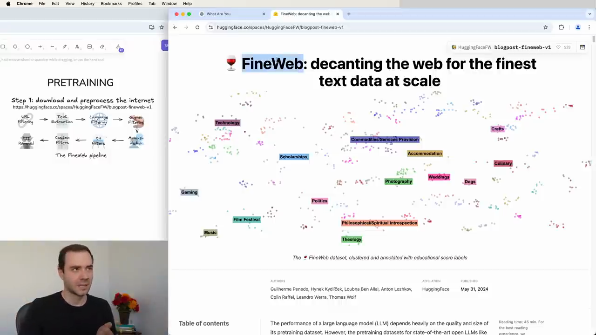
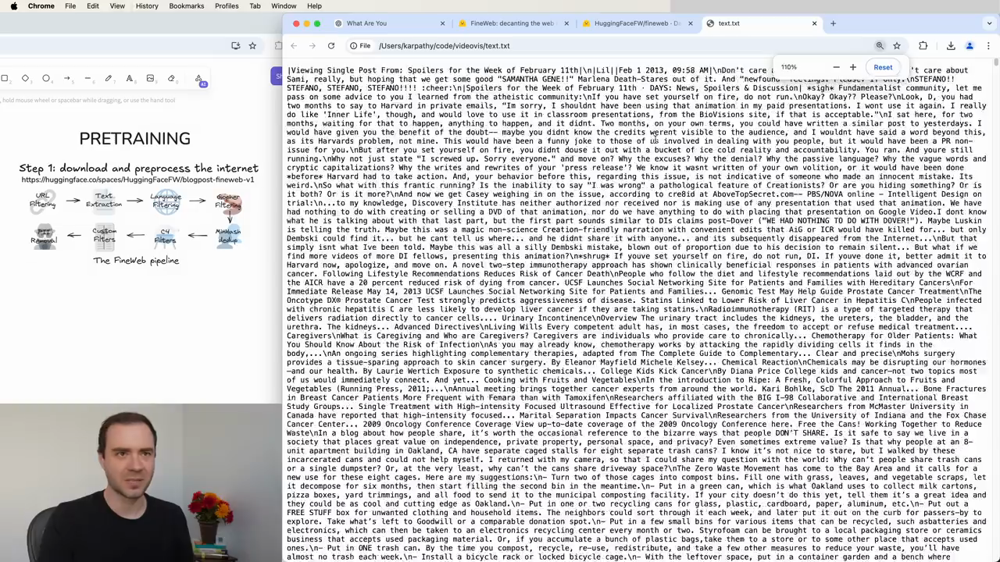
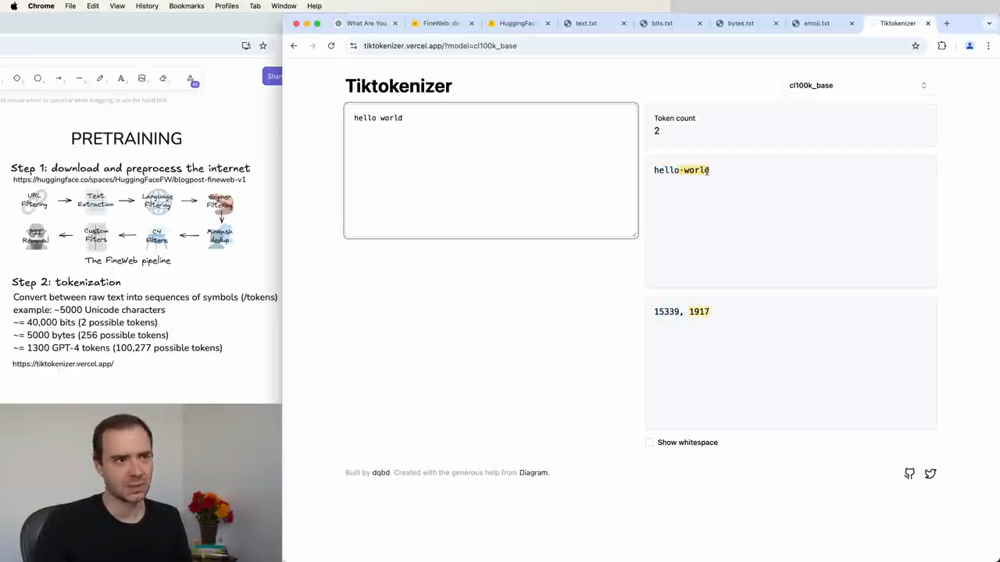
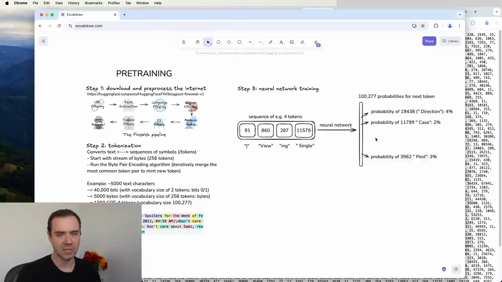
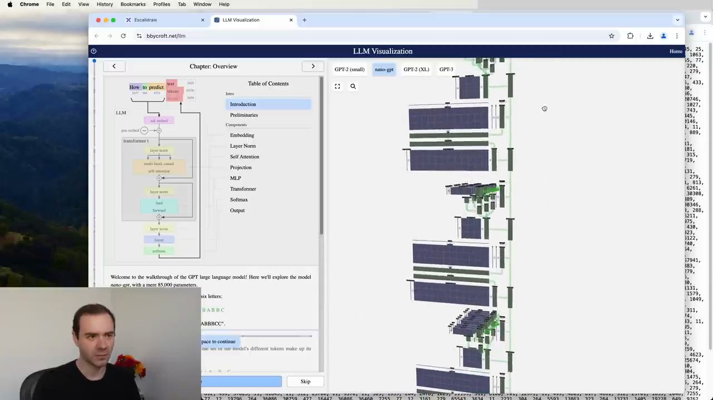
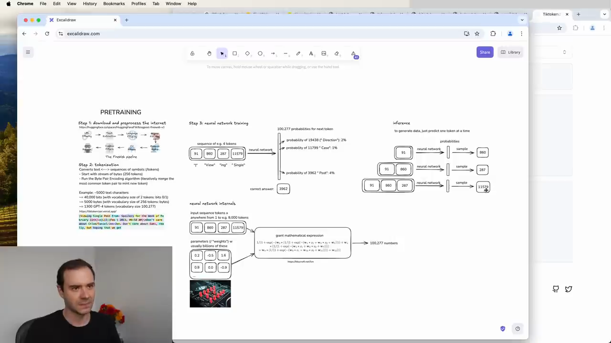

# Inside a Transformer, slowly

*A friendly route from raw web pages to token batches, attention, residual streams, training runs, inference, and finally Kimi K3.*

---

## Before we begin

The fastest way to make Transformers feel mysterious is to introduce every moving part at once.

A typical diagram shows embeddings, positional encodings, query-key-value projections, multiple attention heads, normalization, residual connections, feed-forward layers, logits, and softmax. Each label is individually understandable. The whole diagram still feels like a machine dropped out of the sky.

We will assemble that machine in the opposite direction. We will begin with the job it must do:

> Given the tokens so far, assign a probability to every token that could come next.

Then we will add only the machinery needed to do that job better:

1. **Data curation** turns raw sources into a collection of usable documents.
2. **Tokenization** turns those documents into a finite alphabet of integer IDs.
3. **Batching** packs the IDs into fixed-size rectangles with shifted targets.
4. **Embeddings** turn IDs into vectors the network can work with.
5. **Attention** lets each token retrieve useful information from earlier tokens.
6. **A feed-forward network** lets each token transform the information it has gathered.
7. **Residual connections** preserve a clean route through a deep stack.
8. **Normalization** keeps the scale of the numbers manageable.
9. Repeating that block builds a Transformer.
10. **Training** adjusts its weights to make the observed next token more likely.
11. **Inference** samples one token, appends it, and repeats.

That is the machine. Modern architectures change the details, scale, and efficiency, but they do not discard this foundation.

### Who this is for

This is not written on the assumption that you have never trained a model. The expected reader already knows the broad ideas behind supervised learning, gradient descent, linear layers, activations, and train-versus-inference.

The goal is to connect familiar machinery into a much sharper model of a Transformer:

- how a tokenizer’s vocabulary is actually learned from corpus statistics;
- how crawled web pages become cleaned documents, token streams, and batches;
- why token IDs become vectors and then split into query, key, and value roles;
- why attention and the MLP divide token mixing from feature mixing;
- why the residual stream is more than a skip-connection footnote;
- why normalization is placed where it is;
- how causal training creates a target at every position without leaking answers;
- what prefill, decode, and the KV cache really reuse;
- exactly which parts Kimi K3 replaces and which parts remain.

Foundational derivations remain because they make the guide self-contained and useful in audio. They are labeled so an ML-literate reader can skip them without losing the thread.

### The fast path

If the material is familiar, use this route:

- Read **Practical bridge: before tokens** for the data-to-batch pipeline; it supplies the concrete layer missing from many architecture explanations.
- In Chapter 1, skip the basic “text needs symbols” setup but read **How byte-pair encoding learns the vocabulary**.
- In Chapter 2, skim the embedding lookup and read **Position has to enter too**.
- In Chapter 3, skim softmax and cross-entropy, then read **Every position becomes a supervised example**.
- Chapter 4 is a compact neural-network refresher; jump to **Parameters are adjustable knobs** or skip to Chapter 5.
- Do not skip Chapters 5 through 13. They contain the Transformer-specific intuition and the bridge to Kimi K3.
- Chapter 14 is the code-level consolidation.

### How to use this guide

This is designed to survive conversion into an EPUB, a standalone HTML page, or an audio script:

- Every equation is followed by a plain-language reading.
- Every image has a descriptive caption.
- The prose does not depend on interactive diagrams or collapsed sections.
- Code samples are followed by a spoken-language walkthrough.
- Quiz answers appear after each checkpoint, so the questions still work on a Kindle.
- Timestamp links jump to the relevant moment in Andrej Karpathy’s video.
- “Practice lens” passages connect the theory to artifacts a practitioner can inspect without turning the guide into a setup manual.

If you want a quick first pass, read the prose and skip the indented derivations and code. On a second pass, work the examples with pencil and paper.

### About the Karpathy transcript sections

Andrej Karpathy’s video description explicitly permits free educational and individual-learning use, while prohibiting commercial resale, external commercial use, and modification that misrepresents the content. The transcript passages below come from the video’s English captions. They are lightly edited for punctuation, capitalization, obvious speech-recognition errors, and repeated false starts. They are not an official transcript.

The full video is [Deep Dive into LLMs like ChatGPT](https://www.youtube.com/watch?v=7xTGNNLPyMI).

---

## 0. The whole model in one picture

Before examining any part, hold this small pipeline in your head:

```text
text
  ↓ tokenize
token IDs
  ↓ embedding lookup + position information
vectors, one per token
  ↓ Transformer block × many
context-aware vectors
  ↓ vocabulary projection
one score ("logit") per possible next token
  ↓ softmax
probabilities
  ↓ sample or choose
next token
```


*The same model viewed only through tensor shapes. During training, all \(T\) positions contribute a prediction. During generation, the sampler reads the \(V\) logits at the final position.*

During training, one more arrow runs backward:

```text
correct next token
  ↓ compare with predicted probabilities
loss
  ↓ backpropagation
small updates to every useful weight
```

An LLM is not searching a hidden collection of finished sentences. It is repeatedly running a learned mathematical function. That function receives token IDs and returns next-token probabilities.

The apparent magic comes from three facts:

- the function has an enormous number of learned parameters;
- it learned from an enormous number of prediction examples;
- predicting the next token well forces it to learn a surprising amount about language, facts, style, reasoning patterns, and the world that produced the text.

We can now build the function.

---

## Practical bridge: before tokens, where does the text come from?

The phrase “trained on the internet” compresses an entire engineering discipline into four words.

The neural network never connects itself to the web and wanders around reading pages. By the time training begins, an upstream data pipeline has already made thousands of decisions about what counts as a document, which documents to keep, how to remove duplicates, which languages to include, how to represent boundaries, and which records belong in validation.

What reaches the model is not “the internet.” It is a versioned training artifact.

### Karpathy at 1:11 — the missing first stage

[Watch the pretraining-data section beginning at 1:11](https://www.youtube.com/watch?v=7xTGNNLPyMI&t=71s).



*At 1:27, Karpathy uses FineWeb to make “download and process the internet” concrete. The small diagram is already a warning that data is manufactured through a pipeline, not discovered in a ready-made training file.*

Karpathy’s sequence is worth preserving:

1. collect a very large and diverse body of public text;
2. remove material that is unusable or outside the intended distribution;
3. extract the actual prose from HTML and other containers;
4. deduplicate and clean the surviving documents;
5. only then decide how to represent the text as tokens.

The [FineWeb dataset card](https://huggingface.co/datasets/HuggingFaceFW/fineweb) is unusually valuable because the dataset and much of its recipe are public. At this guide’s verification date, the card describes more than 18.5 trillion GPT-2 tokens of cleaned, deduplicated English web text derived from Common Crawl. The files total tens of terabytes. The exact totals evolve as bugs are fixed, takedowns are honored, and crawls are added; the approximately 44-terabyte snapshot shown in Karpathy’s talk and the later card need not match.

That mutability is itself practical knowledge:

> A dataset name is not enough for reproducibility. Record its configuration, revision, processing code, and split.

Availability is not the same thing as an absence of obligations. FineWeb’s card lists its dataset license and separately points to Common Crawl’s terms. A real project records source provenance, licenses, exclusions, takedown procedures, and privacy limitations alongside the data recipe rather than treating them as a footnote after training.

### A web crawl is raw material, not a dataset

[Common Crawl](https://commoncrawl.org/overview) operates crawlers and publishes web-archive data. A crawl contains far more than clean prose:

- HTML tags, CSS, JavaScript, menus, cookie banners, and navigation;
- duplicated pages, mirrors, boilerplate, and templated text;
- spam, machine-generated junk, malformed documents, and keyword lists;
- many languages and character encodings;
- email addresses, IP addresses, and other potentially identifying strings;
- pages whose legal, safety, or quality status needs review.

FineWeb’s public recipe, implemented with [DataTrove](https://github.com/huggingface/datatrove), turns that raw material into documents through stages including:

1. **URL filtering** — reject known malicious, adult, or otherwise excluded domains.
2. **Text extraction** — recover the main readable content from raw HTML rather than training on menus and markup.
3. **Language identification** — FineWeb’s English pipeline keeps documents above a language-score threshold.
4. **Quality heuristics** — remove pathological repetition, list-like pages, strange formatting, and other low-quality patterns.
5. **MinHash deduplication** — detect near-duplicate documents without comparing every pair directly.
6. **PII formatting** — anonymize certain email and public-IP patterns.


*Conceptual illustration. Each filter changes the distribution that the eventual model experiences. Material falling out of the pipeline is not merely storage saved; it is behavior the model receives fewer opportunities to learn.*

These are modeling choices disguised as preprocessing choices.

If the language filter removes most Spanish, the model receives less Spanish practice. If deduplication removes repeated boilerplate, common templates exert less influence. If a quality classifier equates “good prose” with one narrow style, it can erase dialects or domains that do not resemble the reference data. If code is scarce, code ability will be scarce unless another source is mixed in.

Large training corpora are therefore usually **mixtures**, not one monolithic scrape. A recipe may combine web text with code, books, papers, reference material, conversations, mathematics, or synthetic examples, giving each source a sampling weight. Dataset composition is one of the model’s implicit curricula.

### What one FineWeb record looks like

[Watch Karpathy inspect the released records beginning at 6:08](https://www.youtube.com/watch?v=7xTGNNLPyMI&t=368s).


*At 6:16, the abstraction becomes a table. One row is one cleaned document plus provenance and processing metadata—not a ready-made token batch.*

A FineWeb row can include fields such as:

- `text` — extracted document text;
- `id` — a document identifier;
- `dump` — the Common Crawl snapshot it came from;
- `url` and `date` — source provenance;
- `language` and `language_score`;
- `token_count` — a length estimate under a specified tokenizer.

You can inspect a few rows without downloading the whole corpus by using Hugging Face’s documented streaming mode:

```python
from datasets import load_dataset

documents = load_dataset(
    "HuggingFaceFW/fineweb",
    name="CC-MAIN-2024-10",
    split="train",
    streaming=True,
)

for row in documents.take(3):
    print(row["url"])
    print(row["text"][:500])
    print("---")
```

The important act is not running these exact lines. It is looking at real examples. Dataset summaries can sound pristine while rows reveal navigation remnants, broken formatting, surprising genres, duplicates, or domain imbalance.

Streaming is excellent for inspection and some pipelines. A high-throughput training run often prepares local, sharded, pretokenized files so workers can read sequentially without repeatedly performing network requests and tokenization.

### Documents become one-dimensional token streams

[Watch the “massive tapestry of text” segment beginning at 7:03](https://www.youtube.com/watch?v=7xTGNNLPyMI&t=423s).



*At 7:22, hundreds of documents have visually become one long stream. This is the conceptual handoff from dataset engineering to tokenization.*

There are still choices at that boundary:

- Add an end-of-document token, such as `<EOD>`, so the model can learn that one source ended and another began.
- Split training and validation at the **document level** before packing, so fragments of one document do not leak into both.
- Tokenize each document with a frozen tokenizer.
- Pack tokens into fixed-length rows to avoid wasting compute on padding.
- Shuffle documents or shards well enough that adjacent batches are not all from one site or topic.
- Decide whether attention may cross document boundaries inside a packed row.


*The data loader’s output is a rectangle of integer IDs. Shifting that rectangle by one position produces the targets for next-token prediction.*

The full route now looks like this:

```text
web archives and other sources
    ↓ extract, filter, deduplicate, mix
clean documents + provenance
    ↓ split by document
train documents / validation documents
    ↓ frozen tokenizer
token IDs + end-of-document markers
    ↓ shuffle and pack
[batch, time] integer tensors
    ↓ shift one position
inputs and next-token targets
```

The model’s first matrix multiplication happens only after all of this.

### What a practitioner can actually inspect

Even without training a large model, the pipeline leaves tangible artifacts:

- a manifest naming dataset sources, revisions, and mixture weights;
- raw or cleaned document shards, often JSONL or Parquet;
- filtering statistics showing how much each stage removed;
- duplicate clusters or exclusion logs;
- tokenizer vocabulary and merge files;
- pretokenized `train` and `validation` shards;
- a data-loader configuration describing context length, shuffle seed, and packing.

That is the practical layer to remember: every theoretical noun eventually becomes either a file, a tensor, a metric, or a repeatable operation.

### Data checkpoint

**1. Why is “trained on the internet” an incomplete description?**

- A. Models can train only on books.
- B. Crawled pages are extracted, filtered, deduplicated, mixed, split, tokenized, and packed before the model sees them.
- C. The tokenizer downloads pages during inference.
- D. Attention removes HTML.

**2. Why split validation documents before packing token windows?**

- A. To prevent pieces of the same document from leaking across train and validation.
- B. To make token IDs smaller.
- C. To avoid using softmax.
- D. To create more attention heads.

**3. What does the model finally receive from the data pipeline?**

- A. A browser
- B. A directory of HTML pages
- C. Fixed-shape tensors of token IDs and shifted targets
- D. A search engine

**Answers:** 1-B. The corpus is an engineered artifact. 2-A. Document-level separation produces a more honest held-out distribution. 3-C. The network operates on integer tensors, not dataset webpages.

---

## 1. Tokenization is a learned compression scheme

> **Skippable setup:** If token IDs and vocabulary-size tradeoffs are already familiar, jump to **How byte-pair encoding learns the vocabulary**. That is where the non-obvious part begins.

### Computers do not begin with words

Suppose the prompt is:

> `The cat sat.`

A neural network cannot directly multiply the concept of “cat” by a matrix. It needs numbers.

The most literal representation would be bits: a long sequence of zeros and ones. That alphabet is tiny—only two possible symbols—but the sequence becomes needlessly long. At the opposite extreme, we could assign a unique ID to every sentence ever written. The sequences would be short, but the alphabet would be absurdly large and unable to handle new sentences.

A tokenizer chooses a useful middle ground. Its vocabulary contains pieces of text such as:

- whole common words;
- word fragments;
- spaces joined to words;
- punctuation;
- bytes for text it cannot represent more directly.

Each piece gets an integer ID. The exact IDs are arbitrary labels. Token `15339` is not mathematically “more hello” than token `1917`.

### The vocabulary-size tradeoff

There are two competing costs:

- A **small vocabulary** needs longer token sequences.
- A **large vocabulary** needs a larger embedding table and output layer, and rare entries receive fewer learning examples.

Modern tokenizers usually learn a vocabulary by repeatedly merging common adjacent byte or character patterns. Common text becomes compact; unusual text can still be represented through smaller pieces.

This explains several odd behaviors:

- A leading space can change the token.
- `hello`, `Hello`, and `HELLO` can split differently.
- A rare surname may consume several tokens.
- Code, numbers, and non-English text can have very different token efficiency.
- The model “sees” token pieces, not the characters exactly as your eyes do.

### How byte-pair encoding learns the vocabulary

There are two distinct operations that are often blurred together:

1. **Tokenizer training:** inspect a representative text corpus and decide which byte sequences deserve vocabulary entries.
2. **Encoding:** use that frozen vocabulary and merge order to turn a new string into token IDs.

Tokenizer training happens before language-model training. It does not use backpropagation. It is a corpus-statistics and compression procedure.

A byte-level BPE trainer begins with 256 base symbols, one for each possible byte. This guarantees that any UTF-8 text can be represented. It then repeats:

1. count adjacent symbol pairs across the training corpus;
2. find the most frequent pair;
3. create a new symbol representing that pair;
4. replace occurrences of the pair;
5. repeat until the vocabulary reaches its target size.

The learned object is not just a bag of substrings. It is an **ordered merge table**. Earlier merges have higher priority because later symbols may be built from them.

### A tiny merge trace

Imagine a corpus whose distribution contains:

```text
" the"      1,000 times
" there"      200 times
" theory"     100 times
```

At byte level, those strings begin approximately as:

```text
" the"     → [" ", "t", "h", "e"]
" there"   → [" ", "t", "h", "e", "r", "e"]
" theory"  → [" ", "t", "h", "e", "o", "r", "y"]
```

Across this deliberately simple corpus:

- the pair `(" ", "t")` appears 1,300 times;
- after merging it into `" t"`, the pair `(" t", "h")` appears 1,300 times;
- after that merge, `(" th", "e")` appears 1,300 times.

Three merges have created the common token `" the"`.

The remaining suffix distributions can produce tokens such as `"re"` or `"ory"` if they occur often enough. The algorithm does not know what a word or morpheme is. Word-like and subword-like units emerge because repeated linguistic chunks compress the corpus well.

This also explains why a space often belongs to the following word. In English text, `" the"` is a more stable repeated unit than bare `"the"` in all positions. The tokenizer can learn separate entries for `" the"`, `"the"`, and `"The"`.

Real GPT tokenizers add important details:

- UTF-8 text becomes bytes, so the base vocabulary can represent anything.
- A regular-expression pre-tokenization step constrains which regions can merge.
- Special control tokens are reserved explicitly.
- The target vocabulary size is chosen in advance.
- The final mapping assigns each learned symbol a token ID and merge rank.

Other tokenizer families exist. SentencePiece can implement BPE or a Unigram language-model tokenizer. The universal point is that the vocabulary is engineered or learned from a data distribution; it is not a natural list of English words.

### Training BPE in a few lines

This is a deliberately stripped-down byte-level trainer. Production tokenizers handle corpus scale, pre-tokenization, special tokens, merge ranks, serialization, and fast encoding.

```python
from collections import Counter


def merge_pair(sequence, pair, new_symbol):
    merged = []
    index = 0

    while index < len(sequence):
        if (
            index + 1 < len(sequence)
            and (sequence[index], sequence[index + 1]) == pair
        ):
            merged.append(new_symbol)
            index += 2
        else:
            merged.append(sequence[index])
            index += 1

    return merged


def train_byte_bpe(texts, number_of_merges):
    # IDs 0–255 are the original byte values.
    corpus = [list(text.encode("utf-8")) for text in texts]
    merge_table = []

    for step in range(number_of_merges):
        counts = Counter(
            pair
            for sequence in corpus
            for pair in zip(sequence, sequence[1:])
        )

        if not counts:
            break

        best_pair, frequency = counts.most_common(1)[0]
        new_symbol = 256 + step

        corpus = [
            merge_pair(sequence, best_pair, new_symbol)
            for sequence in corpus
        ]
        merge_table.append(
            {
                "pair": best_pair,
                "new_symbol": new_symbol,
                "training_frequency": frequency,
            }
        )

    return merge_table
```

To encode a new string, start with its bytes and apply eligible learned merges according to the stored priority. The result is a sequence of vocabulary symbols, which are then mapped to token IDs.

This code reveals the central intuition:

> A BPE vocabulary is a hierarchical dictionary of frequently recurring byte sequences.

> **Practice lens — what tokenizer training leaves behind**
>
> A trained tokenizer is a small model artifact of its own. In a BPE system, the durable pieces are usually a mapping from token bytes to IDs, an ordered merge table, special-token definitions, and normalization or pre-tokenization rules. Save them with the language-model checkpoint. The integer `15339` is meaningful only relative to that exact tokenizer.
>
> Practitioners test more than “does it round-trip?” They measure tokens per byte or characters per token on held-out domains, inspect how names, numbers, code, whitespace, and multiple languages split, and look for pathological cases. A tokenizer can compress the average English article well while fragmenting the domain you actually care about.

### Why tokenizer quality changes model quality

Tokenization is not neutral preprocessing.

If a concept or syntax pattern is split into many awkward fragments:

- it consumes more context positions;
- attention and MLP computation run on more tokens;
- long-range relationships span more steps;
- the model must learn to reconstruct a useful unit internally.

If the vocabulary is too large:

- the embedding and vocabulary-projection matrices grow;
- softmax must score more entries;
- rare tokens receive weak statistical support;
- parameters are spent on brittle chunks.

Tokenizer design therefore trades **sequence length** against **vocabulary width**. It also distributes modeling capacity unevenly across languages, code styles, number formats, and domains according to the corpus used to train it.

Changing a pretrained model’s tokenizer is difficult because token IDs index the embedding and output matrices. A new vocabulary changes the model’s input and output interface, not just a text-processing utility.

### Karpathy at 12:31 — seeing the pieces

[Watch the segment beginning at 12:31](https://www.youtube.com/watch?v=7xTGNNLPyMI&t=751s).



*At 12:55, `hello world` has become two vocabulary entries with IDs 15339 and 1917. The colored spans show the text owned by each token.*

**Lightly cleaned transcript, 12:31–13:48**

> Here on the left, you can put in text, and it shows you the tokenization of that text. For example, “hello world” turns out to be exactly two tokens: the token `hello`, which has ID 15339, and the token ` world`, which has ID 1917.
>
> If I join these, I again get two tokens, but it is a different tokenization. If I put two spaces between “hello” and “world,” it is again a different tokenization; there is a new token, 220, here. Also keep in mind that this is case-sensitive. If this is a capital H, it is something else. You can play with this and get an intuitive sense of how these tokens work.

The important lesson is not the particular IDs. It is that tokenization is the model’s sensory boundary. Everything after this point operates on the resulting sequence of symbols.

### A useful correction

People often say that a model “reads words.” That is close enough for casual conversation but wrong enough to cause confusion later.

A more accurate sentence is:

> The model receives token IDs, looks up a vector for each ID, and learns patterns over those vectors.

---

## 2. An embedding turns an ID into a vector

> **Skimmable refresher:** The lookup-table idea is standard. The important bridge is that this tensor becomes the residual stream, and that position information must make identical tokens behave differently at different locations.

### An ID is only a label

Token IDs do not contain useful geometry. If the IDs for `cat`, `dog`, and `democracy` happened to be 40, 900, and 901, that would not make `dog` more similar to `democracy` than to `cat`.

The model therefore owns an **embedding table**:

$$
E \in \mathbb{R}^{V \times d}
$$

Read this as: a table with \(V\) rows, one for every vocabulary token, and \(d\) columns, one for every feature in the model’s internal vector space.

If token ID \(t\) appears, the model retrieves row \(E_t\):

$$
x = E_t
$$

This is a lookup, not a calculation based on the numeric size of \(t\).

Imagine a toy vocabulary of six tokens and an embedding width of four:

```text
token       ID       learned vector
---------------------------------------------
the          0       [ 0.2, -0.1,  0.7,  0.3]
cat          1       [ 0.9,  0.4, -0.2,  0.1]
dog          2       [ 0.8,  0.5, -0.1,  0.0]
sat          3       [-0.3,  0.8,  0.2,  0.5]
on           4       [ 0.1, -0.2,  0.4,  0.6]
mat          5       [ 0.7,  0.2, -0.3,  0.2]
```

We did not hand-design these meanings. Training gradually moves the rows to places that help prediction. Tokens used in related contexts often develop related directions, but an individual coordinate rarely has a clean English label.

### What a vector means

A vector is just an ordered list of numbers. The useful mental model is a bundle of features.

Some directions can correspond—loosely and in combination—to properties such as:

- noun-like versus verb-like;
- singular versus plural;
- person versus location;
- source-code punctuation;
- the tone or topic of the surrounding text.

Do not imagine one neuron labeled `is_a_cat`. Representations are distributed. Meaning usually lives in patterns across many coordinates and many layers.

### Position has to enter too

The sequences:

> `dog bites person`

and

> `person bites dog`

contain the same tokens but mean different things. A model needs information about order.

GPT-2 adds a learned position vector \(P_i\) to each token embedding:

$$
x_i = E_{t_i} + P_i
$$

Read this as: the starting representation at position \(i\) says both **which token this is** and **where it appears**.

Many newer models use rotary position embeddings, or RoPE, which encode relative position inside attention rather than simply adding a position vector at the entrance. Kimi K3 goes further: its KDA layers are inherently position- and recency-sensitive, while its periodic MLA layers use no explicit positional encoding. Those details matter later. The foundational need is unchanged: the network must distinguish order somehow.

### The first tiny piece of code

```python
import torch
import torch.nn as nn

vocab_size = 50_000
width = 768
max_context = 1_024

token_embedding = nn.Embedding(vocab_size, width)
position_embedding = nn.Embedding(max_context, width)

token_ids = torch.tensor([[10, 42, 99, 7]])  # shape: [batch=1, time=4]
positions = torch.arange(4)                   # shape: [time=4]

x = token_embedding(token_ids) + position_embedding(positions)
print(x.shape)  # [1, 4, 768]
```

In spoken language: four token IDs enter. Each becomes a vector of 768 numbers. Four position vectors are added. The result is a stack of four vectors, with shape:

```text
one sequence × four positions × 768 features
```

That tensor \(x\) is what the first Transformer block receives.

> **Practice lens — embeddings have a visible budget**
>
> With a 50,000-token vocabulary and width 768, the token table contains \(50{,}000 \times 768 = 38.4\) million parameters. Stored in 16-bit form, those values alone occupy about 76.8 MB before optimizer state or gradients. An untied vocabulary-output matrix would add another table of similar size.
>
> This is why vocabulary size is not a free tokenizer setting. It changes sequence lengths, but it also changes parameter count, checkpoint size, and the cost of scoring the vocabulary. In code, print `token_embedding.weight.shape` and count its elements; the abstract \(V \times d\) immediately becomes an object with a storage cost.

---

## 3. The job: predict the next token

> **Skimmable refresher:** If logits, softmax, and cross-entropy are familiar, focus on how one causal sequence supplies a target at every position and how the vocabulary projection closes the model’s input/output loop.

### Input and output before internals

Karpathy makes a very useful pedagogical choice: before opening the neural network, he defines its contract.

[Watch the network input/output explanation beginning at 16:40](https://www.youtube.com/watch?v=7xTGNNLPyMI&t=1000s).



*At 17:30, four token IDs form the context. The network’s output has one probability for every vocabulary entry.*

**Lightly cleaned transcript, 16:40–17:45**

> We take a window of four tokens, just so everything fits nicely. These four tokens are the context, and they feed into a neural network. This is the input to the neural network.
>
> I am going to go into the detail of what is inside this neural network in a little bit. For now, what is important to understand is the input and the output. The inputs are sequences of tokens of variable length, anywhere between zero and some maximum size. The output is a prediction for what comes next.
>
> Because our vocabulary has 100,277 possible tokens, the neural network is going to output exactly that many numbers. All of those numbers correspond to the probability of that token coming next in the sequence.

The model does this at every position during training. Given:

```text
The | cat | sat | on | the | mat
```

one training window provides several prediction examples at once:

```text
context                    target
------------------------------------------------
The                        cat
The cat                    sat
The cat sat                on
The cat sat on             the
The cat sat on the         mat
```

A causal mask prevents each position from seeing its own target or anything after it. The GPU can still process all positions in parallel.

### Every position becomes a supervised example

This training arrangement is a form of **teacher forcing**. The input at position \(i\) is the real prefix from the dataset, not a prefix corrupted by the model’s own earlier samples.

For a sequence of length \(T\), one forward pass can produce \(T-1\) next-token losses:

$$
L
=
-\frac{1}{T-1}
\sum_{i=1}^{T-1}
\log
p(t_{i+1}\mid t_{\le i})
$$

The causal mask makes the computation honest, while matrix operations make it parallel.

This resolves an apparent contradiction:

- **Generation is sequential** because the next sampled token does not exist until the previous step finishes.
- **Training within a known sequence is parallel** because every true token is already available as a label, and masking enforces which prefixes each position may use.

The model is trained on clean ground-truth prefixes but deployed on prefixes containing its own choices. That mismatch is one reason a small early generation error can push later text into a different region of the distribution.

> **Practice lens — count tokens, not just batches**
>
> If one device processes \(B\) rows of length \(T\), one micro-batch contains \(B \times T\) token positions. With \(D\) devices and \(G\) gradient-accumulation steps, one optimizer update covers roughly:
>
> $$
> B \times T \times D \times G
> $$
>
> tokens. This is the number behind phrases such as “one million tokens per update.” Batch size alone is ambiguous unless context length, devices, and accumulation are also known.

### Logits come before probabilities

The final vector at each position is projected into one raw score per vocabulary token:

$$
z = hW_U + b_U
$$

Here:

- \(h\) is the final hidden vector for the current position;
- \(W_U\) is sometimes called the unembedding or vocabulary-projection matrix;
- \(z\) is the vector of raw scores, called **logits**.

From a traditional-ML perspective, the output layer is multinomial logistic regression on top of an extraordinarily learned feature vector. The deep Transformer’s job is to make the relevant next-token evidence linearly readable at the end.

### Weight tying: make input and output share one learned geometry

There is an elegant symmetry hiding between the first and last layers of many language models.

Earlier, the token embedding table was:

$$
E \in \mathbb{R}^{V \times d}
$$

On the way **into** the model, token ID \(t\) selects one row:

$$
x = E_t
$$

Without weight tying, the vocabulary projection owns a separate matrix \(W_U \in \mathbb{R}^{d \times V}\). The input embedding and output classifier can therefore learn two unrelated coordinate systems.

With **weight tying**, the output projection reuses the embedding table:

$$
W_U = E^\top
$$

so the logits become:

$$
z = hE^\top
$$

The score for candidate token \(t\) is simply:

$$
z_t = h \cdot E_t
$$

Read the two directions together:

```text
On the way in
    token identity → select that token's row

On the way out
    contextual vector → compare with every token row
```

This does not mean the model merely searches for an input embedding that is semantically similar to the context. The final vector \(h\) has passed through every Transformer block, and dot-product compatibility can use vector direction and magnitude in ways that are not cleanly human-interpretable. The important point is that training must make the two jobs cooperate in one shared coordinate system.

Suppose `Paris` is the observed next token. Cross-entropy pushes the model toward a larger value of:

$$
h \cdot E_{\text{Paris}}
$$

relative to the scores for competing tokens. But \(E_{\text{Paris}}\) is also the row inserted into the residual stream whenever `Paris` appears as an input. The same numbers must work as both an **input representation** and an **output target direction**.

That is the deeper architectural lesson:

> We can encourage compatible representations by removing the model's ability to learn two independent codebooks.

The compatibility is not hand-designed. The network is constrained to share the table, and gradient descent discovers representations that make the shared arrangement useful. This is an example of an **inductive bias**: architecture changes what kinds of solutions are easy for training to find.

The parameter saving is substantial too. With \(V=50{,}000\) and \(d=768\), one table contains 38.4 million parameters. An untied input table and output matrix would require two such collections; tying saves 38.4 million parameters.

In PyTorch, the idea is almost literal:

```python
token_embedding = nn.Embedding(vocab_size, width)
output_head = nn.Linear(width, vocab_size, bias=False)

# Both modules now refer to the same Parameter object.
output_head.weight = token_embedding.weight
```

`nn.Linear` stores its weights as `[output_features, input_features]`, so `output_head(h)` computes \(hE^\top\). [Press and Wolf (2017)](https://arxiv.org/abs/1608.05859) showed that this sharing can reduce parameters and improve language-model generalization.

Logits can be positive or negative and do not add to one. Softmax turns them into probabilities:

$$
p_i = \frac{e^{z_i}}{\sum_j e^{z_j}}
$$

Read this as:

1. exponentiate every score, making each value positive;
2. divide by the total;
3. the results now sum to one.

For numerical stability, code subtracts the largest logit first. That changes none of the probabilities because it scales the numerator and denominator equally.

### A three-token worked example

Pretend the vocabulary contains only:

```text
["cat", "dog", "."]
```

and the logits are:

```text
[2.0, 1.0, 0.0]
```

Exponentiating gives approximately:

```text
[7.39, 2.72, 1.00]
```

The total is \(11.11\), so the probabilities are:

```text
cat     7.39 / 11.11 ≈ 0.665
dog     2.72 / 11.11 ≈ 0.245
.       1.00 / 11.11 ≈ 0.090
```

Softmax preserves the ranking but converts it into a distribution.

### Loss tells training how surprised the model was

If `cat` is the correct next token, the model assigned it probability \(0.665\). Cross-entropy loss for this example is:

$$
L = -\log p_{\text{correct}}
$$

So:

$$
L = -\log(0.665) \approx 0.41
$$

If `.` were correct, the loss would be:

$$
L = -\log(0.090) \approx 2.41
$$

Low loss means the observed token received high probability. High loss means the model was surprised.

Training does not directly reward fluent paragraphs, truth, reasoning, or helpfulness. In pretraining, it repeatedly rewards assigning more probability to the tokens that actually followed the context in the dataset. Higher-level abilities emerge because good prediction requires useful internal models of many regularities.

### Karpathy at 18:17 — the nudge

[Watch the training-update explanation beginning at 18:17](https://www.youtube.com/watch?v=7xTGNNLPyMI&t=1097s).

**Lightly cleaned transcript, 18:17–20:09**

> We sampled this window from the dataset, so we know what comes next. That is the label. We know that token 3962 actually comes next in the sequence.
>
> We have a mathematical process for doing an update to the neural network. We know that this probability—three percent—we want to be higher, and we want the probabilities of the other tokens to be lower. We can calculate how to adjust the network so that the correct answer has a slightly higher probability.
>
> This process happens not just for this token. It happens at the same time for all of these tokens in the dataset. In practice, we sample batches of little windows. At every token, we want to adjust the network so the probability of that token becomes slightly higher.
>
> This is training the neural network: a sequence of updates so its predictions match the statistics of what actually happens in the training set.

### Checkpoint 1

**1. Why not feed token IDs directly into matrix multiplication as meaningful numbers?**

- A. The IDs are encrypted.
- B. Their numeric order is arbitrary and contains no useful similarity geometry.
- C. Matrix multiplication cannot accept integers.
- D. IDs are always larger than the model width.

**2. A vocabulary has 50,000 tokens. How many logits does the model produce for one position?**

- A. One
- B. The context length
- C. 50,000
- D. The embedding width

**3. The model gives the correct next token a probability of 0.8 instead of 0.1. What happens to cross-entropy loss?**

- A. It decreases.
- B. It increases.
- C. It stays the same.
- D. It becomes negative.

**4. During pretraining, why can one sequence provide many training examples?**

- A. Every position predicts its next token under a causal mask.
- B. The tokenizer generates alternative spellings.
- C. Every attention head uses a different label.
- D. The model changes vocabulary at every position.

**Answers:** 1-B. An ID is a label; the embedding table supplies learned geometry. 2-C. There is one score per possible next token. 3-A. \(-\log(p)\) gets smaller as \(p\) approaches one. 4-A. The model predicts the next token at every position while the mask blocks future information.

---

## 4. What is a neural network made of?

> **Skippable refresher:** This section reconnects linear layers, nonlinearities, parameters, and activations to Transformer terminology. If that vocabulary is already automatic, jump to Chapter 5.

Karpathy calls it a “giant mathematical expression.” That description is both accurate and reassuring.

The expression is built from simple operations:

- looking up rows in tables;
- multiplying vectors and matrices;
- adding numbers;
- applying simple nonlinear functions;
- normalizing;
- taking weighted averages.

The scale is enormous. The primitives are not.

### The linear layer: mix the features

The workhorse is:

$$
y = xW + b
$$

Suppose:

$$
x = [2, 3]
$$

and:

$$
W =
\begin{bmatrix}
1 & 4 \\
2 & -1
\end{bmatrix},
\qquad
b = [0.5, 1]
$$

Then:

$$
y =
[2,3]
\begin{bmatrix}
1 & 4 \\
2 & -1
\end{bmatrix}
+ [0.5,1]
$$

The two outputs are:

$$
y_1 = 2(1) + 3(2) + 0.5 = 8.5
$$

$$
y_2 = 2(4) + 3(-1) + 1 = 6
$$

So:

$$
y = [8.5, 6]
$$

Each output coordinate is a learned mixture of the input coordinates.

### Why linear layers alone are not enough

If we stack two purely linear transformations:

$$
y = (xW_1)W_2
$$

we can combine the matrices:

$$
y = x(W_1W_2)
$$

No matter how many linear layers we stack, the whole stack collapses into one linear transformation. Depth would buy very little.

A neural network therefore inserts a nonlinear activation:

$$
y = W_2\,\sigma(W_1x + b_1) + b_2
$$

GPT-2 uses GELU, a smooth activation that suppresses some values and passes or reshapes others. Many newer models use gated variants such as SwiGLU. Kimi K3 uses a bounded variant called SiTU-GLU in its routed experts.

The important point is not the brand name of the activation. Nonlinearity lets the network express conditional behavior that cannot collapse into one matrix.

### Parameters are adjustable knobs

Every number in \(W\), \(b\), the embedding table, and the other learned matrices is a **parameter** or **weight**.

At initialization, the parameters are mostly small random values. The network’s predictions are therefore mostly random. Training discovers a configuration that makes better predictions.

[Watch Karpathy’s “parameters as knobs” explanation beginning at 20:11](https://www.youtube.com/watch?v=7xTGNNLPyMI&t=1211s).

**Lightly cleaned transcript, 20:11–22:17**

> These inputs are mixed up in a giant mathematical expression together with the parameters, or weights, of the neural network. Here I am showing six example parameters, but modern neural networks have billions of them.
>
> In the beginning, these parameters are completely randomly set. With a random setting, you would expect the network to make random predictions, and it does. Through the process of iteratively updating the network—which we call training—the parameters are adjusted so the outputs become consistent with patterns in the training set.
>
> Think of these parameters as knobs on a DJ set. As you twiddle the knobs, you get different predictions for every possible token-sequence input. Training a neural network means discovering a setting of the parameters that seems consistent with the statistics of the training set.
>
> The expression mixes the inputs with the weights using simple things like multiplication, addition, exponentiation, and division. Neural-network architecture research designs expressions with useful characteristics: they are expressive, optimizable, parallelizable, and so on.

This is a good place to separate three terms:

- **Architecture:** the blueprint of operations and connections.
- **Parameters:** the learned numerical settings inside that blueprint.
- **Activations:** the temporary intermediate numbers produced for one particular input.

Two copies of GPT-2 can have the same architecture and different parameters because they were trained differently. The same trained model has fixed parameters but produces different activations for different prompts.

---

## 5. The residual stream: a highway through depth

We now have token vectors and learnable transformations. Why not simply apply one transformation after another?

```text
x → layer 1 → layer 2 → layer 3 → ... → output
```

Deep networks are difficult to optimize if every layer must completely replace the representation it receives. Useful information and useful gradients have to survive a long chain.

A **residual connection** creates a direct route around a transformation:

$$
y = x + F(x)
$$

Instead of learning a whole new representation from scratch, the sublayer \(F\) can learn a useful **change** to the existing representation.

### The notebook analogy

Imagine the token representation as a page of working notes.

- Attention writes, “The pronoun probably refers to Bob.”
- The feed-forward network writes, “This clause is a request.”
- Later layers add more conclusions.

With a residual connection, a sublayer adds a note to the existing page instead of throwing away the page and returning a replacement.

That does not mean old information is perfectly preserved. Additions can reinforce, rotate, obscure, or cancel earlier features. It means there is an identity path through the stack, and a layer can choose to make a small update.

### Why the gradient likes the shortcut

For:

$$
y = x + F(x)
$$

the derivative with respect to \(x\) includes an identity term:

$$
\frac{\partial y}{\partial x}
= I + \frac{\partial F}{\partial x}
$$

Even if the derivative through \(F\) becomes awkward, the \(I\) path gives learning signals a more direct route backward. This is the central insight of residual networks.

### The Transformer has two residual updates per block

A modern pre-normalized block is approximately:

$$
x \leftarrow x + \operatorname{Attention}(\operatorname{Norm}(x))
$$

$$
x \leftarrow x + \operatorname{MLP}(\operatorname{Norm}(x))
$$

The same residual stream flows through the whole model. Attention and the MLP take turns reading it and writing updates to it.

This yields one of the most helpful Transformer mental models:

> The residual stream is the shared workspace. Attention moves information between token positions; the MLP transforms the information at each position.

### The workspace is a superposition, not a growing list

The residual stream keeps the same width through the model. A 768-wide GPT-2 block does not append a new 768 features after every sublayer. Every update is added into the same 768-dimensional space.

That forces representations into **superposition**: many useful features coexist as directions and combinations in one fixed-width vector. A later sublayer can read a direction, strengthen it, suppress it, or use it to write another feature.

This also explains why the output layer can read the final residual stream with one matrix multiplication. The model has spent its depth transforming the shared workspace into a representation from which next-token evidence is linearly accessible.

Residual connections are therefore not only an optimization trick. They define the communication substrate of the network.

There is a loose analogy to additive modeling: each sublayer contributes a correction to an existing representation. Unlike classical stagewise boosting, however, Transformer sublayers are normally optimized jointly end to end.

---

## 6. Normalization: keep the workspace numerically healthy

If every layer keeps adding updates, the scale of the residual stream can drift. One coordinate might sit around \(0.01\), another around \(500\), and the distributions can change as training proceeds. That makes optimization brittle.

**Layer normalization** rescales the features for one token.

Given a vector \(x\) of width \(d\), compute its mean:

$$
\mu = \frac{1}{d}\sum_{i=1}^{d}x_i
$$

and variance:

$$
\sigma^2 = \frac{1}{d}\sum_{i=1}^{d}(x_i-\mu)^2
$$

Then normalize and apply learned scale and shift:

$$
\operatorname{LayerNorm}(x)_i
=
\gamma_i
\frac{x_i-\mu}{\sqrt{\sigma^2+\epsilon}}
+\beta_i
$$

Read it in four steps:

1. subtract the vector’s average;
2. divide by its typical scale;
3. multiply by a learned per-feature gain \(\gamma\);
4. add a learned per-feature bias \(\beta\).

The small \(\epsilon\) prevents division by zero.

### A four-number example

Take:

$$
x = [1, 2, 3, 4]
$$

The mean is \(2.5\). The centered vector is:

$$
[-1.5, -0.5, 0.5, 1.5]
$$

The variance is:

$$
\frac{2.25 + 0.25 + 0.25 + 2.25}{4} = 1.25
$$

The standard deviation is approximately \(1.118\). Ignoring learned \(\gamma\) and \(\beta\), the normalized vector is approximately:

$$
[-1.34, -0.45, 0.45, 1.34]
$$

The relative pattern remains, but the scale becomes predictable.

### LayerNorm does not erase meaning

Normalization sounds destructive until you notice two things:

- it preserves the direction-like pattern across features;
- learned gain and bias let the model restore useful feature-specific scale and offset.

It is closer to adjusting the input level before an audio effect than replacing the music.

### Pre-norm and post-norm

The original 2017 Transformer applied normalization after the residual addition:

$$
x \leftarrow \operatorname{Norm}(x + F(x))
$$

GPT-2 and many modern decoder models use a pre-normalized arrangement:

$$
x \leftarrow x + F(\operatorname{Norm}(x))
$$

Pre-norm leaves a particularly clean identity path along the residual stream and usually makes very deep models easier to train.

Notice that pre-norm does **not** normalize away every residual addition. It normalizes the input presented to each branch while the main stream itself carries the accumulated result. A final normalization before the vocabulary projection controls the scale seen by the output layer.

Post-norm and pre-norm have different optimization and representation tradeoffs; pre-norm is not a mathematical requirement for a Transformer. It is the arrangement used by GPT-2 and a common modern default because of its training stability.

Many modern models use **RMSNorm**, which rescales using root mean square but does not subtract the mean:

$$
\operatorname{RMSNorm}(x)
=
\gamma \odot
\frac{x}{\sqrt{\frac{1}{d}\sum_i x_i^2 + \epsilon}}
$$

Kimi K3 uses RMSNorm in several important places. The purpose is familiar even when the formula differs: present each sublayer with inputs whose scale is controlled.

### Residual and normalization in code

```python
class Block(nn.Module):
    def __init__(self, width):
        super().__init__()
        self.norm_1 = nn.LayerNorm(width)
        self.attention = Attention(width)
        self.norm_2 = nn.LayerNorm(width)
        self.mlp = MLP(width)

    def forward(self, x):
        x = x + self.attention(self.norm_1(x))
        x = x + self.mlp(self.norm_2(x))
        return x
```

Read this from the inside out:

1. normalize the current workspace;
2. let attention calculate an update;
3. add that update back;
4. normalize the new workspace;
5. let the MLP calculate another update;
6. add that update back.

We have not implemented `Attention` or `MLP` yet. Their interfaces already make sense: each receives a stack of token vectors and returns an update with the same shape.

### Checkpoint 2

**1. What is the defining operation of a residual connection?**

- A. Multiply the output by zero.
- B. Add a sublayer’s update to its input.
- C. Normalize every token across the batch.
- D. Copy the final layer to every earlier layer.

**2. Why does a stack of linear layers need nonlinear activations?**

- A. Without them, the stack collapses into one linear transformation.
- B. Activations add token positions.
- C. Matrix multiplication works only after GELU.
- D. Nonlinearities create the tokenizer vocabulary.

**3. LayerNorm in a Transformer usually computes statistics across what?**

- A. All documents in the dataset
- B. All tokens ever seen
- C. The feature coordinates of one token representation
- D. The vocabulary IDs

**4. In the “shared workspace” mental model, what flows along the model’s depth?**

- A. Raw UTF-8 bytes
- B. The optimizer state
- C. The residual stream
- D. The training labels

**Answers:** 1-B. A residual sublayer computes \(x + F(x)\). 2-A. Composed linear maps remain one linear map. 3-C. LayerNorm normalizes the features within each token representation. 4-C. Attention and MLP sublayers read and update the residual stream.

---

## 7. Attention: let tokens retrieve from earlier tokens

We have reached the component that gives the Transformer its name.

### The problem attention solves

Consider:

> `Alice gave Bob the book because he asked for it.`

To build a useful representation for `he`, the model may need information from `Bob`. To understand `it`, it may need information from `book`.

A fixed-size window filter could mix nearby tokens, but the relevant token might be far away. A recurrent network could carry a running state, but every new token would depend sequentially on the previous state.

Self-attention gives each token a content-dependent way to retrieve information from earlier positions.

### Query, key, and value

For every token vector \(x_i\), learned projections produce three new vectors:

$$
q_i = x_iW_Q
$$

$$
k_i = x_iW_K
$$

$$
v_i = x_iW_V
$$

The names provide the right intuition:

- The **query** says what this position is looking for.
- The **key** says what this position can be found by.
- The **value** says what information this position can contribute.

The query and key determine **how much to read**. The value determines **what is read**.

This is not a literal database with human-readable addresses. The projections are learned, distributed, and different for every head. But learned lookup is a durable mental model.

The separation is more important than the names suggest. One token representation is projected into three different coordinate systems because being **searchable by a feature** and **returning a feature** are different jobs.

For example, a name token’s key could expose “recent singular person,” while its value returns features about identity, number, grammatical role, or surrounding content. A later pronoun’s query can match the address-like key without requiring its own vector to resemble the returned payload.

If one shared vector had to serve all three roles directly, retrieval compatibility and returned content would be unnecessarily tied together.

### Step 1: compare one query with all available keys

For a current position \(i\), calculate a dot product with each earlier key \(k_j\):

$$
s_{ij} = q_i \cdot k_j
$$

A dot product is large when two vectors point in compatible directions.

Suppose the current query is:

$$
q = [1, 0]
$$

and three earlier positions have keys:

$$
k_{\text{Alice}} = [0.5, 0]
$$

$$
k_{\text{Bob}} = [1, 0]
$$

$$
k_{\text{book}} = [0, 1]
$$

The raw scores are:

```text
Alice:  [1, 0] · [0.5, 0] = 0.5
Bob:    [1, 0] · [1.0, 0] = 1.0
book:   [1, 0] · [0.0, 1] = 0.0
```

The query aligns most strongly with Bob’s key.

In real attention, the score is divided by \(\sqrt{d_k}\):

$$
s_{ij} = \frac{q_i \cdot k_j}{\sqrt{d_k}}
$$

As vector width grows, unscaled dot products tend to grow in magnitude. The division prevents softmax from becoming excessively sharp just because the head is wide.

The \(\sqrt{d_k}\) appears for a statistical reason. If query and key components are roughly independent, zero-mean, and unit-variance, their dot product sums \(d_k\) random products. The sum’s variance grows roughly like \(d_k\), so its standard deviation grows like \(\sqrt{d_k}\). Dividing by that quantity keeps score scale approximately stable as head width changes.

To keep the next toy calculation easy to verify by hand, we will continue with the three unscaled raw scores. The real implementation applies the \(\sqrt{d_k}\) scaling shown above.

### Step 2: mask the future

A decoder-only language model must not peek at the target.

When predicting token 4, it may use positions 1 through 4 but not position 5. Scores for future positions are replaced by negative infinity:

```text
             key position
query        1    2    3    4
--------------------------------
1            ✓    ×    ×    ×
2            ✓    ✓    ×    ×
3            ✓    ✓    ✓    ×
4            ✓    ✓    ✓    ✓
```

After softmax, an entry of negative infinity receives probability zero.

This triangular **causal mask** is what allows training to process a whole sequence in parallel without leaking future answers.

### Step 3: softmax turns scores into attention weights

For our scores:

```text
[0.5, 1.0, 0.0]
```

softmax produces approximately:

```text
Alice: 0.307
Bob:   0.506
book:  0.186
```

These are the attention weights. They are positive and sum to one.

Attention is usually not a hard selection. The current position takes a mixture, with more weight on the most relevant values.

### Step 4: take a weighted sum of values

Suppose:

```text
v_Alice = [1.0, 0.0]
v_Bob   = [0.0, 1.0]
v_book  = [0.5, 0.5]
```

The attention output is:

$$
0.307v_{\text{Alice}}
+0.506v_{\text{Bob}}
+0.186v_{\text{book}}
$$

which is approximately:

$$
[0.40, 0.60]
$$

That returned vector is written back into the current position through an output projection and residual connection.

The model did not copy the word `Bob`. It retrieved a learned mixture of features stored in the value vectors.

### The complete matrix equation

Stack the queries, keys, and values for every position into matrices \(Q\), \(K\), and \(V\):

$$
\operatorname{Attention}(Q,K,V)
=
\operatorname{softmax}
\left(
\frac{QK^\top}{\sqrt{d_k}} + M
\right)V
$$

Read it from left to right:

1. \(QK^\top\): every query compares with every key;
2. divide by \(\sqrt{d_k}\): keep score scale reasonable;
3. add \(M\): hide future positions;
4. softmax: turn each row into retrieval weights;
5. multiply by \(V\): return weighted mixtures of value vectors.

The dimensions make the operation concrete:

```text
Q                    [tokens × key_width]
Kᵀ                   [key_width × tokens]
QKᵀ                  [tokens × tokens]
softmax(QKᵀ)         [tokens × tokens]
V                    [tokens × value_width]
output               [tokens × value_width]
```

The tokens-by-tokens score matrix is why ordinary attention has quadratic work and memory pressure during long-sequence prefill.


*An illustrative attention map for `Alice gave Bob the book`. The bottom row can read every earlier position; the upper-right triangle is unavailable. The particular colors are invented to teach the mechanism, not measured from a trained head.*

### A traditional-ML analogy: learned kernel smoothing

One attention head resembles a learned, input-dependent kernel smoother:

- the query is the point requesting an estimate;
- keys are reference points in a learned similarity space;
- query-key dot products define kernel-like affinities;
- softmax normalizes them into weights;
- values are the features being averaged.

The crucial difference from a fixed RBF kernel or nearest-neighbor model is that the query, key, and value representations are all learned end to end, then recomputed at every layer. Attention does not merely retrieve from raw observations; it retrieves from representations already transformed by earlier computation.

### Attention in code

```python
import math
import torch

def causal_attention(q, k, v):
    # q, k, v: [batch, heads, time, head_width]
    scores = q @ k.transpose(-2, -1)
    scores = scores / math.sqrt(q.size(-1))

    time = q.size(-2)
    allowed = torch.tril(
        torch.ones(time, time, dtype=torch.bool, device=q.device)
    )
    scores = scores.masked_fill(~allowed, float("-inf"))

    weights = torch.softmax(scores, dim=-1)
    return weights @ v
```

The code is almost a direct transcription of the equation.

> **Practice lens — debug the clear version before the fast version**
>
> Optimized kernels such as PyTorch scaled-dot-product attention or FlashAttention may never materialize the full score matrix in ordinary memory. When implementing or debugging attention, keep a tiny reference version like the one above and test it on short tensors.
>
> Three useful invariants are: every softmax row sums to approximately one; masked future entries contribute exactly zero; and the output shape matches the input’s `[batch, heads, time, head_width]` structure. Once the reference and optimized results agree within floating-point tolerance, use the fast kernel for the real run.

### Why multiple heads?

One attention operation produces one pattern of retrieval. Language benefits from many retrieval patterns at once.

Multi-head attention splits the model width into several heads. Each head gets its own query, key, and value projections. One head may become useful for nearby syntax, another for matching names, another for punctuation, another for copying a formatting pattern.

If the model width is \(768\) and there are \(12\) heads, each head may use width \(64\):

```text
12 heads × 64 features per head = 768 total features
```

The head outputs are concatenated and mixed by an output projection:

$$
\operatorname{MultiHead}(X)
=
\operatorname{Concat}(head_1,\ldots,head_h)W_O
$$

Heads are not assigned jobs by a programmer. Training discovers useful divisions of labor.

Heads are also not isolated miniature models. Their outputs are concatenated and mixed back into the residual width by \(W_O\). A feature can be assembled from several heads, and one head can participate in many behaviors.

### What attention is—and is not

Attention is:

- a data-dependent weighted read from token representations;
- recalculated for the current input;
- a way to mix information across positions.

Attention is not:

- the whole Transformer;
- a guarantee of human-interpretable reasoning;
- a permanent database lookup;
- the component that performs all feature computation.

An attention map is not automatically an explanation either. It shows the value-mixture weights for one head and layer, not the full causal contribution after value content, output projection, residual mixing, later layers, and MLP computation.

That last distinction takes us to the other half of the block.

---

## 8. The feed-forward network: think at each position

After attention, each token has gathered information from other positions. It now needs to transform that information.

The Transformer’s feed-forward network—also called the MLP—applies the same learned function independently to every token position:

$$
\operatorname{MLP}(x)
=
W_2\,\operatorname{GELU}(W_1x+b_1)+b_2
$$

### Expand, activate, compress

In GPT-2 small, the residual width is \(768\). The MLP expands to \(3072\), applies GELU, and projects back to \(768\):

```text
768 features
    ↓ first linear layer
3072 hidden features
    ↓ GELU
3072 activated features
    ↓ second linear layer
768-feature update
```

The expansion gives the network a larger workspace in which many feature combinations can be detected and transformed.

### Attention versus MLP

This distinction is worth memorizing:

> **Attention mixes across token positions. The MLP mixes across feature channels.**

Attention asks:

> Which earlier positions contain useful information for this token?

The MLP asks:

> Given the features now present at this token, what new features should be written?

For the sentence about Alice and Bob:

1. attention may retrieve features associated with `Bob` into the representation for `he`;
2. the MLP may transform that combination into a stronger “male singular antecedent” or “subject of asked” feature;
3. the residual connection adds that result to the ongoing representation.

This is an intuition, not a literal label on one neuron. The computation is distributed.

### The same MLP visits every position

The MLP weights do not change from token to token. What changes is the input activation.

```python
class MLP(nn.Module):
    def __init__(self, width):
        super().__init__()
        self.expand = nn.Linear(width, 4 * width)
        self.activate = nn.GELU()
        self.project = nn.Linear(4 * width, width)

    def forward(self, x):
        return self.project(self.activate(self.expand(x)))
```

If `x` has shape `[batch, time, width]`, PyTorch applies these linear layers to the final dimension at every batch item and every time position.

### Why modern models change the MLP

The MLP contains a large fraction of a dense Transformer’s parameters and computation, so it is a natural target for architectural changes.

- Gated MLPs such as SwiGLU give one learned branch control over another.
- Mixture-of-Experts models replace one dense MLP with many expert MLPs and route each token to only a few.
- Kimi K3 projects tokens into a smaller latent expert width, activates 16 of 896 routed experts plus shared experts, normalizes the aggregate, and projects back to the residual width.

These are more elaborate answers to the same question: how should one token’s feature vector be transformed after it gathers context?

---

## 9. One complete Transformer block

We now know every conceptual part:

```text
residual stream x
    │
    ├─ normalize → causal multi-head attention → add back
    │
    └─ normalize → feed-forward network      → add back
```


*Conceptual illustration. The left half is attention: other positions contribute selected information to the current position. The right half is the MLP: one position expands, gates, and recombines its local features. The colored ribbon survives both stages and receives their updates; that is the residual stream.*

[Watch Karpathy open the Transformer visualizer beginning at 23:18](https://www.youtube.com/watch?v=7xTGNNLPyMI&t=1398s).



*At 23:40, the visualizer shows embeddings at the entrance, repeated Transformer blocks in the middle, and the vocabulary output at the top. The left panel lists the same components we are building here.*

**Lightly cleaned transcript, 23:18–25:59**

> I encourage you to go to this website, which has a very nice visualization of one of these networks. This neural network has a special structure called the Transformer. This particular example has roughly 85,000 parameters.
>
> At the top we take the input token sequence, and information flows through the network until the output—the logits and softmax—which are the predictions for what token comes next. There is a sequence of transformations and intermediate values produced inside this mathematical expression as it predicts what comes next.
>
> These tokens are embedded into a distributed representation. Every possible token has a vector that represents it inside the neural network. First we embed the tokens, and then those values flow through the diagram.
>
> Individually, these are very simple mathematical expressions. We have layer norms, matrix multiplications, softmaxes, the attention block, and then the multilayer perceptron block. All these numbers are intermediate values of the expression.
>
> I would caution against thinking of these too much like biological neurons. Biological neurons are complex dynamical processes with memory. There is no memory in this expression; it is a fixed, stateless mathematical expression from input to output.
>
> What is important is that this is a mathematical function parameterized by a fixed set of parameters. It transforms inputs into outputs. As we adjust the parameters, we get different predictions, and we need to find a setting whose predictions match patterns in the training set.

Karpathy deliberately stops before deriving each component. The point of this guide is to fill in that missing middle.

### A block in explicit code

This version keeps the machinery visible:

```python
class CausalSelfAttention(nn.Module):
    def __init__(self, width, heads, max_context):
        super().__init__()
        assert width % heads == 0
        self.heads = heads
        self.head_width = width // heads

        self.qkv = nn.Linear(width, 3 * width)
        self.output = nn.Linear(width, width)

        mask = torch.tril(
            torch.ones(max_context, max_context, dtype=torch.bool)
        )
        self.register_buffer("mask", mask[None, None, :, :])

    def forward(self, x):
        batch, time, width = x.shape
        q, k, v = self.qkv(x).chunk(3, dim=-1)

        def split_heads(tensor):
            tensor = tensor.view(
                batch, time, self.heads, self.head_width
            )
            return tensor.transpose(1, 2)

        q = split_heads(q)
        k = split_heads(k)
        v = split_heads(v)

        scores = q @ k.transpose(-2, -1)
        scores = scores / math.sqrt(self.head_width)
        scores = scores.masked_fill(
            ~self.mask[:, :, :time, :time],
            float("-inf"),
        )

        weights = torch.softmax(scores, dim=-1)
        values = weights @ v

        values = values.transpose(1, 2).contiguous()
        values = values.view(batch, time, width)
        return self.output(values)


class TransformerBlock(nn.Module):
    def __init__(self, width, heads, max_context):
        super().__init__()
        self.norm_1 = nn.LayerNorm(width)
        self.attention = CausalSelfAttention(
            width, heads, max_context
        )
        self.norm_2 = nn.LayerNorm(width)
        self.mlp = MLP(width)

    def forward(self, x):
        x = x + self.attention(self.norm_1(x))
        x = x + self.mlp(self.norm_2(x))
        return x
```

This is not production-optimized. Libraries use fused kernels such as scaled dot-product attention or FlashAttention. Conceptually, they compute the same result more efficiently.

### Trace one position through one block

Take the position for `he` in:

> `Alice gave Bob the book because he`

At the entrance to a block:

1. Its residual vector already contains the token identity, position information, and features written by earlier blocks.
2. LayerNorm presents a controlled-scale version to attention.
3. Its query is compared with keys for all permitted positions.
4. The head outputs mix value vectors, perhaps emphasizing `Bob`.
5. The output projection combines the heads.
6. The attention update is added to the residual stream.
7. A second normalization presents the enriched vector to the MLP.
8. The MLP detects and transforms useful feature combinations.
9. That update is added too.

The block does not output a word. It outputs a better context-aware vector for every position.

Stack many blocks, and later blocks can operate on relationships and features discovered by earlier blocks.

### Checkpoint 3

**1. What determines the attention weight from position \(i\) to position \(j\)?**

- A. The numeric distance between their token IDs
- B. Compatibility between \(q_i\) and \(k_j\), followed by masking and softmax
- C. The value vector alone
- D. The MLP expansion width

**2. Why are values separate from keys?**

- A. Keys determine where to read; values carry the returned content.
- B. Values are used only during training.
- C. Keys are integers and values are text.
- D. There is no practical difference.

**3. What does the causal mask do?**

- A. Hides rare vocabulary items
- B. Prevents a position from attending to future positions
- C. Removes all punctuation
- D. Chooses which expert MLP runs

**4. Which component directly mixes information across token positions?**

- A. The position-wise MLP
- B. LayerNorm
- C. Self-attention
- D. GELU

**5. Which component directly mixes features within each token position?**

- A. The MLP
- B. The causal mask
- C. Tokenization
- D. Sampling

**Answers:** 1-B. Queries score keys, the mask removes illegal positions, and softmax produces weights. 2-A. The address and payload roles are learned separately. 3-B. A decoder cannot see its future targets. 4-C. Attention reads across positions. 5-A. The MLP transforms channels independently at each position.

---

## 10. Training: how the knobs move

We have described the forward pass. Training adds three operations:

1. measure the prediction error;
2. calculate how every parameter influenced that error;
3. nudge the parameters in directions expected to reduce future error.

### Forward pass

A batch of token sequences enters. The model produces logits for each position. Cross-entropy compares the logits with the actual next-token IDs and averages the losses.

```python
logits = model(input_ids)

loss = torch.nn.functional.cross_entropy(
    logits[:, :-1].reshape(-1, vocab_size),
    input_ids[:, 1:].reshape(-1),
)
```

The shift is the whole language-modeling objective:

```text
input positions:   token 0, token 1, token 2, ...
targets:            token 1, token 2, token 3, ...
```

### Backpropagation

The loss is one number. The model may have billions of parameters. Backpropagation uses the chain rule to calculate:

$$
\frac{\partial L}{\partial w}
$$

for every parameter \(w\).

This derivative answers a local question:

> If this parameter increased by a tiny amount, which way and how strongly would the loss move?

The gradient is not a human-readable explanation of the mistake. It is a large collection of local sensitivities.

Automatic differentiation records the operations used in the forward pass and traverses them backward:

```text
loss
  → softmax and vocabulary projection
  → final block
  → ...
  → first block
  → embeddings
```

Residual connections help because the backward signal has direct addition paths through depth.

### The optimizer

The simplest update would be:

$$
w \leftarrow w - \eta \frac{\partial L}{\partial w}
$$

where \(\eta\) is the learning rate.

Real LLM training commonly uses AdamW, which tracks moving averages of gradients and squared gradients, applies per-parameter adaptive scaling, and separately decays weights. The intuition remains: use gradients to make small, carefully scaled updates.

### One training loop

```python
optimizer = torch.optim.AdamW(
    model.parameters(),
    lr=3e-4,
)

for input_ids in data_loader:
    logits = model(input_ids)

    loss = torch.nn.functional.cross_entropy(
        logits[:, :-1].reshape(-1, vocab_size),
        input_ids[:, 1:].reshape(-1),
    )

    optimizer.zero_grad()
    loss.backward()
    optimizer.step()
```

In spoken language:

1. run the current model;
2. score its surprise;
3. compute gradients;
4. clear gradients left from the previous batch;
5. update the weights;
6. repeat on another batch.

### Budgeting training data: the Chinchilla rule of thumb

Once parameter count and tokens-per-update are visible, a natural planning question appears:

> How many total training tokens should a model see?

A memorable starting point from the Chinchilla scaling-law work is:

> **For every parameter in a dense language model, plan on roughly 20 training tokens.**

If \(N\) is parameter count and \(D\) is the total number of training tokens, the shorthand is:

$$
D \approx 20N
$$

That gives quick order-of-magnitude estimates:

| Parameters | Chinchilla-style token budget |
|---:|---:|
| 100 million | about 2 billion tokens |
| 1 billion | about 20 billion tokens |
| 7 billion | about 140 billion tokens |
| 70 billion | about 1.4 trillion tokens |

The last row is the paper's concrete Chinchilla configuration: a 70-billion-parameter model trained on 1.4 trillion tokens. Under a fixed training-compute budget, the authors found that model size and training-token count should grow in roughly equal proportions. Their result challenged the then-common practice of spending most new compute on more parameters while leaving the data budget nearly fixed. [Hoffmann et al. (2022)](https://arxiv.org/abs/2203.15556)

Treat 20 as a **compute-optimal planning heuristic**, not a law of nature or a guarantee of a good model. The useful ratio can move with:

- data quality, duplication, and domain diversity;
- tokenizer compression and what one “token” represents;
- architecture, sparsity, and training objective;
- optimizer and learning-rate schedule;
- whether the goal is lowest loss for a fixed training budget or a smaller model that is cheaper to serve repeatedly.

In particular, a team that cares about inference cost may deliberately train a smaller model on more than 20 tokens per parameter. For a learning project, the heuristic is most useful as a scale check: a model with hundreds of millions of parameters paired with only a few million training tokens is probably parameter-rich and data-starved.

### What training looks like in practice

[Watch Karpathy’s live GPT-2 run beginning at 34:50](https://www.youtube.com/watch?v=7xTGNNLPyMI&t=2090s).


*At 35:20, each terminal row is one optimization step. The loss is slowly falling while periodic samples reveal what the still-early model can generate.*

**Lightly cleaned transcript, 34:50–36:58**

> I am training a GPT-2 model right now. Every line here is one update to the model. We are changing its parameters a little bit so it becomes better at predicting the next token.
>
> Every line is improving the prediction on one million tokens from the training set. We have taken one million tokens and tried to improve the prediction of the token coming next, simultaneously for all one million.
>
> The number to watch closely is called the loss. Loss is a single number telling you how well the neural network is performing. It is created so that low loss is good. You will see the loss decreasing as we make more updates, which corresponds to better next-token predictions.
>
> Every 20 steps I configured the optimization to do inference. The model is predicting tokens one at a time. It is not yet very coherent because it is only about one percent through training. What comes out is gibberish, but it already has a little local coherence.
>
> If we scroll up to the start, after only 20 updates the text looks completely random. If we waited for all 32,000 steps, the model would generate substantially more coherent English.

### Reading a real training log

A useful training display usually answers six different questions:

| Signal | What it tells you | A suspicious pattern |
|---|---|---|
| training loss | fit to the sampled training batches | flat from the start, exploding, or suddenly `NaN` |
| validation loss | generalization to held-out documents | worsens while training loss keeps improving |
| learning rate | how aggressively the optimizer is stepping | wrong warmup, unexpected restart, or zero too early |
| gradient norm | approximate update pressure before or after clipping | repeated spikes or continual clipping |
| tokens per second | end-to-end data and compute throughput | sharp drops, stalls, or unstable variance |
| generated samples | the qualitative distribution the checkpoint produces | memorized fragments, collapse, repetition, or no visible progress |

These signals diagnose different layers of the system.

- Loss can be wrong because targets are shifted incorrectly.
- Throughput can be low because the data loader starves the accelerator.
- A gradient spike can come from optimization, numerical precision, or a bad batch.
- Good-looking samples can coexist with worsening validation loss.
- A low loss is not comparable across tokenizers unless you account for their different token units.

This is where a project such as [Language Model Builder](https://languagemodelbuilder.com/) is useful as an intuition aid: it places loss, validation, throughput, checkpoints, and samples next to the model being trained. Its value here is not a hardware-specific recipe. It is that these abstract terms become much easier to reason about once you can watch them change together.

> **Practice lens — keep a fixed sample panel**
>
> At each evaluation interval, generate from the same small set of prompts with a fixed random seed and recorded sampler settings. Also keep one free-running random sample. The fixed panel makes checkpoints comparable; the free sample reveals the broader texture of the model. If the prompts, seed, temperature, and top-\(k\) all change, qualitative progress becomes impossible to separate from sampling noise.

### Loss is essential but incomplete

A decreasing training loss means the optimizer is fitting the training distribution. It does not by itself prove:

- good generalization;
- factual reliability;
- instruction following;
- safety;
- useful long-horizon reasoning.

Researchers track validation loss on held-out data and run downstream evaluations. Post-training then uses demonstrations, preference data, verifiable rewards, or other signals to shape a base model into a useful assistant.

The foundation still begins with next-token pretraining.

### A checkpoint is more than model weights

To resume training faithfully, a checkpoint commonly needs:

- model parameters;
- optimizer state, often much larger than the inference weights;
- training step and number of tokens processed;
- model and data configuration;
- learning-rate scheduler state;
- random-number-generator state;
- tokenizer identity or an immutable reference to it;
- enough dataset/shuffle state to avoid silently changing the stream.

For inference, you may export only weights plus model configuration and tokenizer files. For training resumption, leaving out optimizer and data state can turn “resume” into a subtly different experiment.

### The training record changes after pretraining

“Training data” does not always mean the same schema.

| Stage | A typical record | What the loss encourages |
|---|---|---|
| pretraining | a document or packed token stream | predict ordinary text token by token |
| supervised fine-tuning | messages or instruction-response examples | imitate the demonstrated response behavior |
| preference training | a prompt plus preferred and rejected responses | score the preferred behavior more favorably |
| reinforcement or verifiable-reward training | prompts, generated rollouts, and rewards | increase the probability of rewarded trajectories |

An SFT record may begin as:

```python
example = {
    "messages": [
        {"role": "user", "content": "Explain why the sky is blue."},
        {"role": "assistant", "content": "Sunlight contains many wavelengths..."},
    ]
}
```

A **chat template** serializes those structured messages into the model’s one-dimensional token sequence, including role and boundary tokens. Many SFT pipelines mask the loss on user or system tokens so the update is driven primarily by the assistant response; other objectives make different masking choices.

This is a concrete reason a base model and an assistant can share the same Transformer architecture yet behave so differently. The architecture defines the function family. The data format, loss mask, and optimization stages define which behavior is reinforced.

---

## 11. Inference: one token at a time

Training changes parameters. Inference normally holds them fixed.

### The autoregressive loop

Given a prompt:

```text
The capital of France is
```

the model:

1. tokenizes the prompt;
2. produces logits for the next token;
3. turns logits into probabilities;
4. chooses or samples a token such as ` Paris`;
5. appends it to the context;
6. runs again to predict what follows ` Paris`;
7. repeats until a stopping condition.

[Watch Karpathy’s inference explanation beginning at 26:01](https://www.youtube.com/watch?v=7xTGNNLPyMI&t=1561s).



*At 27:55, each new sample extends the prefix. The model then predicts from the longer prefix.*

**Lightly cleaned transcript, 26:01–29:53**

> In inference, we are generating new data from the model. We want to see what patterns it has internalized in the parameters.
>
> We start with some tokens—your prefix. We feed them into the network, and the network gives us a probability vector. We can sample a token from that probability distribution. Tokens given high probability are more likely to be sampled.
>
> We append the sampled token and ask for the next one. We do that again and again. At every step there may be many possible tokens. These systems are stochastic: we are sampling, or flipping biased coins.
>
> Sometimes a small chunk may reproduce something in the training data, but sometimes we get a token that was not verbatim part of that document. We quickly generate token streams that are different from the training documents. Statistically they have similar properties, but they are not identical; they are like remixes of patterns in the training data.
>
> Inference is predicting from these distributions one at a time, feeding the tokens back in, and getting the next one. When you talk with a deployed model, its weights were trained earlier. The parameters are held fixed. You provide some tokens, and it completes the token sequence.

### Greedy choice versus sampling

The simplest decoder always chooses the highest-probability token:

```python
next_id = torch.argmax(logits, dim=-1)
```

This is deterministic but can become repetitive or bland.

Sampling preserves alternatives:

```python
probabilities = torch.softmax(logits, dim=-1)
next_id = torch.multinomial(probabilities, num_samples=1)
```

**Temperature** adjusts sharpness before softmax:

$$
p_i
=
\operatorname{softmax}
\left(
\frac{z_i}{T}
\right)
$$

- \(T < 1\): sharper, more conservative distribution;
- \(T = 1\): unchanged;
- \(T > 1\): flatter, more varied and risky.

Top-\(k\) and top-\(p\) sampling discard very unlikely tails before sampling.

### A minimal generation loop

```python
@torch.no_grad()
def generate(model, token_ids, steps, temperature=1.0):
    for _ in range(steps):
        logits = model(token_ids)
        next_logits = logits[:, -1, :] / temperature
        probabilities = torch.softmax(next_logits, dim=-1)
        next_id = torch.multinomial(probabilities, 1)
        token_ids = torch.cat([token_ids, next_id], dim=1)
    return token_ids
```

Every visible response is produced by repeating this loop, though production systems add batching, caching, quantization, parallelism, stop rules, safety layers, tool calls, and other infrastructure.

> **Practice lens — sampling settings are part of the result**
>
> Save the prompt, checkpoint identifier, random seed, temperature, top-\(k\), top-\(p\), maximum token count, and stop conditions with an interesting generation. Otherwise you have saved an anecdote, not a reproducible observation.
>
> When comparing two checkpoints, hold the sampler fixed. When studying the sampler, hold the checkpoint fixed. Changing both at once makes a better-looking paragraph impossible to attribute.

### Checkpoint 4

**1. What changes during ordinary inference?**

- A. The model’s learned parameters after every generated token
- B. The token sequence and temporary activations, while parameters stay fixed
- C. The tokenizer vocabulary
- D. The training dataset

**2. Why can two runs with the same prompt differ?**

- A. Sampling can choose different tokens from the probability distribution.
- B. LayerNorm deletes random features.
- C. The model retrains between runs.
- D. Token IDs are randomly reassigned.

**3. What does a lower temperature usually do?**

- A. Flattens the distribution
- B. Makes high-logit tokens relatively more dominant
- C. Increases vocabulary size
- D. Removes the causal mask

**4. What does backpropagation calculate?**

- A. A human-readable critique for each response
- B. How the loss locally changes with respect to each parameter
- C. New tokenizer merges
- D. The next sampled token

**Answers:** 1-B. The prompt grows and activations change, but the trained weights usually do not. 2-A. Sampling is stochastic. 3-B. Dividing by a smaller temperature magnifies logit differences. 4-B. Gradients are local loss sensitivities.

---

## 12. Prefill, decoding, and the KV cache

The conceptual generation loop appears to rerun the entire prompt for every new token. A naive implementation would.

Production inference reuses work.

### Prefill

When the prompt first arrives, the model processes all prompt tokens in parallel. This is **prefill**.

At each attention layer, every prompt token produces a key and a value. These are stored in a **KV cache**.

### Decode

For the next generated token, old keys and values have not changed. The model computes only:

- a new query for the current token;
- a new key and value to append;
- attention between the new query and cached earlier keys;
- a weighted sum of cached earlier values.

This is **decoding**.

The cache prevents repeated computation of earlier key and value projections. It does not remove the need for the new query to compare with earlier keys.

### Four kinds of “memory” people confuse

It helps to keep these separate:

1. **Weights:** patterns learned during training; fixed during ordinary inference.
2. **Context tokens:** the explicit text, images, tool results, and messages currently provided.
3. **Activations and KV cache:** temporary numerical state used to process that context efficiently.
4. **External memory:** files, databases, search results, or tools outside the model.

The KV cache does not teach the model permanently. Closing the session discards it. Adding a fact to a prompt does not rewrite the weights. Training a fact into the weights does not guarantee precise database-like recall.

### Why long context is expensive

With ordinary attention, a prompt of \(N\) tokens creates a score for many pairs of positions during prefill. The attention score matrix scales roughly with \(N^2\).

During decoding, each new token compares with \(N\) cached keys in each full-attention layer. The cache itself grows with \(N\).

FlashAttention makes exact attention far more memory-efficient by avoiding unnecessary movement and materialization of the full score matrix in high-bandwidth memory. It does not change full attention into a non-quadratic function during prefill.

These pressures motivate the architectural path to Kimi K3.

---

## 13. From GPT-2 to Kimi K3 without losing the foundation

At this point, the earlier Kimi K3 guide should feel less like a wall of mechanisms.

GPT-2 and Kimi K3 are both autoregressive decoder language models. Both still:

- tokenize inputs;
- produce hidden vectors;
- maintain a residual stream through depth;
- mix information across sequence positions;
- transform features through feed-forward computation;
- project to vocabulary logits;
- train primarily through prediction losses;
- generate tokens autoregressively.

K3 changes how the expensive middle performs memory, retrieval, depth access, and feed-forward capacity.

### Start with the GPT-2 block

Every GPT-2 block uses:

```text
LayerNorm
→ full multi-head causal attention
→ residual add
→ LayerNorm
→ one dense MLP
→ residual add
```

This works beautifully, but every attention layer retains a growing token-level cache and performs full retrieval.

### KDA: replace most filing-cabinet lookups with running memory

Ordinary attention preserves a key and value for each earlier token. Think of it as a filing cabinet with one folder per position.

Linear attention compresses earlier key-value information into a fixed-size matrix. Think of it as a whiteboard on which all associations are written. The state stops growing with context, but overlapping memories can smear.

DeltaNet improves the write rule:

1. read what the memory currently predicts for a key;
2. compare that prediction with the value to be stored;
3. write only the correction.

Gated DeltaNet adds forgetting. Kimi Delta Attention, or KDA, gives different key channels different retention rates. Some features can persist while others clear quickly.

The attention vocabulary still helps:

- queries read;
- keys address;
- values provide content;
- the state supplies a compressed associative memory.

### MLA: keep periodic exact global retrieval

No fixed-size state can preserve arbitrary detail from an arbitrarily long sequence.

K3 therefore does not use KDA everywhere. It interleaves:

```text
KDA → KDA → KDA → Gated MLA
```

and repeats that pattern, with a final global-attention layer.

Multi-head Latent Attention, or MLA, compresses each token’s key-value representation but still keeps an entry per token and performs global softmax retrieval. It is a more compact filing cabinet, not a fixed whiteboard.

The hybrid gives the model:

- cheap running memory in most layers;
- periodic precise access to token-level history.

### Stable LatentMoE: make the MLP a routed specialist system

Recall that the MLP transforms each position’s features after attention.

Instead of using one dense MLP for every token, K3’s Stable LatentMoE has 896 routed experts. Each token activates 16 of them, plus shared experts.

The token is projected from model width \(7168\) into latent width \(3584\), processed by selected experts, normalized, and projected back.

This produces:

- 2.78 trillion total language-model parameters;
- about 104.2 billion activated parameters per token.

Total parameters and active parameters are not the same as FLOPs, latency, or intelligence. The useful continuity is simpler: MoE replaces the block’s one-size-fits-all feed-forward transformation with sparse routing to specialists.

### Attention Residuals: retrieve across depth

The ordinary residual stream keeps adding updates. After dozens of layers, a useful earlier representation can become diluted.

K3’s Attention Residuals let a later layer selectively retrieve block-level representations from earlier depth.

Compare:

- MLA chooses among **earlier token positions**.
- Attention Residuals choose among **earlier stages of computation**.

This is why the residual-stream foundation matters. AttnRes is not an unrelated trick. It changes a uniform accumulation path into a depth-wise retrieval system.

### The whole K3 mental model

```text
Across sequence positions
    KDA = efficient fixed-state running memory
    MLA = periodic precise global retrieval

Across feature channels
    Stable LatentMoE = sparse specialist computation

Across model depth
    Attention Residuals = retrieve useful earlier representations
```

Or, using one physical analogy:

- KDA is an erasable whiteboard with selective fading.
- MLA is a compressed archive with one record per token.
- MoE is a department that sends each case to a few specialists.
- AttnRes is a shelf of earlier drafts that later layers can reopen.

For the derivations, two-dimensional examples, and exact K3 architecture, continue with [[From GPT-2 to Kimi K3, From First Principles]] after finishing this guide.

### Checkpoint 5

**1. What foundational job do both GPT-2 and Kimi K3 perform?**

- A. Retrieve finished answers from a database
- B. Autoregressively predict tokens from prior context
- C. Rewrite their tokenizer during inference
- D. Store every prompt permanently in weights

**2. Why does K3 keep periodic MLA layers?**

- A. KDA cannot tokenize images.
- B. Fixed-size recurrent memory cannot guarantee precise preservation of arbitrary token-level detail.
- C. MLA is the activation function in the MLP.
- D. KDA works only during training.

**3. How does MoE relate to the feed-forward network?**

- A. It routes a token through a subset of expert feed-forward transformations.
- B. It replaces tokenization.
- C. It removes logits.
- D. It is another name for the KV cache.

**4. What axis does Attention Residuals retrieve across?**

- A. Vocabulary entries
- B. Training examples
- C. Earlier layers or depth representations
- D. GPU devices only

**Answers:** 1-B. The basic autoregressive loop survives. 2-B. Constant-size state is efficient but capacity-limited. 3-A. MoE sparsifies the per-token feature transformation. 4-C. AttnRes retrieves earlier computational states, while MLA retrieves earlier token positions.

---

## 14. A complete miniature GPT

The pieces are easier to trust when they connect into one program.

The following model is intentionally small and unoptimized. It omits dropout, sophisticated initialization, mixed precision, fused kernels, distributed training, and many production details. It does include weight tying so the executable model matches the input-output geometry described earlier. Its forward pass has the same conceptual skeleton as GPT-2.

```python
import math

import torch
import torch.nn as nn
import torch.nn.functional as F


class CausalSelfAttention(nn.Module):
    def __init__(self, width, heads, max_context):
        super().__init__()
        assert width % heads == 0

        self.heads = heads
        self.head_width = width // heads
        self.qkv = nn.Linear(width, 3 * width)
        self.output = nn.Linear(width, width)

        mask = torch.tril(
            torch.ones(max_context, max_context, dtype=torch.bool)
        )
        self.register_buffer("mask", mask[None, None, :, :])

    def forward(self, x):
        batch, time, width = x.shape

        # One matrix multiplication creates Q, K, and V.
        q, k, v = self.qkv(x).chunk(3, dim=-1)

        # [batch, time, width]
        #     → [batch, heads, time, head_width]
        def split_heads(tensor):
            tensor = tensor.view(
                batch, time, self.heads, self.head_width
            )
            return tensor.transpose(1, 2)

        q = split_heads(q)
        k = split_heads(k)
        v = split_heads(v)

        scores = q @ k.transpose(-2, -1)
        scores = scores / math.sqrt(self.head_width)
        scores = scores.masked_fill(
            ~self.mask[:, :, :time, :time],
            float("-inf"),
        )

        weights = torch.softmax(scores, dim=-1)
        gathered = weights @ v

        # Reassemble the heads.
        gathered = gathered.transpose(1, 2).contiguous()
        gathered = gathered.view(batch, time, width)
        return self.output(gathered)


class MLP(nn.Module):
    def __init__(self, width):
        super().__init__()
        self.expand = nn.Linear(width, 4 * width)
        self.project = nn.Linear(4 * width, width)

    def forward(self, x):
        return self.project(F.gelu(self.expand(x)))


class TransformerBlock(nn.Module):
    def __init__(self, width, heads, max_context):
        super().__init__()
        self.norm_1 = nn.LayerNorm(width)
        self.attention = CausalSelfAttention(
            width, heads, max_context
        )
        self.norm_2 = nn.LayerNorm(width)
        self.mlp = MLP(width)

    def forward(self, x):
        x = x + self.attention(self.norm_1(x))
        x = x + self.mlp(self.norm_2(x))
        return x


class TinyGPT(nn.Module):
    def __init__(
        self,
        vocab_size,
        max_context=128,
        width=256,
        heads=4,
        layers=6,
    ):
        super().__init__()
        self.max_context = max_context

        self.token_embedding = nn.Embedding(vocab_size, width)
        self.position_embedding = nn.Embedding(max_context, width)

        self.blocks = nn.ModuleList(
            [
                TransformerBlock(width, heads, max_context)
                for _ in range(layers)
            ]
        )

        self.final_norm = nn.LayerNorm(width)
        self.vocabulary_projection = nn.Linear(
            width, vocab_size, bias=False
        )
        self.vocabulary_projection.weight = self.token_embedding.weight

    def forward(self, token_ids, targets=None):
        batch, time = token_ids.shape
        if time > self.max_context:
            raise ValueError("Sequence is longer than max_context")

        positions = torch.arange(time, device=token_ids.device)
        x = (
            self.token_embedding(token_ids)
            + self.position_embedding(positions)
        )

        for block in self.blocks:
            x = block(x)

        x = self.final_norm(x)
        logits = self.vocabulary_projection(x)

        loss = None
        if targets is not None:
            loss = F.cross_entropy(
                logits.reshape(-1, logits.size(-1)),
                targets.reshape(-1),
            )

        return logits, loss
```

### Read the complete forward pass in English

When `model(token_ids)` runs:

1. Each token ID retrieves a learned token vector.
2. Each position retrieves a learned position vector.
3. The two are added to create the initial residual stream.
4. Every block:
   - normalizes and attends to permitted earlier positions;
   - adds the attention update;
   - normalizes and applies the MLP;
   - adds the MLP update.
5. A final normalization prepares the last hidden representations.
6. The tied embedding table returns one dot-product logit per vocabulary token at every position.
7. If targets are supplied, cross-entropy measures the next-token prediction error.

That is a GPT.

Production code may look much more complicated because it must be fast, distributed, numerically stable, checkpointable, and hardware-aware. Architectural complexity and systems complexity are different. Karpathy’s `llm.c` is valuable precisely because it exposes both the clean reference operations and the optimized implementations.

### One detail this miniature model leaves to the data loader

The model accepts `token_ids` and `targets` separately. A language-model batch constructs them by shifting one stream:

```python
stream = torch.tensor([
    [10, 20, 30, 40, 50, 60]
])

input_ids = stream[:, :-1]  # [10, 20, 30, 40, 50]
targets = stream[:, 1:]     # [20, 30, 40, 50, 60]

logits, loss = model(input_ids, targets)
```

Each position learns to predict the token one step to its right.

In a real pipeline, the `stream` came from cleaned documents, boundary markers, tokenization, shuffling, and packing. The earlier document-packing diagram is not peripheral infrastructure; it manufactures the supervised examples consumed by this code.

> **Practice lens — over-inspect the first batch**
>
> Before a long run, print one batch’s shape and dtype, decode a few rows back to text, and verify `targets[:, :-1] == input_ids[:, 1:]` for the intended layout. Confirm that IDs are within the vocabulary, document-boundary behavior is deliberate, padding positions are excluded from loss if padding exists, and training examples do not appear in validation.
>
> One hour spent proving the first batch is honest can save days of successfully optimizing the wrong objective.

---

## 15. Reconstruct the Transformer from memory

Try to say the following story without looking back.

### The short version

Text is tokenized into integer IDs. Each ID retrieves an embedding, and position information is added. A stack of Transformer blocks repeatedly updates one vector per token.

Inside each block:

- normalization controls input scale;
- causal self-attention retrieves useful information from permitted positions;
- a residual connection adds that retrieved update;
- another normalization controls scale;
- an MLP transforms features at each position;
- another residual connection adds that update.

The final vectors are projected to vocabulary logits, often by reusing the input embedding table as the output classifier. This weight tying encourages the model to learn one geometry that works in both directions. Softmax turns logits into probabilities. Training uses cross-entropy and backpropagation to adjust parameters. Inference samples or selects one token, appends it, and repeats. A KV cache reuses earlier attention keys and values.

### The one-line equation version

For a pre-normalized block:

$$
x
\leftarrow
x
+
\operatorname{Attention}
\left(
\operatorname{Norm}(x)
\right)
$$

$$
x
\leftarrow
x
+
\operatorname{MLP}
\left(
\operatorname{Norm}(x)
\right)
$$

For next-token prediction:

$$
p(\text{next token}\mid\text{context})
=
\operatorname{softmax}
\left(
x_{\text{final}}W_U
\right)
$$

For training:

$$
L
=
-\log
p(\text{observed next token}\mid\text{context})
$$

Those four lines are not every engineering detail, but they are enough to regenerate the map.

### The division-of-labor version

```text
Tokenizer      decides the symbols
Embedding      gives symbols learned vectors
Position       gives order
Attention      moves information between positions
MLP            transforms information within a position
Residual       preserves and accumulates a shared workspace
Normalization  controls numerical scale
Output layer   scores every possible next token, often with the embedding table
Softmax        creates probabilities
Loss           measures surprise
Backprop       assigns local responsibility
Optimizer      updates the weights
Sampling       chooses the next token
KV cache       reuses earlier attention state
```

If you can explain why every line exists, the Transformer is no longer a magic diagram.

---

## 16. Final self-test

Answer these before checking the key.

**1. A token ID and an embedding vector are different because:**

- A. the ID is an arbitrary vocabulary label; the embedding is a learned feature representation.
- B. the embedding exists only during tokenization.
- C. token IDs are probabilities.
- D. embeddings are always two-dimensional.

**2. The model’s vocabulary has \(V\) entries. The final projection produces:**

- A. one logit total.
- B. \(V\) logits per predicted position.
- C. one logit per attention head.
- D. \(V^2\) logits per block.

**3. Why does the attention score matrix have a tokens-by-tokens shape?**

- A. Every vocabulary entry compares with every feature.
- B. Every query position compares with every permitted key position.
- C. Every MLP neuron compares with every layer.
- D. Every optimizer step compares with every batch.

**4. Why can attention retrieve information without copying an earlier token literally?**

- A. It returns a weighted mixture of learned value vectors.
- B. It reads the original UTF-8 file.
- C. It changes the tokenizer.
- D. It always selects exactly one position.

**5. What would happen if a decoder’s causal mask were removed during training?**

- A. Nothing; the mask is only decorative.
- B. Positions could access future tokens, leaking the answers.
- C. The embedding width would become zero.
- D. Cross-entropy would become softmax.

**6. Why is an MLP useful after attention?**

- A. Attention gathers context; the MLP can transform the resulting feature combinations at each position.
- B. The MLP stores the KV cache.
- C. The MLP chooses tokenizer merges.
- D. Attention cannot return vectors.

**7. What is the simplest description of a residual block?**

- A. Replace \(x\) with a completely unrelated vector.
- B. Compute an update \(F(x)\) and add it to \(x\).
- C. Delete the earlier layers.
- D. Average the vocabulary IDs.

**8. Why does pre-normalization help deep Transformers?**

- A. It converts all tokens into English.
- B. It gives sublayers controlled-scale inputs while preserving a clean identity path in the residual stream.
- C. It removes the need for gradients.
- D. It prevents any feature from changing.

**9. What is held fixed in ordinary inference?**

- A. The generated token sequence
- B. The trained parameters
- C. The activations
- D. The sampling result

**10. What does the KV cache store?**

- A. Finished natural-language answers
- B. Earlier key and value projections for reuse during decoding
- C. Optimizer gradients from pretraining
- D. The tokenizer’s source code

**11. KDA and MLA solve different parts of K3’s sequence problem because:**

- A. KDA supplies efficient fixed-size running state; MLA periodically supplies precise token-level global retrieval.
- B. KDA is for images and MLA is for audio.
- C. MLA trains the tokenizer.
- D. They are two names for LayerNorm.

**12. Why is “2.8 trillion parameters” not the same as “2.8 trillion parameters used for every token”?**

- A. Parameters disappear during inference.
- B. K3 is sparse and routes each token through a subset of its experts.
- C. Tokenization divides the count by the context length.
- D. The number refers only to the vision encoder.

**13. Why should a train/validation split usually happen before documents are packed into token windows?**

- A. To keep fragments of the same source document from appearing on both sides.
- B. To make attention linear.
- C. To eliminate the tokenizer.
- D. To increase embedding width.

**14. Which group is sufficient to reproduce an interesting sampled output?**

- A. The output text alone
- B. The model parameter count and current date
- C. Checkpoint, prompt, seed, sampler settings, token limit, and stop conditions
- D. Training loss and GPU model only

**15. What is the main representational effect of tying the input embedding and output projection weights?**

- A. It forces token IDs to become probabilities.
- B. It requires one learned token geometry to serve both input lookup and output scoring.
- C. It prevents gradients from reaching the embedding table.
- D. It makes every token embedding identical.

**16. What does the Chinchilla-style “20 tokens per parameter” rule mean?**

- A. Every input sequence must contain exactly 20 tokens.
- B. A 1-billion-parameter dense model has a rough compute-optimal planning budget of 20 billion training tokens.
- C. Every parameter processes only 20 tokens during inference.
- D. Models stop learning after the twentieth optimizer step.

### Final answer key

- 1-A. IDs label rows; embeddings are the learned rows.
- 2-B. The model needs a score for every possible next token.
- 3-B. Every query compares with keys across the permitted sequence.
- 4-A. Attention returns a value mixture, not raw token text.
- 5-B. The network could cheat by reading targets to its right.
- 6-A. Token mixing and channel mixing are complementary.
- 7-B. Residual computation learns changes to a carried representation.
- 8-B. Pre-norm stabilizes sublayer inputs and leaves a direct residual route.
- 9-B. Ordinary generation changes context and activations, not learned weights.
- 10-B. The cache avoids recomputing old key and value projections.
- 11-A. The hybrid balances efficiency and retrieval precision.
- 12-B. Only selected routed experts activate for each token.
- 13-A. Document-level separation prevents an easy form of validation leakage.
- 14-C. Generation is a result of both model state and decoding procedure.
- 15-B. Sharing the table removes the option of learning independent input and output codebooks.
- 16-B. It is a rough fixed-compute budgeting heuristic, not a universal law.

---

## 17. A glossary in plain language

**Activation** — a temporary number produced while the model processes a particular input.

**Attention head** — one learned query-key-value retrieval channel inside multi-head attention.

**Autoregressive** — generating or predicting one position conditioned on earlier positions.

**Backpropagation** — applying the chain rule backward through the computation to calculate gradients.

**Causal mask** — the rule that prevents a decoder position from reading future positions.

**Chat template** — a deterministic formatting rule that converts structured roles and messages into the token sequence consumed by a language model.

**Checkpoint** — a saved training state, often including model weights, optimizer state, configuration, step, and random state.

**Context length** — the maximum number of tokens the model can process in one sequence, subject to architecture and serving limits.

**Corpus** — the collection of documents selected as raw material for tokenizer or language-model training.

**Cross-entropy loss** — negative log probability assigned to the observed target token.

**Data loader** — the code that samples, shuffles, packs, and batches token sequences for the model.

**Deduplication** — detecting and removing exact or near-duplicate content so repeated sources do not receive unintended weight.

**Document packing** — filling fixed-length training rows with tokens from one or more documents to minimize padding.

**Embedding** — a learned vector retrieved for a discrete token ID.

**Feed-forward network / MLP** — the per-position feature transformation inside a Transformer block.

**Gradient** — how a tiny parameter change would locally change the loss.

**Inference** — using fixed trained weights to produce outputs.

**Key** — the learned address-like vector against which queries are compared.

**KV cache** — stored keys and values from earlier tokens, reused during autoregressive decoding.

**LayerNorm** — centering and rescaling a token’s feature vector, followed by learned gain and bias.

**Logit** — a raw, unnormalized score before softmax.

**Parameter / weight** — a learned numerical setting retained by the model.

**Position encoding** — information that lets the model distinguish token order.

**Prefill** — processing the initial prompt, usually in parallel, and building attention cache state.

**Query** — the learned vector representing what a position wants to retrieve.

**Residual stream** — the main vector workspace carried through the model’s depth.

**RMSNorm** — scale normalization using root mean square without subtracting the mean.

**Shard** — one manageable file or partition of a larger dataset, used for storage and parallel reading.

**Softmax** — the function that turns a list of scores into positive weights summing to one.

**Supervised fine-tuning / SFT** — additional training on demonstrated instruction-response or conversational behavior.

**Token** — one symbol from the tokenizer’s finite vocabulary, often a word or word fragment.

**Weight tying** — reusing one parameter matrix for two roles, most commonly using the token embedding table as the output vocabulary classifier too.

**Training** — adjusting parameters to reduce a loss over examples.

**Value** — the learned payload vector mixed according to attention weights.

---

## 18. Where to go next

Use this order:

1. Rewatch Karpathy from [the FineWeb section at 1:11](https://www.youtube.com/watch?v=7xTGNNLPyMI&t=71s) through [the end of the GPT-2 section at 42:52](https://www.youtube.com/watch?v=7xTGNNLPyMI&t=2572s). The labels should now attach to artifacts as well as mechanisms.
2. Open the [FineWeb dataset card and viewer](https://huggingface.co/datasets/HuggingFaceFW/fineweb). Read a few documents, then read the processing recipe. Notice the distance between a row of text and the crawl that produced it.
3. Explore Brendan Bycroft’s [LLM visualization](https://bbycroft.net/llm), moving one token through embedding, attention, MLP, and softmax.
4. Read Karpathy’s [`nanoGPT/model.py`](https://github.com/karpathy/nanoGPT/blob/master/model.py). Locate the embedding lookup, attention, MLP, block, final norm, and vocabulary projection. The repository is now a historical rather than current training stack, but its compact model code remains pedagogically useful.
5. Read the simple reference implementations in [`llm.c`](https://github.com/karpathy/llm.c) when you want to connect the equations to explicit forward and backward kernels.
6. Use [Language Model Builder](https://languagemodelbuilder.com/) as a visual workbench if you want to watch dataset choice, pretraining loss, validation, checkpoints, sampling, and post-training appear in one coherent interface. It is a companion experience, not a prerequisite or a separate route through this guide.
7. Continue to [[From GPT-2 to Kimi K3, From First Principles]] for linear attention, DeltaNet, KDA, hybrid MLA, Stable LatentMoE, and Attention Residuals.

### A question-driven lab bench

Use external tools to answer a question, not merely to accumulate tools:

| If you are wondering… | Inspect… | Look for… |
|---|---|---|
| “Where did this training text come from?” | [FineWeb](https://huggingface.co/datasets/HuggingFaceFW/fineweb) and its [DataTrove recipe](https://github.com/huggingface/datatrove) | source URL, document fields, filters, deduplication, revisions |
| “What symbols does the model actually see?” | [Tiktokenizer](https://tiktokenizer.vercel.app/) | whitespace, case, numbers, uncommon names, multilingual fragmentation |
| “Where does this tensor go?” | [LLM visualization](https://bbycroft.net/llm) | shape changes, residual additions, query-key-value flow |
| “What is the smallest readable implementation?” | [`nanoGPT/model.py`](https://github.com/karpathy/nanoGPT/blob/master/model.py) | classes corresponding to the equations in this guide |
| “What does a live run expose?” | [Language Model Builder](https://languagemodelbuilder.com/) or a training dashboard | train/validation loss, throughput, learning rate, samples, checkpoints |
| “How do clear equations become fast kernels?” | [`llm.c`](https://github.com/karpathy/llm.c) | reference CPU code beside optimized GPU implementations |

On the next pass, do not try to memorize every shape. Ask one question repeatedly:

> Is this operation choosing symbols, representing features, moving information across positions, transforming features, preserving the workspace, controlling scale, measuring error, or making generation efficient?

Nearly every box in a Transformer belongs to one of those jobs.

---

## Source and accuracy note

The foundational equations follow the original [Transformer paper](https://arxiv.org/abs/1706.03762), the [Layer Normalization paper](https://arxiv.org/abs/1607.06450), and the [residual-network paper](https://arxiv.org/abs/1512.03385). GPT-2 dimensions and architecture follow OpenAI’s [Language Models are Unsupervised Multitask Learners](https://cdn.openai.com/better-language-models/language-models.pdf) and the released implementation lineage represented by Karpathy’s [nanoGPT](https://github.com/karpathy/nanoGPT) and [llm.c](https://github.com/karpathy/llm.c).

The practical data chapter follows the [FineWeb dataset card](https://huggingface.co/datasets/HuggingFaceFW/fineweb), Hugging Face’s [FineWeb processing article](https://huggingface.co/spaces/HuggingFaceFW/blogpost-fineweb-v1), the public [DataTrove](https://github.com/huggingface/datatrove) implementation, [Hugging Face Datasets loading documentation](https://huggingface.co/docs/datasets/loading), and [Common Crawl’s overview](https://commoncrawl.org/overview). Corpus sizes and available crawl snapshots can change; the guide distinguishes the snapshot visible in Karpathy’s talk from the later dataset card verified on the date in the frontmatter. Descriptions of Language Model Builder follow its [official site](https://languagemodelbuilder.com/).

Kimi K3 architecture details follow Moonshot AI’s [official repository](https://github.com/MoonshotAI/Kimi-K3), [technical report](https://github.com/MoonshotAI/Kimi-K3/blob/main/k3_tech_report.pdf), and the earlier [Kimi Linear report](https://arxiv.org/abs/2510.26692). Vendor architecture disclosures are strong primary evidence for model structure. Vendor benchmark comparisons need separate scrutiny because harnesses, reasoning settings, tools, and evaluation conditions differ.

Karpathy screenshots and lightly cleaned transcript passages come from [Deep Dive into LLMs like ChatGPT](https://www.youtube.com/watch?v=7xTGNNLPyMI). The video’s own description grants free educational and individual-learning use, subject to its restrictions on commercial resale, external commercial use, redistribution, and misleading modification. Transcript edits here are limited to readability and correction of obvious caption errors.

The data-refinery and Transformer-workshop images are original conceptual illustrations generated for this guide. Their captions label them as metaphors. The tensor-shape, causal-attention, and document-packing diagrams are deterministic vector diagrams created for this guide; illustrative attention weights are explicitly not presented as measurements from a trained model.

The central claim of this guide is deliberately modest:

> A Transformer is a stack of understandable operations. Its surprising abilities come not from one mystical box, but from learned representations, content-dependent retrieval, nonlinear feature computation, stable residual depth, enormous data, and enormous optimization.
