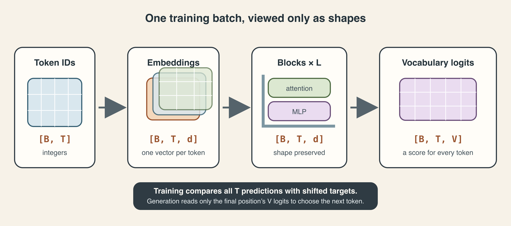
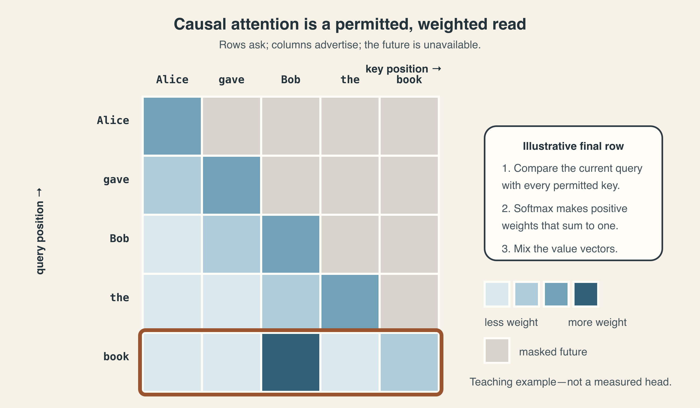
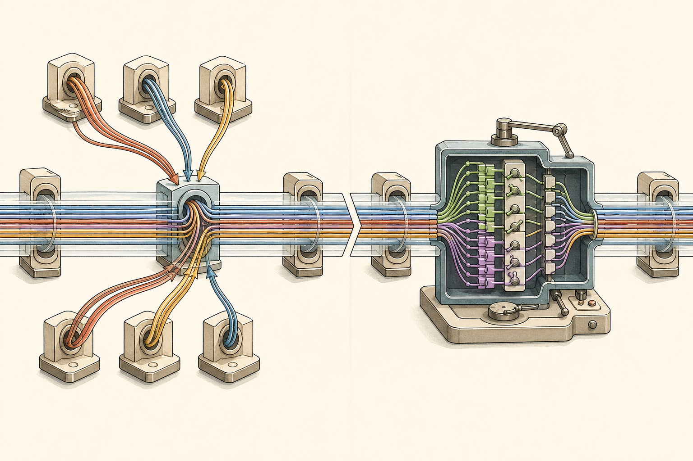
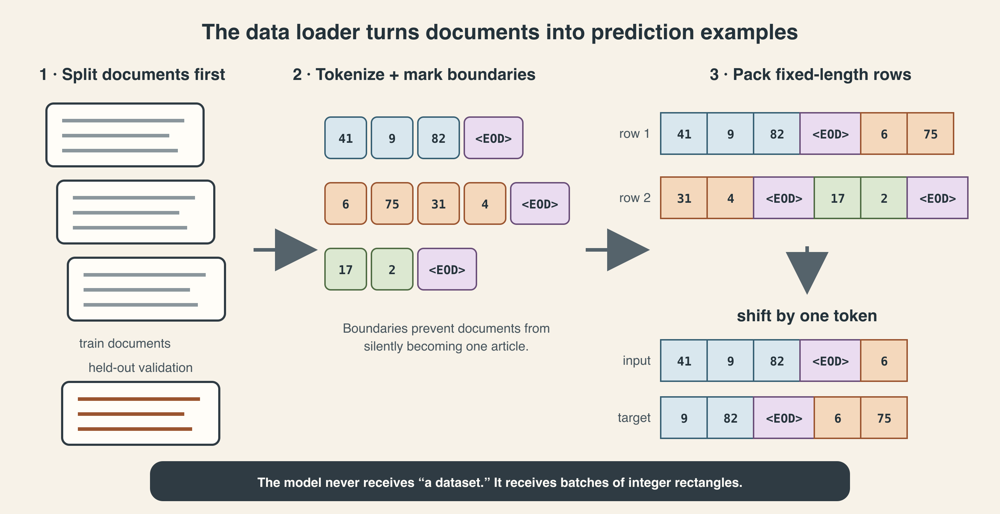
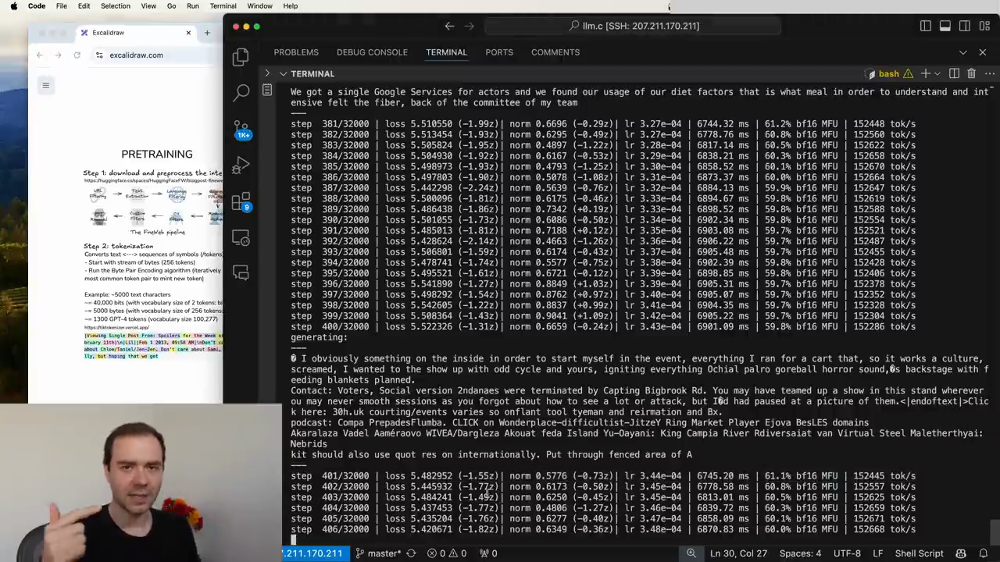

# Inside nanoGPT, line by line

*A code-reading book about the 330 lines where token IDs become a language model.*

---

## Before opening the file

There is a moment in learning Transformers when the diagrams stop being enough.

You know that attention compares queries with keys. You know an MLP follows attention. You know residual connections preserve a route through depth. Yet a real implementation still feels oddly compressed: one linear layer produces three different tensors; four dimensions appear after a `view`; an innocent-looking list containing `-1` changes the inference API; and six lines of generation somehow turn a trained predictor into a text-producing machine.

Karpathy's `nanoGPT/model.py` is an unusually good bridge across that gap. It is short enough to hold in your head and complete enough to train or import a real GPT-2. It does not hide the model inside a framework abstraction. The important tensors are visible.

This book reads that file in execution order. The central question is never merely, “What does this line call?” It is:

> What mathematical operation is this line implementing, what shape does it produce, and what contract does the next line expect?

The answer will often reveal more than a class diagram would.

### The exact source used here

All line links and code-specific claims refer to official nanoGPT master commit [`3adf61e154c3fe3fca428ad6bc3818b27a3b8291`](https://github.com/karpathy/nanoGPT/tree/3adf61e154c3fe3fca428ad6bc3818b27a3b8291), verified on August 4, 2026. The pinned [`model.py`](https://github.com/karpathy/nanoGPT/blob/3adf61e154c3fe3fca428ad6bc3818b27a3b8291/model.py) contains 330 physical lines.

The repository's [README notice](https://github.com/karpathy/nanoGPT/blob/3adf61e154c3fe3fca428ad6bc3818b27a3b8291/README.md#L7-L11) has carried an important message since November 2025: nanoGPT is old and deprecated, and Karpathy points people beginning new work toward [nanochat](https://github.com/karpathy/nanochat). That does not make this reading exercise obsolete. It makes its purpose precise. We are studying a compact, historically influential GPT-2 implementation, not adopting it uncritically as a 2026 production stack.

Modern systems may use rotary positions, RMSNorm, gated MLPs, grouped-query attention, KV caches, distributed sharding, and much more. nanoGPT gives us the clean chassis against which those changes become legible.

### What you should already know

This is not a general introduction to neural networks. It assumes you understand parameters, matrix multiplication, activations, gradient descent, and tokenization at a working level. Brief reminders appear where they clarify the code, but we will not spend a chapter proving that a linear layer is useful.

The book concentrates on the Transformer-specific seams that often remain fuzzy even after someone has trained other deep-learning models:

- why a single projection can create every query, key, and value;
- why head splitting is mostly a reshape, not a new learned operation;
- how the causal mask makes all positions safe to train in parallel;
- what the “Flash Attention” branch really promises and what it does not;
- why pre-normalization and residual addition appear in that exact order;
- how weight tying forces the input and output sides to share a geometry;
- why training returns logits for every position while inference projects only the last;
- how `model.py` depends on shifted batches created elsewhere;
- what parameter counting, context cropping, optimizer grouping, and MFU estimation are actually measuring;
- why generation works—and why this particular generator is intentionally inefficient.

### How to read this book

On a first pass, read the prose, the shape tables, and the “code-reading lens” callouts. Skip derivations when the conclusion already feels secure.

On a second pass, keep the pinned source open. Follow each stable line link, predict the next tensor shape before reading the answer, and work the quizzes without looking back.

On a third pass, run a tiny configuration and instrument it. The final guided reread tells you exactly where to put hooks and assertions.

The excerpts are deliberately short. This is a commentary on the source, not a substitute for opening it.

---

## 0. The entire file in one map

`model.py` defines one main object, `GPT`, using four smaller pieces:

```text
GPT
├── token embedding table
├── position embedding table
├── dropout
├── Block × n_layer
│   ├── LayerNorm
│   ├── CausalSelfAttention
│   ├── LayerNorm
│   └── MLP
├── final LayerNorm
└── language-model head
```

That is the static module tree. The dynamic path through it is:

```text
token IDs (B, T)
  ↓ token lookup + position lookup
residual stream (B, T, C)
  ↓ [norm → causal attention → add] × one
  ↓ [norm → MLP → add]             × one
  ↓ repeat both updates L times
final normalized states (B, T, C)
  ↓ vocabulary projection
logits (B, T, V) during training
or logits (B, 1, V) during inference
```

Here and throughout:

| Symbol | Meaning | GPT-2-small default |
|---|---|---:|
| (B) | batch size | chosen by `train.py` |
| (T) | sequence length in this call | at most 1,024 |
| (C) | embedding or residual width, `n_embd` | 768 |
| (L) | number of Transformer blocks, `n_layer` | 12 |
| (H) | number of attention heads, `n_head` | 12 |
| (D) | width per head, (C/H) | 64 |
| (V) | vocabulary table size | 50,304 from scratch |

The visual below shows the same journey. nanoGPT's names differ slightly—`wte`, `wpe`, `h`, and `lm_head`—but the shapes are exact.



*During training, nanoGPT creates vocabulary logits at all (T) positions. Without targets, it creates them only for the final position.*

### The source map

The file is unusually linear. These are the landmarks:

| Source region | What it defines |
|---|---|
| [lines 10–16](https://github.com/karpathy/nanoGPT/blob/3adf61e154c3fe3fca428ad6bc3818b27a3b8291/model.py#L10-L16) | imports |
| [lines 18–27](https://github.com/karpathy/nanoGPT/blob/3adf61e154c3fe3fca428ad6bc3818b27a3b8291/model.py#L18-L27) | optional-bias LayerNorm |
| [lines 29–76](https://github.com/karpathy/nanoGPT/blob/3adf61e154c3fe3fca428ad6bc3818b27a3b8291/model.py#L29-L76) | causal multi-head self-attention |
| [lines 78–92](https://github.com/karpathy/nanoGPT/blob/3adf61e154c3fe3fca428ad6bc3818b27a3b8291/model.py#L78-L92) | position-wise MLP |
| [lines 94–106](https://github.com/karpathy/nanoGPT/blob/3adf61e154c3fe3fca428ad6bc3818b27a3b8291/model.py#L94-L106) | pre-norm residual block |
| [lines 108–116](https://github.com/karpathy/nanoGPT/blob/3adf61e154c3fe3fca428ad6bc3818b27a3b8291/model.py#L108-L116) | configuration schema |
| [lines 118–168](https://github.com/karpathy/nanoGPT/blob/3adf61e154c3fe3fca428ad6bc3818b27a3b8291/model.py#L118-L168) | GPT construction, tying, initialization, counting |
| [lines 170–193](https://github.com/karpathy/nanoGPT/blob/3adf61e154c3fe3fca428ad6bc3818b27a3b8291/model.py#L170-L193) | forward pass and loss |
| [lines 195–204](https://github.com/karpathy/nanoGPT/blob/3adf61e154c3fe3fca428ad6bc3818b27a3b8291/model.py#L195-L204) | context-window surgery |
| [lines 206–261](https://github.com/karpathy/nanoGPT/blob/3adf61e154c3fe3fca428ad6bc3818b27a3b8291/model.py#L206-L261) | GPT-2 checkpoint importer |
| [lines 263–287](https://github.com/karpathy/nanoGPT/blob/3adf61e154c3fe3fca428ad6bc3818b27a3b8291/model.py#L263-L287) | AdamW parameter grouping |
| [lines 289–303](https://github.com/karpathy/nanoGPT/blob/3adf61e154c3fe3fca428ad6bc3818b27a3b8291/model.py#L289-L303) | model FLOPs utilization estimate |
| [lines 305–330](https://github.com/karpathy/nanoGPT/blob/3adf61e154c3fe3fca428ad6bc3818b27a3b8291/model.py#L305-L330) | autoregressive sampling |

One productive way to view this organization is as a sequence of contracts. LayerNorm promises to preserve shape. Attention promises to return a residual update of shape `(B,T,C)`. The MLP makes the same promise. A Block can therefore add either result back to its input. `GPT` can stack any number of Blocks without changing the external width. Only the final head changes (C) into (V).

The whole design becomes easier to read once you track promises rather than class names.

---

## 1. Imports and configuration: the quiet architecture

The [imports](https://github.com/karpathy/nanoGPT/blob/3adf61e154c3fe3fca428ad6bc3818b27a3b8291/model.py#L10-L16) look almost trivial:

```python
import math
import inspect
from dataclasses import dataclass
```

Then come PyTorch, `torch.nn`, and the functional namespace `F`.

Each import previews a later design choice:

- `math` supplies square roots in attention scaling and residual initialization.
- `inspect` lets the code ask whether the installed `AdamW` exposes a fused implementation.
- `dataclass` makes the architecture configuration a small typed value object.
- `nn` supplies stateful modules and registered parameters.
- `F` supplies stateless operations such as layer normalization, softmax, cross-entropy, and scaled dot-product attention.

This distinction between a module and a functional operation matters. An `nn.Linear` owns learned weights. `F.softmax` owns nothing; it transforms the tensor it receives. `LayerNorm`, as nanoGPT defines it, owns scale and optional bias but delegates the arithmetic to `F.layer_norm`.

### `GPTConfig` is more than convenience

The configuration appears after the small modules, at [lines 108–116](https://github.com/karpathy/nanoGPT/blob/3adf61e154c3fe3fca428ad6bc3818b27a3b8291/model.py#L108-L116):

```python
@dataclass
class GPTConfig:
    block_size: int = 1024
    n_layer: int = 12
    n_head: int = 12
    n_embd: int = 768
```

The omitted fields are `vocab_size`, `dropout`, and `bias`.

These seven values divide into different kinds of contract:

| Field | What it governs | Can old weights survive a change? |
|---|---|---|
| `vocab_size` | rows in token table and output head | usually no |
| `block_size` | number of learned position rows and manual-mask size | can shrink with surgery |
| `n_layer` | number of Blocks | no |
| `n_head` | head partition of width | not without remapping behavior |
| `n_embd` | residual width and most matrix shapes | no |
| `dropout` | stochastic regularization | yes; no learned shape change |
| `bias` | whether Linear and LayerNorm offsets exist | no for strict checkpoint loading |

This explains a later detail in `from_pretrained`: dropout is the only allowed override. It changes behavior without changing parameter shapes. The other fields participate in the checkpoint's schema.

### Two defaults that are easy to misread

First, the class default vocabulary size is **50,304**, not GPT-2's actual 50,257. The extra 47 rows are padding for favorable matrix dimensions. They are legal output classes but do not correspond to normal GPT-2 tokens. When importing an actual GPT-2 checkpoint, nanoGPT forces the exact 50,257 rows.

Second, `GPTConfig.bias` defaults to `True` to match GPT-2, while [`train.py` defaults `bias=False`](https://github.com/karpathy/nanoGPT/blob/3adf61e154c3fe3fca428ad6bc3818b27a3b8291/train.py#L51-L56) for a from-scratch nanoGPT run. Reading only `model.py` and saying “nanoGPT trains with bias” would therefore be wrong. A model definition describes possible construction; the training script selects one construction.

> **Code-reading lens:** Defaults have scope. Ask whether a value is the class default, the training-script default, a config-file override, or a checkpoint-forced value.

---

## 2. LayerNorm: normalize each token's feature vector

The first defined module is only ten lines long. That is enough to hide three important ideas.

The implementation at [lines 18–27](https://github.com/karpathy/nanoGPT/blob/3adf61e154c3fe3fca428ad6bc3818b27a3b8291/model.py#L18-L27) creates a learned gain and an optional learned offset:

```python
self.weight = nn.Parameter(torch.ones(ndim))
self.bias = nn.Parameter(torch.zeros(ndim)) if bias else None
```

For a token vector $x \in \mathbb{R}^{C}$, LayerNorm computes

\[
\mu = \frac{1}{C}\sum_{j=1}^{C}x_j
\]

\[
\sigma^2 = \frac{1}{C}\sum_{j=1}^{C}(x_j-\mu)^2
\]

\[
y_j = \gamma_j\frac{x_j-\mu}{\sqrt{\sigma^2+\epsilon}}+\beta_j.
\]

In nanoGPT, $\epsilon=10^{-5}$, $\gamma$ is `weight`, and $\beta$ is `bias` when enabled. The initial $\gamma=1$ and $\beta=0$, so the learned affine part begins as an identity transformation after normalization.

### Which axis is normalized?

Suppose `input` has shape `(B,T,C)`. `self.weight.shape` is `(C,)`. Passing that as the normalized shape tells PyTorch to compute separate statistics over the final (C) features for every `(batch, position)` pair.

It does **not** average:

- across examples in the batch;
- across token positions;
- across the entire tensor.

Token 7 in example 2 gets its own mean and variance across its 768 features. This independence is one reason LayerNorm works the same way at train and evaluation time, unlike BatchNorm's moving-statistics behavior. That follows the original [Layer Normalization paper](https://arxiv.org/abs/1607.06450).

For `(B,T,C) = (4,128,768)`:

| Item | Shape |
|---|---|
| input | `(4,128,768)` |
| per-token mean | conceptually `(4,128,1)` |
| per-token variance | conceptually `(4,128,1)` |
| learned gain $\gamma$ | `(768,)` |
| learned offset $\beta$ | `(768,)` or absent |
| output | `(4,128,768)` |

Broadcasting applies the same learned $\gamma$ and $\beta$ feature-by-feature to every token.

### Why define a custom LayerNorm?

The reason is not a novel normalization algorithm. It is the `bias` switch. The source predates a convenient way to say “learn a scale but no offset” through the high-level `nn.LayerNorm` API it targeted. nanoGPT therefore registers `bias=None` when offsets are disabled and calls `F.layer_norm` directly.

This has a downstream consequence in parameter counting and optimizer grouping:

- with bias, each LayerNorm owns (2C) scalars;
- without bias, it owns (C) scalars;
- either way, those tensors are one-dimensional and nanoGPT excludes them from weight decay.

### What LayerNorm changes—and preserves

It changes the scale and centering of a token's current feature vector. It preserves:

- tensor shape;
- token order;
- separation between examples;
- the ability of learned $\gamma$ and $\beta$ to restore useful feature-specific scales.

It is therefore a conditioning operation, not a content-erasing reset. The direction of the normalized vector still varies with the token's state, and the following learned projections can interpret that direction.

### Debugging lens: the zero-variance token

Imagine every feature in one token vector is exactly 3. Without $\epsilon$, the standard deviation is zero and normalization divides by zero. Adding $10^{-5}$ makes the operation finite. The normalized part becomes all zeros; with bias disabled the output is zero, and with bias enabled the output is $\beta$.

In a real run, useful diagnostics around normalization include:

- non-finite activations before or after the norm;
- unexpectedly huge input RMS, which the norm may hide from downstream layers while gradients still reveal instability;
- learned gain values growing or collapsing in particular layers;
- accidentally normalizing across the wrong dimension in a modification.

The strongest shape assertion is simple:

```python
assert norm(x).shape == x.shape
```

Shape correctness is necessary, not sufficient, but it catches a surprising class of axis mistakes.

### Checkpoint 1

1. For an input shaped `(8,256,768)`, how many separate means does LayerNorm compute?

   - A. 1
   - B. 8
   - C. 256
   - D. $8 \times 256$

2. Setting `bias=False` in nanoGPT's LayerNorm removes which object?

   - A. The normalization mean
   - B. The epsilon
   - C. The learned offset $\beta$
   - D. The learned gain $\gamma$

3. Why can LayerNorm preserve useful information even though it standardizes a vector?

#### Answers

1. **D.** Every batch-position pair gets statistics across its final 768 features.
2. **C.** The gain remains. Only the learned additive offset is absent.
3. It preserves the vector's feature pattern or direction, keeps learned per-feature gains, and does not mix tokens or examples. Standardizing scale is not the same as making all token vectors equal.

---

## 3. Causal self-attention: the file's dense center

Nearly every confusing tensor maneuver in `model.py` is concentrated in [lines 29–76](https://github.com/karpathy/nanoGPT/blob/3adf61e154c3fe3fca428ad6bc3818b27a3b8291/model.py#L29-L76). We will slow those 48 lines down.

Attention receives the residual stream $X \in \mathbb{R}^{B\times T\times C}$ and returns another tensor of exactly the same shape. Internally, it temporarily exposes two different structures:

1. a head axis, because multiple retrieval patterns operate in parallel;
2. a query-by-key position grid, because every allowed position can score earlier positions.

The shape expands and folds back:

```text
(B, T, C)
  → project Q, K, V
three tensors (B, T, C)
  → split C into H heads of width D
three tensors (B, H, T, D)
  → compare Q with K
scores (B, H, T, T)
  → weighted sum of V
values (B, H, T, D)
  → concatenate heads
(B, T, C)
  → output projection
(B, T, C)
```

No magic dimension appears. $C=H\times D$, and the second $T$ in the score matrix is the set of possible source positions.



*Rows are query positions; columns are key/value positions. The forbidden upper triangle is what makes parallel training compatible with next-token prediction.*

### 3.1 Construction: one packed projection, one output projection

The constructor first enforces divisibility:

```python
assert config.n_embd % config.n_head == 0
```

If (C) cannot be split evenly across (H), the later `view` has no valid integer head width. For GPT-2 small, (768/12=64).

Then it defines a packed input projection and a normal output projection:

```python
self.c_attn = nn.Linear(C, 3 * C, bias=config.bias)
self.c_proj = nn.Linear(C, C, bias=config.bias)
```

`c_attn` has weight shape `(3C,C)` in PyTorch's `nn.Linear` convention. For each token vector, it performs one matrix multiplication that produces (3C) numbers. Those numbers are laid out as a (C)-wide query segment, a (C)-wide key segment, and a (C)-wide value segment.

Mathematically, writing separate matrices is clearer:

\[
Q=XW_Q^\top,\qquad K=XW_K^\top,\qquad V=XW_V^\top.
\]

The packed implementation simply stacks the three weight matrices:

\[
W_{QKV}=
\begin{bmatrix}
W_Q\\W_K\\W_V
\end{bmatrix},
\qquad
[Q\;K\;V]=XW_{QKV}^{\top}.
\]

Packing does not force queries, keys, and values to use the same weights. They occupy different rows of one larger parameter tensor. It reduces Python and kernel overhead and lets hardware handle one larger matrix multiplication.

The output projection `c_proj` has a different job. After heads produce and concatenate their retrieved information, `c_proj` learns how to mix those head features back into a residual update.

### 3.2 Split the packed result

The forward pass begins:

```python
B, T, C = x.size()
q, k, v = self.c_attn(x).split(self.n_embd, dim=2)
```

If `x` is `(B,T,C)`, the linear layer operates independently at every `(B,T)` location and produces `(B,T,3C)`. `.split(C, dim=2)` cuts the last dimension into three views, each `(B,T,C)`.

The choice `dim=2` is not incidental. Dimension 0 is examples; dimension 1 is positions; dimension 2 is features. Splitting along positions would divide the sentence into thirds rather than divide each projected token into Q, K, and V.

### 3.3 Reveal the heads

Each of Q, K, and V is reshaped and transposed:

```python
q = q.view(B, T, H, C // H).transpose(1, 2)
```

The `view` changes `(B,T,C)` into `(B,T,H,D)`. It does not learn anything and does not copy the numerical content into new semantic features. It declares that consecutive chunks of the last dimension belong to different heads.

The transpose changes `(B,T,H,D)` into `(B,H,T,D)`. Why put heads before positions? Because PyTorch's batched matrix multiplication treats the leading dimensions as batch dimensions. With `(B,H,T,D)`, each example-head pair independently multiplies a `T×D` query matrix by a `D×T` key matrix.

This is the first major intuition:

> Multi-head attention is one large projected feature vector partitioned into head-sized subspaces, followed by the same attention algebra independently in each subspace.

The heads become different because their slices come from different learned rows of the QKV projection—not because Python loops over named specialists.

### 3.4 The score matrix

For one example and one head:

\[
Q_h\in\mathbb{R}^{T\times D},\qquad
K_h\in\mathbb{R}^{T\times D}.
\]

The raw compatibility grid is

\[
S_h=\frac{Q_hK_h^\top}{\sqrt{D}}
\in\mathbb{R}^{T\times T}.
\]

Entry (S_{i,j}) measures how strongly the query at destination position (i) matches the key at source position (j). This orientation is worth memorizing:

- row (i): who does token (i) want to read from?
- column (j): how much does source token (j) offer to that query?

Across batches and heads, the tensor is `(B,H,T,T)`.

Why divide by (sqrt{D})? If query and key components have roughly unit variance, their dot product sums (D) terms and its variance grows with (D). Dividing by (sqrt D) keeps scores in a range where softmax is less likely to saturate immediately. This is the scaled dot-product attention from [Attention Is All You Need](https://arxiv.org/abs/1706.03762).

### 3.5 Causality is a restriction on information flow

A next-token model may use the token at position (i) and anything earlier to predict position (i+1). It must not inspect tokens farther right.

The slow-path constructor registers a lower-triangular matrix:

```python
self.register_buffer(
    "bias", torch.tril(torch.ones(block_size, block_size))
)
```

The actual source adds singleton batch and head dimensions, producing `(1,1,block_size,block_size)`. Those singleton dimensions broadcast over all (B) examples and (H) heads.

It is registered as a **buffer**, not a parameter:

- it moves with the module between CPU and GPU;
- it appears in the state dictionary;
- the optimizer does not update it;
- it receives no gradient.

During a call with actual length (T), the code slices the top-left `T×T` portion and turns forbidden scores into negative infinity:

```python
att = att.masked_fill(mask == 0, float('-inf'))
```

Softmax assigns $e^{-\infty}=0$ probability to those positions. The mask is not a gentle penalty. It makes future attention probability exactly zero in ideal arithmetic.

This is why training can process the entire sequence at once. Every row computes a different next-token example, but the upper triangle prevents a row from reading its answer.

### 3.6 Softmax and value retrieval

After masking:

\[
A_{i,:}=\operatorname{softmax}(S_{i,:}).
\]

Call this pre-dropout probability matrix $A$. Every row of $A$ sums to one: masked locations receive zero probability and the remaining locations share all the mass.

In evaluation mode, or whenever the configured dropout rate is zero, value retrieval is simply

\[
Y_h=AV_h,
\]

where $A\in\mathbb{R}^{T\times T}$ and $V_h\in\mathbb{R}^{T\times D}$, yielding $Y_h\in\mathbb{R}^{T\times D}$.

Training with attention dropout inserts a distinct matrix between those two steps:

\[
A'=\operatorname{Dropout}(A),
\qquad
Y_h=A'V_h.
\]

PyTorch uses inverted dropout. If the drop probability is $p$, each retained entry is scaled by $1/(1-p)$. Therefore $\mathbb{E}[A']=A$ and the **expected** row sum remains one, but a particular sampled row of $A'$ generally does not sum to one. This distinction matters when inspecting attention maps: $A$ is a normalized probability distribution; $A'$ is the stochastic, rescaled matrix actually used to mix values during that training pass.

A row-sum assertion belongs immediately after softmax, before dropout. Give it a tolerance appropriate to the active dtype and backend; `rtol=atol=1e-5` is a reasonable FP32 starting point, while lower-precision formats need a looser threshold—often around `1e-3` for FP16 and `1e-2` for BF16. The tolerance is for rounding error, not for excusing a wrong softmax dimension.

Queries and keys decide **where to read**. Values contain **what is read**. A source position can match a query through one learned representation and contribute different content through another.

The manual path at [lines 66–71](https://github.com/karpathy/nanoGPT/blob/3adf61e154c3fe3fca428ad6bc3818b27a3b8291/model.py#L66-L71) is the complete textbook algorithm:

1. $QK^\top/\sqrt D$
2. causal mask
3. softmax
4. dropout on attention probabilities
5. multiply by $V$

### 3.7 The fast path: an API, not a guaranteed kernel

If `torch.nn.functional` exposes `scaled_dot_product_attention`, nanoGPT calls it with `is_causal=True`:

```python
y = F.scaled_dot_product_attention(
    q, k, v, dropout_p=p if self.training else 0,
    is_causal=True,
)
```

The source calls this the Flash Attention path. The precise modern reading is more nuanced.

PyTorch's scaled-dot-product-attention API may dispatch among multiple implementations depending on device, dtype, shape, and backend availability: a FlashAttention-style fused kernel, another memory-efficient kernel, or a math implementation. The presence of the Python function proves the API exists; it does not prove that a particular call on a particular machine uses FlashAttention.

The important semantic promise is that the API computes scaled dot-product attention with causal masking. The performance mechanism is selected underneath. PyTorch's [official SDPA documentation](https://docs.pytorch.org/docs/stable/generated/torch.nn.functional.scaled_dot_product_attention.html) describes the backends and their constraints.

The original [FlashAttention paper](https://arxiv.org/abs/2205.14135) is also frequently misunderstood. FlashAttention is **exact attention** in the algorithmic sense. It does not approximate away arbitrary tokens. It tiles the computation to reduce expensive reads and writes between GPU memory levels and avoids materializing the full probability matrix in high-bandwidth memory. Floating-point ordering can still create small numerical differences.

One subtlety in nanoGPT is excellent practice:

```python
dropout_p=self.dropout if self.training else 0
```

The functional SDPA call does not infer the module's evaluation mode. Passing a nonzero `dropout_p` would still apply dropout. nanoGPT explicitly sends zero in evaluation mode. The manual branch uses an `nn.Dropout` module, which *does* inspect `self.training` automatically.

### 3.8 Put the heads back together

After attention, `y` is `(B,H,T,D)`. The file performs:

```python
y = y.transpose(1, 2).contiguous().view(B, T, C)
```

Transpose gives `(B,T,H,D)`. Viewing the last two dimensions together concatenates the heads back into width $C=H\times D$.

Why `.contiguous()`? A transpose usually changes tensor strides without physically rearranging storage. The logical order becomes `(B,T,H,D)`, but adjacent logical entries may not be adjacent in memory. `.view` requires a compatible storage layout. `.contiguous()` materializes the transposed order so flattening `(H,D)` into (C) is valid and unsurprising.

Finally:

\[
\operatorname{Attention}(X)=\operatorname{Dropout}(YW_O^\top+b_O),
\]

where the output projection mixes information across head features and returns `(B,T,C)`. The Block can now add it to the residual stream.

### 3.9 A worked shape trace

Use a deliberately small configuration:

```text
B = 2 examples
T = 4 tokens
C = 12 features
H = 3 heads
D = 4 features per head
```

| Operation | Shape | Element count |
|---|---:|---:|
| `x` | `(2,4,12)` | 96 |
| `c_attn(x)` | `(2,4,36)` | 288 |
| each of `q,k,v` after split | `(2,4,12)` | 96 |
| each after head reshape | `(2,3,4,4)` | 96 |
| `q @ k.transpose(-2,-1)` | `(2,3,4,4)` | 96 |
| masked/softmax attention | `(2,3,4,4)` | 96 |
| `att @ v` | `(2,3,4,4)` | 96 |
| concatenate heads | `(2,4,12)` | 96 |
| output projection | `(2,4,12)` | 96 |

Notice two different tensors share `(2,3,4,4)` here only because (T=D=4). One is a position-by-position score grid; the other is position-by-feature head output. Equal shapes do not imply equal semantics. In debugging, name axes—not just integer tuples.

### 3.10 Parameter arithmetic for attention

Ignoring biases:

- QKV projection: $C\times3C=3C^2$
- output projection: $C\times C=C^2$
- total: (4C^2)

At (C=768), that is 2,359,296 weights per attention module. With bias enabled, add (3C+C=4C=3,072) scalars.

Increasing the number of heads while holding (C) fixed does **not** change this projection parameter count. It changes the partition: more heads, smaller (D). Increasing (C) is expensive because the leading term grows quadratically.

### Debugging lens: five failures that still have plausible shapes

1. **No causal mask.** Every tensor shape is valid; training loss becomes suspiciously good because positions can read future answers.
2. **Softmax over the wrong dimension.** The output still has `(B,H,T,T)`, but weights normalize across queries rather than sources.
3. **Training dropout during evaluation.** Shapes remain valid; generation becomes unnecessarily stochastic even with the same RNG controls.
4. **Incorrect QKV ordering when importing weights.** Shapes agree; behavior is nonsense.
5. **Forgetting the output projection.** The tensor can still be reshaped to `(B,T,C)`, but heads never receive a learned post-retrieval mixing step and imported GPT-2 weights no longer align.

A useful manual-path assertion belongs **immediately after softmax and before attention dropout**:

```python
att = F.softmax(att, dim=-1)
row_sums = att.sum(dim=-1)  # check before self.attn_dropout(att)
tol = {
    torch.float64: 1e-7,
    torch.float32: 1e-5,
    torch.float16: 1e-3,
    torch.bfloat16: 1e-2,
}[att.dtype]
torch.testing.assert_close(
    row_sums, torch.ones_like(row_sums), rtol=tol, atol=tol
)
```

PyTorch dropout uses inverted scaling: retained probabilities are enlarged so the dropped tensor has the right expectation. A realized training-time row therefore does not generally sum to one after `self.attn_dropout(att)`. The post-dropout row-sum assertion is valid only in evaluation mode or when dropout is zero. In training, it is the **expectation over dropout masks**, not every sampled row, that preserves the pre-dropout total.

To test causality, perturb a future input token and verify that outputs at earlier positions do not change in evaluation mode. This behavioral test catches more than a mask-shape inspection.

### Checkpoint 2

1. `c_attn(x)` has shape `(B,T,3C)`. Does this mean Q, K, and V share weights?

2. Why transpose `(B,T,H,D)` to `(B,H,T,D)` before the attention matrix multiplication?

3. Holding (C=768) fixed, changing from 12 heads to 24 heads does what to (D) and the QKV weight count?

4. Which claim is most accurate?

   - A. nanoGPT always executes the original FlashAttention CUDA kernel when `self.flash` is true.
   - B. nanoGPT calls PyTorch SDPA, which may select a fused or math backend.
   - C. FlashAttention approximates attention by dropping low-score keys.
   - D. The fast branch does not apply causality.

5. Why is `.contiguous()` placed between transpose and view?

#### Answers

1. No. One packed matrix contains three independent row blocks; packing fuses the operation, not the learned parameters.
2. It makes `(B,H)` the batch-like dimensions, leaving a `T×D` matrix per example and head for batched multiplication.
3. (D) falls from 64 to 32. The packed projection remains `(3C,C)`, so its weight count is unchanged.
4. **B.** The function is a dispatcher. Kernel choice depends on the runtime conditions.
5. Transpose changes strides. Contiguity places elements in a storage order that can safely flatten head and head-feature axes into (C).

---

## 4. The MLP: transform features without mixing positions

After attention lets positions exchange information, the MLP gives each position a larger private workspace in which to transform what it has gathered.

The entire module is at [lines 78–92](https://github.com/karpathy/nanoGPT/blob/3adf61e154c3fe3fca428ad6bc3818b27a3b8291/model.py#L78-L92):

```python
self.c_fc = nn.Linear(C, 4 * C, bias=bias)
self.gelu = nn.GELU()
self.c_proj = nn.Linear(4 * C, C, bias=bias)
```

Its equation is

\[
\operatorname{MLP}(x)=
\operatorname{Dropout}\left(
W_2\operatorname{GELU}(W_1x+b_1)+b_2
\right).
\]

For every position, the path is:

```text
C features
  ↓ learned expansion
4C features
  ↓ GELU
4C features
  ↓ learned compression
C features
  ↓ dropout
C-feature residual update
```

At GPT-2-small width, `768 → 3072 → 768`.

### Token mixing versus feature mixing

This division of labor is one of the most useful Transformer intuitions:

- **Attention mixes information across token positions.** Its temporary grid is `(T,T)` per head.
- **The MLP mixes features within each position.** The same two matrices are applied separately at every `(B,T)` location.

An `nn.Linear` applied to `(B,T,C)` operates on the final dimension. It does not flatten the sequence. If you permuted the token positions immediately before the MLP and reversed that permutation immediately after, the MLP result would be unchanged apart from the permutation. Attention would generally not have that property because positions interact.

Calling the MLP “position-wise” does not make it context-free. Its input vector at position $i$ already contains context retrieved by attention in this block and previous blocks. The MLP transforms a contextual representation independently at each position.

### Why expand to four times the width?

The factor four is a GPT-2 architectural convention, not a theorem. Expansion gives the nonlinear layer a broader hidden basis. A useful way to picture it is:

1. project the residual vector into many candidate feature detectors;
2. gate them smoothly through GELU;
3. recombine activated features into an update at residual width.

The expansion is also where many Transformer parameters live. Ignoring bias:

\[
C(4C)+(4C)C=8C^2.
\]

At $C=768$, that is 4,718,592 weights per MLP—twice the attention projection weights in the same block. Saying “attention is the whole model” misses a large fraction of its learned capacity and compute.

### What GELU is doing

GELU is

\[
\operatorname{GELU}(x)=x\Phi(x),
\]

where $\Phi$ is the standard Gaussian cumulative distribution function. Unlike ReLU's hard rule “keep positive, zero negative,” GELU smoothly weights inputs according to magnitude. Small negative values can pass weakly; large positive values pass nearly unchanged. The definition comes from the [GELU paper](https://arxiv.org/abs/1606.08415).

nanoGPT uses `nn.GELU()` without selecting the tanh approximation. In the PyTorch API, that means the default exact formulation $x\Phi(x)$.

That is **not** the activation recorded in the released GPT-2 configuration. The official Hugging Face [GPT-2 config](https://huggingface.co/openai-community/gpt2/blob/main/config.json) specifies `"activation_function": "gelu_new"`, the tanh-based GELU approximation. Its formula corresponds to PyTorch's `nn.GELU(approximate="tanh")`.

This creates a small but real compatibility gap: nanoGPT's `from_pretrained` copies the released matrices and vectors, but its unchanged `nn.GELU()` applies a different nonlinear operation. The imported model can still behave very similarly, yet it is not an exact operational rewrite of released GPT-2 and should not be expected to reproduce Hugging Face logits exactly. If exact GPT-2 activation compatibility is the goal, use the tanh approximation and pin the surrounding dependency versions before testing equivalence. Section 9 identifies a second, training-mode mismatch in the dropout policy.

### Why `c_proj` appears twice in every Block

Both the attention module and the MLP name their final compression matrix `c_proj`. This is not accidental naming trivia. Later, GPT initialization finds every parameter whose name ends in `c_proj.weight` and applies depth-scaled initialization. Each block contributes two updates to the residual stream, and both projections are the final learned step on those branches.

### Dropout placement

The MLP applies dropout **after** compression back to (C). The residual shortcut is outside this module, so dropout affects the proposed update, not the existing residual stream.

With `dropout=0`, which nanoGPT uses by default for pretraining, the operation is an identity. With dropout active, `model.train()` samples a mask; `model.eval()` disables it. This is another reason inference code must call `eval()` even though generation is wrapped in `no_grad()`—gradient tracking and train/eval behavior are separate switches.

### Debugging lens

Useful MLP checks include:

- `c_fc(x).shape[-1] == 4 * C`;
- the final output shape equals the input shape;
- activation distributions are neither all near zero nor explosively large;
- `model.eval()` makes repeated MLP calls deterministic for fixed input;
- both MLP matrices, not just one, are present in the optimizer.

A common modification is a gated MLP such as SwiGLU. That is not a one-line activation replacement: it usually changes the input projection to produce two branches, multiplies a gated branch by a value branch, and adjusts hidden width to manage parameter count. The clean $C\to4C\to C$ trace is the baseline against which that change should be reasoned.

---

## 5. `Block`: two residual updates, both pre-normalized

The `Block` constructor merely assembles modules. Its forward pass at [lines 103–106](https://github.com/karpathy/nanoGPT/blob/3adf61e154c3fe3fca428ad6bc3818b27a3b8291/model.py#L103-L106) is the architecture:

```python
x = x + self.attn(self.ln_1(x))
x = x + self.mlp(self.ln_2(x))
```

In equations:

\[
x' = x + \operatorname{Attention}(\operatorname{LN}_1(x)),
\]

\[
x'' = x' + \operatorname{MLP}(\operatorname{LN}_2(x')).
\]

The output (x'') becomes the next block's input.



*The residual stream stays at width (C). Attention and the MLP are workshops that propose additions to it.*

### Read the nesting from the inside out

For the first line:

1. `ln_1(x)` normalizes each token's current feature vector.
2. `attn(...)` lets tokens retrieve from allowed positions.
3. the result is an update shaped exactly like `x`.
4. `x + ...` writes that update into the residual stream.

The second line repeats the pattern with a fresh norm and a position-wise MLP. Importantly, it uses the already updated `x`. The MLP sees attention's contribution from the same block.

### Pre-norm, not post-norm

Normalization occurs before each sublayer. This is called **pre-norm**. A post-norm alternative would look conceptually like

\[
x'=\operatorname{LN}(x+\operatorname{Attention}(x)).
\]

GPT-2 moved normalization to the input of each sub-block and added a final norm after the stack, as described in its [technical report](https://cdn.openai.com/better-language-models/language_models_are_unsupervised_multitask_learners.pdf). nanoGPT follows that arrangement.

Pre-norm gives the residual path an especially direct identity route through depth. If a sublayer initially proposes a small update, the block is close to $x\mapsto x$. In backpropagation, the derivative includes an identity term:

\[
\frac{\partial}{\partial x}\left[x+f(\operatorname{LN}(x))\right]
= I + \frac{\partial f}{\partial x}.
\]

The model does not need every sublayer's Jacobian to transmit the entire learning signal. This does not make deep optimization automatic, but it is a major structural aid.

### The residual stream is the model's shared workspace

It is tempting to say the attention output “replaces” a token representation. The code says otherwise. Each branch adds to a persistent (C)-dimensional stream.

Across depth, this stream can hold a superposition of many features:

- token identity and position traces;
- syntactic relations retrieved by attention;
- entity or topic information;
- local computations formed by MLPs;
- features used only by much later layers.

Nothing in the code allocates named slots for those concepts. They are learned directions and patterns in a common vector space.

### Why shape preservation is architectural leverage

Both branches accept `(B,T,C)` and return `(B,T,C)`. Therefore:

- residual addition is valid;
- Blocks can be stored in a simple `ModuleList`;
- the stack depth is controlled by one integer;
- forward execution needs no adapter between layers.

The shape invariant is what makes 12 copies feel like one readable loop later.

### Checkpoint 3

1. Does `ln_2` normalize the Block's original input or the state after attention has been added?
2. Why is dropout inside the branches rather than on the residual shortcut itself?
3. If attention and MLP outputs were `(B,T,2C)`, what would immediately fail?
4. In one sentence, distinguish pre-norm from post-norm.

#### Answers

1. It sees the state **after** the attention update because the first assignment replaces the local variable `x`.
2. The existing residual stream keeps a clean identity path while stochastic regularization affects new proposed updates.
3. Residual addition to `(B,T,C)` would be undefined without another projection or changed stream width.
4. Pre-norm normalizes before a sublayer and then adds its output; post-norm applies a sublayer, adds it, and normalizes the sum.

---

## 6. Constructing `GPT`: turn the block into a model

The main class begins at [line 118](https://github.com/karpathy/nanoGPT/blob/3adf61e154c3fe3fca428ad6bc3818b27a3b8291/model.py#L118). Its constructor handles four jobs:

1. assemble the module tree;
2. tie the input and output token weights;
3. initialize parameters;
4. report a parameter count.

### 6.1 The module tree and its compact names

At [lines 126–133](https://github.com/karpathy/nanoGPT/blob/3adf61e154c3fe3fca428ad6bc3818b27a3b8291/model.py#L126-L133), the code creates:

| Name | Module | Shape or role |
|---|---|---|
| `wte` | token embedding | `(V,C)` table |
| `wpe` | position embedding | `(block_size,C)` table |
| `drop` | dropout | regularizes their sum |
| `h` | `ModuleList` | (L) Transformer Blocks |
| `ln_f` | LayerNorm | normalizes after the last Block |
| `lm_head` | bias-free Linear | maps $C\to V$ logits |

`ModuleDict` and `ModuleList` are not cosmetic containers. They register child modules with PyTorch so that:

- `.parameters()` finds their parameters;
- `.to(device)` moves them;
- `.train()` and `.eval()` propagate mode;
- `state_dict()` gives them stable hierarchical keys.

A plain Python list of Blocks would not automatically provide those module-registration behaviors.

The terse names follow GPT implementation lineage and facilitate checkpoint matching. `wte` is “word token embedding,” `wpe` is “word position embedding,” and `h` is the block stack.

### 6.2 Learned absolute positions

`wpe` stores one vector for every possible index from 0 through `block_size-1`. Position 17 has the same learned vector regardless of which document occupies the sequence.

This is **learned absolute positional embedding**, not sinusoidal encoding and not rotary embedding. It creates a hard construction-time maximum because positions beyond the table have no row. It also makes shrinking the context window possible by slicing rows; extending it is not defined by the existing weights.

### 6.3 Weight tying: one table, two directions

The language-model head is created as a $C\to V$ linear layer without bias. Then [line 138](https://github.com/karpathy/nanoGPT/blob/3adf61e154c3fe3fca428ad6bc3818b27a3b8291/model.py#L138) makes its weight and the token embedding weight the same `Parameter` object:

```python
self.transformer.wte.weight = self.lm_head.weight
```

Call the shared table $E\in\mathbb{R}^{V\times C}$.

On the way in, token ID $t$ selects row $E_t$:

\[
x_t=E_t.
\]

On the way out, a final contextual vector $h\in\mathbb{R}^{C}$ is scored against every row:

\[
z=hE^\top,
\qquad z_t=h\cdot E_t.
\]

One token table therefore serves as both:

- a vocabulary-to-vector codebook;
- a vector-to-vocabulary scoring geometry.

The critical insight is architectural:

> By removing the option to learn separate input and output codebooks, we force both jobs to negotiate a compatible representation.

Training pressure comes from both sides. When a token appears in the context, its row affects the internal computation. When that token is the target, the same row participates in the output dot products and cross-entropy gradient. The model can still learn complex contextual transformations between entry and exit, but entry and exit must share a vocabulary geometry.

This is an **inductive bias**: the architecture encourages a useful compatibility instead of merely hoping two independent matrices discover it. [Press and Wolf](https://arxiv.org/abs/1608.05859) analyzed output embeddings and recommended tying them to input embeddings.

It also saves (VC) parameters. With `V=50,304` and `C=768`, the avoided second table would contain 38,633,472 parameters—larger than many complete models.

Two practical subtleties:

1. Assignment shares the object; copying numerical values once would not be enough. Two copied parameters would diverge on the next optimizer step.
2. PyTorch's named-parameter traversal normally removes duplicate parameter objects, so the tied table is counted and optimized once even though two module paths refer to it.

The state dictionary has a different job and retains entries for both module paths: `transformer.wte.weight` and `lm_head.weight`. They represent the same tied value in this model, even though a serialized checkpoint exposes two names. nanoGPT establishes the tie during construction before loading state. This distinction explains why parameter counting and optimizer grouping see one unique object while checkpoint key lists can show both aliases.

### 6.4 General initialization

The constructor calls `self.apply(self._init_weights)`. PyTorch recursively visits submodules. nanoGPT initializes:

- every Linear weight from $\mathcal{N}(0,0.02^2)$;
- every Linear bias to zero;
- every Embedding weight from the same normal distribution;
- LayerNorm gain and bias through their constructor values of one and zero.

Because the tied embedding and head refer to the same parameter, recursive initialization may encounter that shared tensor through both module roles. The last write still draws from the same intended distribution. What matters after construction is that there remains one parameter object.

Initialization is not “the model's starting knowledge.” It is a scale regime. Values must be random enough to break symmetry and controlled enough that signals and gradients remain numerically useful through 12 blocks.

### 6.5 Scaled residual initialization

After general initialization, nanoGPT scans parameter names. Every name ending in `c_proj.weight` is redrawn with

\[
\sigma_{\text{proj}}=\frac{0.02}{\sqrt{2L}}.
\]

For (L=12), this is approximately 0.004082.

Why $2L$? Each block contributes two residual branches: one attention projection and one MLP projection. Repeatedly adding independently scaled updates can make residual variance grow with depth. Scaling the final branch projections by the square root of the number of residual additions compensates at initialization. GPT-2 describes scaling residual-layer weights by $1/\sqrt N$, where $N$ is the number of residual layers.

Because both attention and MLP final matrices are called `c_proj`, the suffix test reaches exactly those two branches in each Block.

This naming-based behavior creates a modification trap. Rename a projection `out_proj` and the code will silently stop applying special initialization unless you update the matching rule. A model can run, have correct shapes, and start from the wrong scale.

### 6.6 Count the default model by hand

`get_num_params()` sums unique trainable tensors. By default it subtracts learned position embeddings but keeps the shared token/output table because that table actively serves the output computation.

For the class defaults with bias enabled:

| Component | Formula | Parameters |
|---|---:|---:|
| shared token/head table | (VC) | 38,633,472 |
| learned positions | (TC) | 786,432 |
| one Block | norms + attention + MLP | 7,087,872 |
| 12 Blocks | $12\times7,087,872$ | 85,054,464 |
| final LayerNorm | (2C) | 1,536 |
| **total including positions** |  | **124,475,904** |
| **reported non-embedding count** | subtract (TC) | **123,689,472** |

The constructor therefore prints approximately `123.69M` under these defaults.

Why call the latter “non-embedding” when token embeddings remain? The source's own docstring explains the convention: position embeddings are used only as embeddings and get subtracted; the token table is also the final vocabulary classifier, so subtracting it would hide active output parameters.

Parameter counts are conventional measurements, not natural laws. When comparing models, ask:

- are tied parameters counted once?
- are input embeddings excluded?
- are position embeddings excluded?
- are buffers excluded? They should be.
- are inactive mixture-of-experts parameters included?

### Checkpoint 4

1. What would be wrong with `wte.weight.data.copy_(lm_head.weight.data)` as a substitute for weight tying?
2. Why does the vocabulary table still appear in nanoGPT's “non-embedding” count?
3. Which matrices receive the $0.02/\sqrt{2L}$ initialization?
4. If a modification renames MLP `c_proj` to `down_proj`, what non-obvious behavior changes?

#### Answers

1. It synchronizes values only at that instant. The optimizer would subsequently update two independent `Parameter` objects.
2. The same table is the output classifier, so it is not only an input embedding under the tied architecture.
3. The attention output projection and MLP output projection in every Block.
4. The suffix-based residual initialization no longer finds that matrix unless the matching code is updated.

---

## 7. The forward pass: where training and inference diverge

The core `GPT.forward` occupies [lines 170–193](https://github.com/karpathy/nanoGPT/blob/3adf61e154c3fe3fca428ad6bc3818b27a3b8291/model.py#L170-L193). Its input contract is:

- `idx`: integer token IDs of shape `(b,t)`;
- `targets`: optional integer target IDs, normally also `(b,t)`.

The presence of `targets` selects the full-logits-and-loss branch independently of `model.train()` or `model.eval()`. Validation correctly runs in evaluation mode **with** targets and still receives `(b,t,V)` logits plus loss. Conversely, calling the model in training mode without targets returns only final-position logits, while dropout remains active. Mode controls stochastic module behavior; `targets is not None` controls the forward API branch.

### 7.1 Guard the context length

The method asserts $t\le\mathtt{block\_size}$. This protects both the learned position table and the attention-mask allocation. It is an assertion rather than automatic cropping because silently dropping tokens during training would change the examples. The generation method, where sliding-window cropping is intentional, handles overlength context explicitly.

### 7.2 Positions are shared across the batch

The position IDs are

```python
pos = torch.arange(0, t, dtype=torch.long, device=device)
```

with shape `(t,)`, not `(b,t)`. Looking them up yields `(t,C)`. Token lookup yields `(b,t,C)`. When added, PyTorch broadcasts the same positional rows across all batch examples:

\[
x_{b,i}=E_{\text{token}_{b,i}}+P_i.
\]

This is exactly intended. Every example uses the same position coordinate system.

### 7.3 The residual stack

Dropout is applied to the token-plus-position sum. Then:

```python
for block in self.transformer.h:
    x = block(x)
x = self.transformer.ln_f(x)
```

The shape stays `(b,t,C)` throughout. The final LayerNorm is the companion to pre-norm blocks: each branch receives normalized input, and the state leaving the entire residual stack receives one final normalization before vocabulary scoring.

### 7.4 With targets: score every position

When targets are present:

```python
logits = self.lm_head(x)
loss = F.cross_entropy(
    logits.view(-1, logits.size(-1)),
    targets.view(-1),
    ignore_index=-1,
)
```

The tied head maps `(b,t,C)` to `(b,t,V)`. Flattening produces:

- logits: `(b*t,V)`;
- targets: `(b*t,)`.

Cross-entropy treats the first dimension as a collection of $b\times t$ classification examples. For valid target $y_{b,i}$, the contribution is

\[
-\log\frac{\exp z_{b,i,y_{b,i}}}
{\sum_{v=1}^{V}\exp z_{b,i,v}}.
\]

The returned loss is the mean over positions whose target is not `-1`.

`ignore_index=-1` is a general hook for masking target positions. nanoGPT's normal pretraining batches do not insert `-1`; every location contributes. In supervised fine-tuning, the same mechanism can exclude prompt or padding positions while keeping response tokens trainable—provided the data pipeline actually writes `-1` there.

At least one target in the flattened batch must remain valid. With PyTorch's default mean reduction, an all-`-1` target tensor leaves zero contributing elements, so the mean cross-entropy is `NaN`. This can occur when an SFT batch contains only prompt or padding tokens after masking. Validate the number of loss-bearing tokens and skip, repack, or repair an all-masked batch before backward.

### The model does not shift targets

The forward method has no line saying “predict the next token.” That semantic relationship is created by [`train.py`'s batch loader](https://github.com/karpathy/nanoGPT/blob/3adf61e154c3fe3fca428ad6bc3818b27a3b8291/train.py#L114-L131):

```text
x = data[i     : i + T]
y = data[i + 1 : i + 1 + T]
```

If a source stream is

```text
[The, cat, sat, down, .]
```

then a length-four pair is

```text
x = [The, cat, sat, down]
y = [cat, sat, down, .]
```

`logits[:,0,:]` is compared with `cat`, `logits[:,1,:]` with `sat`, and so on. Passing `targets=idx` would instead train current-token reconstruction. The architecture might still drive loss down, but it would be the wrong objective.

This separation is a deep software lesson:

> A model's task is often defined jointly by its forward computation and the alignment of data supplied to its loss.

### Why all positions are legal training examples

At position $i$, causal attention reads only positions $0\ldots i$. The target aligned there is token $i+1$. Therefore the representation cannot inspect the target it is asked to predict.

One `(b,t)` batch yields $b\times t$ supervised next-token predictions in parallel. We are not training only on the last token. This is one of the Transformer's largest training-efficiency advantages.

### 7.5 Without targets: project only the last position

When `targets is None`, nanoGPT uses:

```python
logits = self.lm_head(x[:, [-1], :])
```

The output is `(b,1,V)`.

The list `[-1]` matters. `x[:, -1, :]` would remove the time axis and produce `(b,C)`. `x[:, [-1], :]` selects the same last item while preserving a length-one time dimension. That keeps the method's logits consistently three-dimensional, which `generate` expects.

This is an inference optimization, but be exact about what it saves:

- embeddings and all Transformer Blocks still process **every input token**;
- attention still constructs or computes interactions for the whole prefix;
- only the expensive final $C\to V$ projection is skipped for earlier positions.

If $V\approx50,000$, avoiding `(b,t,V)` logits can save substantial compute and memory. It is not a KV cache.

### Prefill versus decode in this implementation

Given a prompt of (T) tokens, the first inference call processes all (T) tokens through every Block. That resembles **prefill**, although nanoGPT keeps no key/value cache.

After sampling one token, `generate` calls the model again with (T+1) tokens. It recomputes all earlier keys, values, and hidden states. A production decoder normally caches each layer's earlier K and V tensors so the next step processes only the new token against cached context.

nanoGPT chooses readability over that optimization. So the accurate answer to “does prefill process every token?” is:

> Yes. Every prompt token passes through the model. nanoGPT only asks the output head to score the final position, and then it recomputes the prefix at every later decode step because it has no KV cache.

### A worked forward trace

Let `(b,t,C,V)=(2,4,12,100)`.

| Stage | Training with targets | Inference without targets |
|---|---:|---:|
| `idx` | `(2,4)` | `(2,4)` |
| token embeddings | `(2,4,12)` | `(2,4,12)` |
| position embeddings | `(4,12)` | `(4,12)` |
| after broadcast addition | `(2,4,12)` | `(2,4,12)` |
| after all Blocks and final norm | `(2,4,12)` | `(2,4,12)` |
| head input | all 8 states | 2 final states |
| logits | `(2,4,100)` | `(2,1,100)` |
| flattened loss rows | 8 | none |

### Debugging lens: forward-pass contracts

Before training a modified model, assert:

- `idx.dtype == torch.long`;
- all IDs satisfy $0\le id<V$;
- `idx.shape == targets.shape` for the usual language-model objective;
- `idx.shape[1] <= block_size`;
- training logits end in `V` and preserve `(b,t)`;
- inference logits are `(b,1,V)`;
- loss is finite;
- changing a future token cannot change earlier logits in eval mode.

For a fresh random model, loss on roughly uniform predictions should be near $\log V$. With $V=50,304$, $\log V\approx10.83$. Exact initialization and data can move it slightly, but a wildly different first loss is a useful clue about targets, vocabulary size, or numerical stability.

### Checkpoint 5

1. During training with `B=12` and `T=1024`, how many target classifications contribute when no targets are ignored?
2. Which component creates the one-token shift: `GPT.forward` or `train.py`'s batch construction?
3. In the no-target branch, which work is skipped?
4. Does nanoGPT's generation use a KV cache?
5. Why does the code index with `[-1]` rather than `-1`?

#### Answers

1. $12\times1024=12,288$.
2. The batch loader constructs shifted `x` and `y`; forward merely compares aligned logits and targets.
3. Vocabulary projection for all positions except the last. The Transformer still processes the full input.
4. No. It recomputes the retained prefix on every generation step.
5. A list preserves the time dimension, returning `(B,1,C)` instead of `(B,C)`.

---

## 8. `crop_block_size`: small model surgery with a sharp edge

The method at [lines 195–204](https://github.com/karpathy/nanoGPT/blob/3adf61e154c3fe3fca428ad6bc3818b27a3b8291/model.py#L195-L204) can only shrink the context window.

It changes three things:

1. `config.block_size` becomes the smaller value.
2. the learned position table keeps only its first rows;
3. if manual attention masks exist, each is sliced to the smaller square.

Why the conditional `hasattr(block.attn, 'bias')`? In the fast SDPA path, the causal mask buffer is never registered; `is_causal=True` supplies causality. In the slow path, the buffer exists and must be trimmed.

### Why shrinking works

A 1,024-position GPT-2 checkpoint already learned embeddings for positions `0..255`. A 256-token model can reuse those rows and discard later ones. No shape inside a Block depends on sequence length except the optional mask buffer, so the rest of the parameters remain valid.

### Why growing does not

There are no learned rows for new positions. One could initialize them, interpolate position embeddings, or replace the positional scheme, but each choice changes behavior and requires further training or validation. The method refuses expansion with an assertion.

### The optimizer-order trap

The line assigning a new `nn.Parameter` to `wpe.weight` creates a new parameter object. If an optimizer had already captured the old parameter, its parameter groups would still refer to the old object.

nanoGPT's [`train.py` crops before optimizer construction](https://github.com/karpathy/nanoGPT/blob/3adf61e154c3fe3fca428ad6bc3818b27a3b8291/train.py#L189-L200). That ordering is safe for a scratch model or a GPT-2 weight import because there is no older optimizer state to restore: AdamW captures the already-cropped position parameter.

Resume is subtler. When resuming a checkpoint with a larger context and requesting a smaller `block_size`, `train.py` can construct and crop the new model, create AdamW around the cropped parameter, and then load the checkpoint's optimizer state. The old Adam moments for `wpe.weight`—notably `exp_avg` and `exp_avg_sq`—still have the larger position-table shape. `optimizer.load_state_dict` maps saved state onto the new parameter but does not perform nanoGPT's position slicing for those tensors. The mismatch can surface on a later optimizer step.

There are two defensible policies:

1. discard the old optimizer state and initialize a fresh optimizer for the cropped continuation, while deliberately choosing how to resume the learning-rate schedule;
2. migrate state by slicing every position-shaped optimizer tensor in exactly the same way as `wpe.weight`, then validate all state shapes before stepping.

Likewise, if you call `crop_block_size` after constructing an optimizer in your own code, rebuild the optimizer or migrate its state and parameter references explicitly. “Surgery before optimizer construction” solves parameter capture; it does not automatically solve restoration of incompatible historical optimizer state.

Cropping also changes the meaning of long examples. The model is not “the same but faster” if the task needs dependencies beyond the new window.

---

## 9. `from_pretrained`: make parameter layouts agree

The class method at [lines 206–261](https://github.com/karpathy/nanoGPT/blob/3adf61e154c3fe3fca428ad6bc3818b27a3b8291/model.py#L206-L261) is an instructive checkpoint importer. It aligns names, parameter shapes, storage orientation, and numerical weight values. That is necessary for architectural compatibility, but it does not prove every forward operation agrees—the activation and training-time dropout policies are concrete counterexamples.

### 9.1 Freeze the architecture schema

The method supports four GPT-2 sizes:

| Model | Layers | Heads | Width |
|---|---:|---:|---:|
| `gpt2` | 12 | 12 | 768 |
| `gpt2-medium` | 24 | 16 | 1,024 |
| `gpt2-large` | 36 | 20 | 1,280 |
| `gpt2-xl` | 48 | 25 | 1,600 |

It also forces:

- `vocab_size=50257`;
- `block_size=1024`;
- `bias=True`.

Only dropout may be overridden because it does not alter state-dictionary shapes. The method first constructs an empty nanoGPT with the correct schema, then loads Hugging Face's `GPT2LMHeadModel` as the source.

There is an easy-to-miss default mismatch here. The released GPT-2 configuration records attention, residual, and embedding dropout rates of 0.1 (`attn_pdrop`, `resid_pdrop`, and `embd_pdrop`). nanoGPT's `GPTConfig` default is 0.0, and `from_pretrained` uses that zero unless the caller supplies `override_args={"dropout": ...}`.

This does not affect an evaluation-mode comparison because both implementations disable dropout in evaluation. It **does** change continued training or fine-tuning. nanoGPT also exposes one common rate and applies it to embedding dropout, attention-probability dropout, attention output dropout, and MLP output dropout, rather than preserving GPT-2's three independently named configuration fields. Setting nanoGPT's common rate to 0.1 aligns the released numerical rates, but the importer is still translating a dropout policy rather than loading that policy from the weight tensors.

### 9.2 Buffers are state, but not learned state

Both implementations may have causal-mask buffers with different names. nanoGPT filters keys ending in its attention `bias`; the Hugging Face side filters `attn.bias` and `attn.masked_bias` variants. These masks do not need to be copied because nanoGPT can recreate the same deterministic lower triangle.

This distinguishes:

- **parameters**, learned by gradient descent;
- **persistent buffers**, saved and moved with the model but not learned;
- **reconstructible implementation state**, which can be safely excluded when the destination recreates it.

### 9.3 Why four weight families are transposed

The imported implementation uses a module historically called `Conv1D` for operations that behave like linear projections but stores weight axes opposite PyTorch `nn.Linear`.

nanoGPT lists four suffixes:

- attention QKV projection;
- attention output projection;
- MLP expansion;
- MLP compression.

For those, it asserts the source shape reversed equals the destination shape and copies `.t()`. Other parameters must match directly.

This transpose is storage adaptation, not mathematical change. If one implementation computes $xW$ with $W\in\mathbb{R}^{C\times3C}$ and another computes $xW^\top$ with stored $W\in\mathbb{R}^{3C\times C}$, copying without transposition preserves shape only if you are unlucky enough to have a square matrix—and still changes behavior.

The assertions are part of the design. They turn silent partial compatibility into an immediate error:

- same number of relevant keys;
- expected reversed shape for special matrices;
- exact shape everywhere else.

### 9.4 What this method does not import

It imports model weights. It does not import:

- an optimizer or scheduler;
- training iteration;
- tokenizer code into `model.py`;
- a KV cache;
- dataset state;
- RNG state.

Correct generation also requires the matching GPT-2 tokenizer. nanoGPT's `sample.py` supplies `tiktoken` outside the model class.

### Practical lens: verifying a port

Shape equality is the beginning of a port test, not the end. Before comparing outputs, align non-parameter operations such as the GELU variant. For a training-mode comparison, also align dropout rates, dropout sites, and RNG behavior. A strong evaluation-mode importer test then uses:

1. identical token IDs;
2. both models in evaluation mode;
3. dropout zero;
4. full-precision inference where feasible;
5. a comparison of logits at multiple positions;
6. layer-by-layer activation checks if final logits diverge.

With aligned operations, different kernels or floating-point order may still make bit equality unrealistic. The allowed tolerance should be explicit and small enough to catch layout mistakes. With nanoGPT's source unchanged, the GELU variant remains an evaluation-visible semantic difference; in training mode, the default dropout rate and policy add another difference rather than floating-point noise.

---

## 10. `configure_optimizers`: decay matrices, spare vectors

The optimizer method at [lines 263–287](https://github.com/karpathy/nanoGPT/blob/3adf61e154c3fe3fca428ad6bc3818b27a3b8291/model.py#L263-L287) encodes a policy, not just a constructor call.

It first builds a dictionary of unique named parameters and removes any with `requires_grad=False`. Then it separates them by dimensionality:

```text
dimension ≥ 2 → AdamW with configured weight decay
dimension < 2 → AdamW with zero weight decay
```

For this architecture, the decayed group includes:

- Linear weight matrices;
- the shared token/output embedding table;
- the learned position embedding table.

The non-decayed group includes:

- Linear biases;
- LayerNorm gains;
- LayerNorm offsets.

### Why use dimensionality?

It is a concise proxy for the traditional policy “decay weights participating in matrix multiplications, not biases or normalization scalars.” It avoids brittle string matching and naturally adapts when bias is disabled.

It is still a heuristic. A future architecture might contain a two-dimensional parameter that should not decay or a one-dimensional parameter that should. Modern training code sometimes uses type-aware or module-aware grouping instead. nanoGPT's rule is elegant because it matches this specific model.

### AdamW is not Adam plus an ordinary L2 term

Adam adapts each coordinate using moving estimates of first and second gradient moments. Adding $\lambda\theta$ to the gradient means that the adaptive preconditioner also transforms the regularization contribution. AdamW instead applies decay separately from the loss-gradient update. [Decoupled Weight Decay Regularization](https://arxiv.org/abs/1711.05101) explains why these are not equivalent for adaptive optimizers.

Conceptually, an update includes a shrinkage term like

\[
\theta \leftarrow (1-\eta\lambda)\theta
\]

alongside Adam's moment-normalized gradient step.

### Fused AdamW detection

The method uses `inspect.signature` to ask whether the installed `torch.optim.AdamW` accepts `fused`. It selects the fused implementation only when:

- the argument exists; and
- `device_type == 'cuda'`.

This is capability detection plus device gating. A fused optimizer combines operations to reduce launch and memory overhead. It should implement the same optimizer policy, subject to normal floating-point differences.

The method prints tensor and scalar counts for both groups. Do not treat that logging as noise. If a modification adds parameters and the counts do not change as expected, you may have failed to register a module or may be filtering it accidentally.

### Weight tying and the optimizer

Because the embedding and head share one parameter object, it must appear in exactly one optimizer group. If it appeared twice, AdamW could update it twice or reject duplicate parameters. `named_parameters()` deduplicates shared objects by default, and the dictionary preserves a single entry.

An excellent assertion for a modified model is:

```text
unique trainable parameter IDs
    == unique IDs across all optimizer groups
and optimizer groups are pairwise disjoint
```

That tests coverage and duplication independently of names.

### Checkpoint 6

1. Does nanoGPT apply weight decay to the token embedding table?
2. Why are LayerNorm gains excluded by the dimensionality rule?
3. What two conditions enable fused AdamW?
4. Why must a tied weight appear only once in optimizer groups?

#### Answers

1. Yes. It is two-dimensional and enters the decayed group.
2. They are one-dimensional, matching the policy that normalization scalars should not decay.
3. The installed AdamW signature must expose `fused`, and the device type must be CUDA.
4. It is one trainable object; including aliases twice risks duplicate or double updates.

---

## 11. `estimate_mfu`: turn step time into a hardware-efficiency clue

The method at [lines 289–303](https://github.com/karpathy/nanoGPT/blob/3adf61e154c3fe3fca428ad6bc3818b27a3b8291/model.py#L289-L303) estimates **model FLOPs utilization**, or MFU, relative to an NVIDIA A100's advertised bfloat16 peak of 312 trillion floating-point operations per second.

It is a model-based estimate, not a hardware-counter measurement.

### 11.1 The formula

The code defines:

\[
\text{FLOPs/token}=6N+12LHQT,
\]

where:

- (N) is the reported non-position parameter count;
- (L) is number of layers;
- (H) is number of heads;
- (Q=C/H) is head width;
- (T) is block size.

Then:

\[
\text{FLOPs/forward-backward}=T(6N+12LHQT),
\]

\[
\text{FLOPs/iteration}=\text{FLOPs/forward-backward}
\times \text{sequences per iteration}.
\]

Dividing by elapsed seconds estimates achieved FLOPs/s; dividing that by `312e12` gives MFU.

### Where do the terms come from?

The (6N) approximation says a dense parameter participates in roughly:

- two floating-point operations in the forward matrix multiply—multiply and add;
- about twice that work across backward calculations for activations and weights.

Thus roughly six operations per parameter per token for the parameterized dense transformations.

The (12LHQT) term accounts for attention's sequence interaction work, which cannot be inferred solely from parameter count. Since (HQ=C), it is also (12LCT) per token. This grows with context length even though attention's learned parameter count does not.

nanoGPT cites Appendix B of the [PaLM paper](https://arxiv.org/abs/2204.02311) for this style of accounting.

### What MFU tells you

MFU asks: “At this model shape and batch workload, what fraction of one A100's theoretical bfloat16 matrix-compute peak did our estimated model math achieve?”

It can help compare:

- eager versus compiled execution;
- short versus well-filled batches;
- slow versus fused attention;
- different precision modes;
- changes that introduce memory or launch bottlenecks.

It is not the same as GPU utilization reported by a system monitor. A GPU can be busy 100 percent of the time while doing memory-bound work at low MFU.

### Important limitations

1. **A100-specific denominator.** On another GPU, the percentage is not a calibrated utilization measure.
2. **Assumed precision peak.** The 312 TFLOP/s figure corresponds to a particular advertised bfloat16 regime.
3. **Estimated operations.** Elementwise functions, normalization, dropout, optimizer work, data movement, and communication are not represented with equal fidelity.
4. **Assumed full block size.** The formula uses configured (T), so calls with shorter actual sequences are misestimated.
5. **Wall-time contamination.** If timing includes evaluation, data stalls, checkpointing, or synchronization, MFU falls even though model kernels did not change.
6. **Peak is a ceiling, not an expectation.** Shape alignment and memory traffic constrain achievable throughput.

In `train.py`, MFU is computed after several warm-up iterations and exponentially smoothed. The call passes per-process microbatch count times local gradient-accumulation steps, appropriate for comparing each process with one GPU's peak.

### A practical interpretation

If a code change improves tokens per second but MFU falls, investigate the accounting assumptions. If MFU rises but validation loss per token worsens, the model is computing efficiently toward a worse modeling result. Performance engineering and modeling quality are separate axes.

MFU is best treated as a **diagnostic clue**, not a score for the worth of a training run.

---

## 12. `generate`: prediction becomes a loop

The final method, [lines 305–330](https://github.com/karpathy/nanoGPT/blob/3adf61e154c3fe3fca428ad6bc3818b27a3b8291/model.py#L305-L330), contains no learned parameters. It repeatedly uses the distribution the model already learned.

The algorithm is:

```text
retain a legal context window
  ↓
run the model and get final-position logits
  ↓
adjust temperature
  ↓
optionally remove all but top-k candidates
  ↓
softmax into probabilities
  ↓
sample one token
  ↓
append it and repeat
```

### 12.1 `@torch.no_grad()`

The decorator tells PyTorch not to build an autograd graph inside this method. Generation does not call backward, so recording every operation for derivatives would waste memory and bookkeeping.

This does **not** put the model into evaluation mode. The source docstring advises the caller to do that, and [`sample.py` explicitly calls `model.eval()`](https://github.com/karpathy/nanoGPT/blob/3adf61e154c3fe3fca428ad6bc3818b27a3b8291/sample.py#L51-L54). The two controls solve different problems:

- `no_grad`: do not record derivatives;
- `eval`: disable training-time behaviors such as dropout.

You usually want both.

Generation also needs at least one prompt token whenever `max_new_tokens > 0`. An input shaped `(B,0)` contains no final contextual state to score; the forward path eventually fails when `x[:, [-1], :]` tries to select the nonexistent last position. Seed unconditional-style generation with a real boundary token such as the tokenizer's beginning- or end-of-text token rather than an empty tensor.

### 12.2 Keep only the legal window

If the running sequence has grown beyond `block_size`, generation keeps its last `block_size` tokens:

\[
\text{idx\_cond}=\text{idx}[:, -T_{\max}:].
\]

The returned sequence `idx` still contains the entire generated history. Only the conditioning input is cropped.

Because nanoGPT uses learned absolute positions, the retained window is reindexed from position zero on the next forward call. A token that was once at position 900 may later be represented as position 700 after earlier context falls away. This is the implementation's sliding-window behavior; it is not extrapolation to positions beyond the learned table.

That reindexing is also why a naive cache cannot merely evict the oldest K/V entry. Every retained token now receives a different `wpe` row, and its deeper K/V tensors were computed from the old positional representation. Section 15.5 develops the consequence: reproducing nanoGPT's post-cap logits requires recomputing the shifted window.

### 12.3 The forward call already returns one time step

`self(idx_cond)` has no targets, so the forward method returns `(B,1,V)` logits. The generator then takes `logits[:, -1, :]`, producing `(B,V)`.

The second last-position selection looks redundant because the time dimension already has length one. It makes the generation code robust to the conceptual API “choose final time-step logits” and would also work if forward later returned more positions.

### 12.4 Temperature changes confidence, not ranking

The code divides logits by positive temperature $\tau$:

\[
p_i=\frac{\exp(z_i/\tau)}{\sum_j\exp(z_j/\tau)}.
\]

- $\tau<1$: differences grow; the distribution sharpens.
- $\tau=1$: unchanged.
- $\tau>1$: differences shrink; the distribution flattens.

For positive $\tau$, temperature does not change logit ranking. It changes the probability mass around that ranking.

Temperature zero is invalid because the code divides by it. If you want greedy decoding, select `argmax` directly. A robust wrapper should validate `temperature > 0` rather than relying on floating-point failure.

### 12.5 Top-k truncation

If `top_k` is supplied, nanoGPT finds the (k)-th largest logit in each batch row and sets everything lower to negative infinity. After softmax, removed candidates receive probability zero and the survivors are renormalized.

This combines two controls:

- temperature reshapes relative probabilities among candidates;
- top-k changes the support by forbidding low-ranked candidates.

If several tokens tie exactly at the threshold, the comparison can retain more than (k) because it removes values strictly less than the threshold. With ordinary floating-point logits, threshold ties are uncommon and harmless.

`top_k` is capped at vocabulary size, so requesting a larger value simply keeps the full vocabulary. Values such as zero deserve caller-side validation; `torch.topk` and later indexing do not define a useful “keep no tokens” sampling policy.

### 12.6 Sampling and appending

Softmax turns logits into `(B,V)` probabilities. `torch.multinomial(..., num_samples=1)` draws one token per batch row, producing `(B,1)`. Concatenation along dimension one turns an `(B,current_length)` sequence into `(B,current_length+1)`.

The sampled token becomes real context on the next iteration. Generation is therefore autoregressive feedback: the model conditions on its own prior choices, including mistakes.

### What this generator intentionally omits

- **KV caching:** every retained token is recomputed every step.
- **end-of-sequence stopping:** it always produces exactly `max_new_tokens`.
- **top-p or nucleus sampling.**
- **repetition or frequency penalties.**
- **beam search.**
- **different completion lengths within a batch.**
- **streaming callbacks.**

These omissions keep the causal loop visible. They also explain why this method should not be used as a performance benchmark for modern serving.

### Complexity intuition without a KV cache

Let the initial prompt contain $p$ tokens and suppose nanoGPT generates $n$ tokens before reaching the context cap. Decode step $j$ reruns the model over $p+j$ tokens, so its attention interactions cost roughly $O((p+j)^2C)$. Across all decode steps:

\[
\sum_{j=0}^{n-1}O((p+j)^2C)
=O\!\left((np^2+pn^2+n^3)C\right).
\]

The familiar $O(n^3C)$ statement treats prompt length as fixed or assumes generated length eventually dominates it. It can badly understate work when $p$ is already large. The repeated dense projections contribute separately:

\[
\sum_{j=0}^{n-1}O((p+j)C^2)
=O\!\left((np+n^2)C^2\right).
\]

With a KV cache, prefill still costs roughly $O(p^2C)$ attention interactions plus $O(pC^2)$ dense work. Afterward, one new query attends to the $p+j$ cached keys. Pre-cap decoding therefore costs $O((np+n^2)C)$ for attention and roughly $O(nC^2)$ for dense layers. Caching reduces repeated attention over the growing prefix, but it does not make attention over an unbounded history constant-time, and it spends memory to retain every layer's K and V tensors.

After nanoGPT reaches $W=\mathtt{block\_size}$, its actual steady-state path costs $O(W^2C)$ attention interactions plus dense work over all $W$ tokens per new token. Across $m$ post-cap steps, those terms are roughly $O(mW^2C)$ and $O(mWC^2)$.

A generic cache-stable sliding-window decoder could reduce the post-cap attention term to $O(WC)$ per token, or $O(mWC)$ across those steps, and run dense layers only for the new token. But that bound does **not** describe an exact cached rewrite of `GPT.generate`. nanoGPT crops the oldest token and renumbers every survivor from position zero, changing each survivor's learned position embedding. Previously cached K/V tensors are consequently stale. Exact agreement with nanoGPT's logits requires recomputing the shifted window; achieving the cheaper cached bound requires a different position policy, stopping before the cap, or accepting different post-cap semantics.

### A tiny sampling example

Suppose three candidate logits are `[2, 1, 0]`.

At temperature 1, their unnormalized weights are approximately `[7.39, 2.72, 1.00]`. At temperature 0.5, logits become `[4,2,0]`, with weights `[54.60, 7.39, 1.00]`. The first token becomes much more dominant.

With `top_k=2`, the third logit becomes negative infinity before softmax. Its probability is exactly zero; the first two are renormalized.

### Debugging lens: reproducible sampling

To make a sampling comparison meaningful:

1. call `model.eval()`;
2. set the same random seed;
3. use the same tokenizer and prompt IDs;
4. keep temperature and top-k fixed;
5. keep device and dtype fixed when chasing small numerical differences.

Greedy decoding is useful for model-port comparisons because it removes sampling randomness, although very small logit differences can still flip an argmax when candidates are nearly tied.

### Checkpoint 7

1. Does `@torch.no_grad()` disable dropout?
2. What happens to the returned sequence when conditioning is cropped?
3. What is the difference between temperature and top-k?
4. Why is temperature zero not the correct way to request greedy decoding?
5. What is the main serving inefficiency in nanoGPT's generator?

#### Answers

1. No. Only evaluation mode disables dropout modules and causes the SDPA call to receive zero dropout.
2. Nothing is deleted from the returned history; only the context passed into the next model call is truncated.
3. Temperature reshapes probabilities while preserving ranking; top-k removes candidates from the distribution.
4. The method divides logits by temperature, so zero is undefined. Greedy decoding should use `argmax`.
5. It has no KV cache and recomputes the entire retained prefix at every step.

---

## 13. Outside `model.py`: how the model becomes trainable

`model.py` is complete as a network definition but incomplete as a training system. Its interfaces assume several things happen elsewhere.

The operational path is:

```text
documents
  ↓ tokenizer and data preparation
train.bin / val.bin token streams
  ↓ random shifted windows in train.py
(X, Y) batches
  ↓ GPT.forward(X, Y)
logits and cross-entropy loss
  ↓ backward + AdamW
updated parameters
  ↓ checkpoint
model + optimizer + architecture + progress
  ↓ sample.py
tokenizer + GPT.generate
text
```

### 13.1 Data preparation manufactures the token stream

The official [`data/openwebtext/prepare.py`](https://github.com/karpathy/nanoGPT/blob/3adf61e154c3fe3fca428ad6bc3818b27a3b8291/data/openwebtext/prepare.py) downloads OpenWebText through Hugging Face Datasets, creates a small validation split, tokenizes documents with GPT-2 BPE, appends the GPT-2 end-of-text token to each document, and concatenates IDs into binary streams.

Its source comments record approximately nine billion training tokens for that prepared snapshot. The token IDs fit in unsigned 16-bit integers because GPT-2's maximum ID is below (2^{16}).

The files are not rows of padded examples. They are long one-dimensional token streams:

```text
document A tokens, <eot>, document B tokens, <eot>, ...
```

The end-of-text token gives the model a boundary signal. Because batches sample arbitrary windows from the concatenated stream, some windows cross document boundaries. Causal attention can read across the boundary token; the model must learn from that marker that a new document begins.

The visual below captures the conceptual packing step.



*The network receives rectangles of IDs. Provenance, document boundaries, and target alignment were decided upstream.*

The source recipe is historically useful, not a modern recommendation to train on any downloadable corpus without review. Dataset provenance, licensing, privacy, deduplication, contamination, and quality control are outside `model.py` but determine the distribution the model learns.

### 13.2 The “poor man's data loader” creates supervision

At [train.py lines 114–131](https://github.com/karpathy/nanoGPT/blob/3adf61e154c3fe3fca428ad6bc3818b27a3b8291/train.py#L114-L131), a memory map opens `train.bin` or `val.bin`. Random start indices select windows. For each start $i$:

\[
X=data[i:i+T],
\qquad
Y=data[i+1:i+T+1].
\]

The code converts storage-efficient `uint16` values to `int64`, because embedding lookup and cross-entropy expect integer index tensors of the appropriate type. On CUDA it pins host memory and requests nonblocking device transfer.

This data loader is intentionally minimal:

- no epoch boundary;
- no record-level sampler;
- no padding;
- no attention mask for variable lengths;
- no deterministic guarantee that each token is seen exactly once;
- no loss masking except what a custom target builder could add.

Training samples random subsequences from a stream. “One epoch” is not the natural unit; iterations or tokens processed are.

### 13.3 Three initialization routes

[`train.py` lines 146–188](https://github.com/karpathy/nanoGPT/blob/3adf61e154c3fe3fca428ad6bc3818b27a3b8291/train.py#L146-L188) select among:

1. **scratch:** construct `GPTConfig` from chosen arguments and initialize random weights;
2. **resume:** rebuild the exact checkpoint architecture and restore state;
3. **gpt2 variant:** call `GPT.from_pretrained` to import released weights.

On resume, architecture-defining fields are forced from the checkpoint. This prevents a command-line typo from trying to load a 12-layer state into a 24-layer model. Dropout can remain an intentional runtime override.

If the requested block size is smaller than the loaded model's context, cropping occurs before optimizer creation.

### 13.4 One optimizer step in slow motion

The training loop at [lines 290–314](https://github.com/karpathy/nanoGPT/blob/3adf61e154c3fe3fca428ad6bc3818b27a3b8291/train.py#L290-L314) performs several microsteps before one optimizer step:

1. enter mixed-precision autocast when configured;
2. compute `logits, loss = model(X,Y)`;
3. divide loss by the number of accumulation steps;
4. prefetch the next batch;
5. backpropagate the scaled micro-loss;
6. repeat until gradients represent the effective larger batch;
7. unscale gradients if using fp16 scaling;
8. clip the global gradient norm if configured;
9. call the AdamW step;
10. update the gradient scaler;
11. clear gradients with `set_to_none=True`.

Dividing each micro-loss is essential. Without it, accumulating (m) microbatches would sum gradients and make their scale roughly (m) times larger than the intended average.

The printed training loss has a subtle bookkeeping limitation. The loop overwrites the variable `loss` on every microstep. After accumulation, `loss` therefore contains only the **final microbatch's** loss divided by `gradient_accumulation_steps`; `lossf = loss.item() * gradient_accumulation_steps` scales that final value back up. It is not the mean over the whole accumulation window, even though the accumulated gradients do represent that window's average.

If the window mean matters for logging, accumulate each raw micro-loss after detaching it from autograd, divide that detached sum by the number of microsteps, and call `.item()` only once at log time. In distributed training, reduce those detached sums and counts across workers as well if the displayed number is meant to be a global mean. Logging should not retain the computation graphs merely to calculate a diagnostic average.

Distributed Data Parallel adds another layer: each process trains on its own microbatches, gradient synchronization happens on the last accumulation microstep, and effective tokens per optimizer update include world size.

### 13.5 Evaluation mode is temporary state

The `estimate_loss` helper calls `model.eval()`, samples multiple validation and training batches under `no_grad`, then calls `model.train()` before returning. That ensures dropout behavior matches evaluation during measurement and training afterward.

This transition is easy to omit in custom loops. If validation is measured in training mode, dropout adds noise and makes results less comparable. If the code forgets to restore train mode, regularization silently disappears from later updates.

### 13.6 What a checkpoint contains

At [train.py lines 274–286](https://github.com/karpathy/nanoGPT/blob/3adf61e154c3fe3fca428ad6bc3818b27a3b8291/train.py#L274-L286), a checkpoint stores:

- model state dictionary;
- optimizer state dictionary;
- architecture arguments;
- current iteration;
- best validation loss;
- full training configuration.

This is more than weights. AdamW's moving moments affect the next update; iteration affects the learning-rate schedule; architecture reconstructs tensor shapes; configuration records data and run choices.

Even this checkpoint is not an exact-resume capsule. In particular, it does not save:

- the PyTorch CPU RNG state or each accelerator's CUDA RNG state;
- Python or NumPy RNG state;
- an exact data cursor or the random-window sampler's next choice;
- the fp16 `GradScaler` state;
- PyTorch, Transformers, CUDA, or other library versions;
- the source-code commit and complete environment.

The restored model and Adam moments can therefore continue training without reproducing the exact next batch, dropout mask, loss-scaling trajectory, or floating-point execution of an uninterrupted run. For serious experiments, record these states and versions explicitly alongside the checkpoint.

`torch.compile` can introduce `_orig_mod.` prefixes in saved keys. Both training resume and sampling strip that prefix before loading. This is a practical compatibility patch between a wrapped runtime model and the unwrapped source-defined model.

### 13.7 `sample.py` closes the loop

[`sample.py`](https://github.com/karpathy/nanoGPT/blob/3adf61e154c3fe3fca428ad6bc3818b27a3b8291/sample.py) reconstructs a model from a checkpoint or imports GPT-2, selects a tokenizer, encodes a prompt into `(1,t)` IDs, calls `generate`, and decodes output IDs.

Tokenizer-model compatibility is non-negotiable. A model trained with one ID-to-token mapping interprets IDs according to that mapping even if another tokenizer supplies them. Equal vocabulary size is not enough; row semantics must match.

When a dataset supplies character-level `stoi` and `itos` metadata, `sample.py` can use it. Otherwise it assumes GPT-2 encoding. That fallback is convenient but potentially dangerous for an arbitrary custom dataset whose metadata is missing.



*The model definition is only one layer of the experiment. Logs, checkpoints, data recipes, and decoding complete the practical system.*

### The full contract across files

| Producer | Artifact | Consumer | Required agreement |
|---|---|---|---|
| tokenizer/preparation | token IDs | embeddings and loss | ID range and row meaning |
| batch loader | `X,Y` | `GPT.forward` | shape, dtype, one-token shift |
| `GPT.forward` | loss | training loop | scalar, correctly averaged/masked |
| model | named parameters | optimizer builder | complete, unique registration |
| checkpoint writer | state + config | resume/sample | architecture and key compatibility |
| generator | token IDs | decoder | same tokenizer vocabulary |

Most frustrating training bugs are contract bugs between components, not algebra errors inside attention.

---

## 14. A practical debugging field guide

The fastest way to understand `model.py` is to make its contracts observable. Do this with a tiny model before renting serious compute.

### 14.1 Start with a configuration that fits in your head

For example:

```text
vocab_size = 100
block_size = 8
n_layer = 2
n_head = 2
n_embd = 16
dropout = 0
bias = False
```

Here (D=8). A batch shaped `(3,8)` produces training logits `(3,8,100)` and inference logits `(3,1,100)`. These numbers are small enough to print without drowning in output.

### 14.2 Inspect names and parameter identity

Check that:

- every Block appears under `transformer.h`;
- the token table and head weights have the same object identity or data pointer;
- the count of unique parameter IDs equals optimizer coverage;
- causal mask buffers, when present, do not appear in optimizer groups.

For weight tying, equality of values is a weak test. Identity is the strong test.

### 14.3 Register shape hooks

Forward hooks on these modules tell most of the story:

| Hook location | Expected shape |
|---|---|
| `wte` | `(B,T,C)` |
| first `ln_1` | `(B,T,C)` |
| first `c_attn` | `(B,T,3C)` |
| first attention `c_proj` | `(B,T,C)` |
| first MLP `c_fc` | `(B,T,4C)` |
| first MLP `c_proj` | `(B,T,C)` |
| `ln_f` | `(B,T,C)` |
| `lm_head` training | `(B,T,V)` |

Hooks can perturb compilation and performance, so use them in eager debug mode, not as permanent instrumentation in benchmark runs.

### 14.4 Test causality behaviorally

Create two input sequences identical through position (i) but different afterward. In evaluation mode, compare logits through position (i) using the training branch or a diagnostic full-logit path.

They should agree up to numerical tolerance. Final positions may differ because they can attend to changed context.

This test validates the information-flow property you care about. Merely seeing a triangular tensor in the state dictionary does not prove the active kernel used it correctly.

### 14.5 Overfit one tiny batch

Hold one shifted batch fixed and train repeatedly. A sound implementation with enough capacity should drive its loss dramatically downward.

If it cannot, investigate:

- target shift and dtype;
- optimizer parameter coverage;
- train/eval mode;
- gradients that are `None` or non-finite;
- accidental detach or `no_grad`;
- wrong vocabulary size;
- excessive learning rate;
- mask logic.

Overfitting a batch does not prove generalization or data quality. It proves the pipeline can represent and optimize the examples it sees.

### 14.6 Establish numerical expectations

For a fresh model:

- loss near (log V) is plausible;
- LayerNorm outputs should be finite;
- manual-path attention rows should normalize to about one immediately after softmax; after attention dropout, require this only in evaluation mode or when dropout is zero;
- forbidden attention probabilities should be zero;
- gradients should reach early embeddings and late projections;
- repeated eval forwards should match for fixed input.

Log distributions, not only extrema. A maximum can look normal while most values collapse to zero.

### 14.7 Distinguish correctness from speed

Use an escalation ladder:

1. CPU or eager execution for shape and objective correctness;
2. GPU eager mode for device-specific correctness;
3. mixed precision;
4. SDPA/fused paths;
5. compilation;
6. gradient accumulation and DDP;
7. throughput tuning.

Adding every optimization before the first correct loss makes failures hard to localize. Once correctness is established, benchmark with warm-up, synchronized timing, fixed shapes, and enough iterations to reduce noise.

### 14.8 Read the symptoms

| Symptom | Likely first checks |
|---|---|
| loss immediately near zero | target leakage, no causal mask, wrong labels |
| loss near (log V) forever | optimizer coverage, target alignment, learning rate |
| index-out-of-range error | tokenizer IDs versus `vocab_size` |
| context-length assertion | batch or prompt longer than `block_size` |
| train good, validation bad | overfitting, train/validation preprocessing mismatch, corrupted or differently shifted targets, domain mismatch |
| validation suspiciously better than expected | split leakage, duplicated examples, train data in validation, evaluation on the wrong file |
| sampling changes across identical calls | expected multinomial randomness; also check eval mode |
| NaNs after a few steps | learning rate, fp16 scaling, gradients, initialization |
| model loads but text is gibberish | tokenizer mismatch, transpose/layout bug, train/eval mode |
| low MFU | small workload, data stalls, unfused kernels, compilation, hardware mismatch |
| checkpoint resume diverges | optimizer/scheduler/RNG state and config mismatch |

---

## 15. Common modifications, reasoned from the baseline

The best way to change nanoGPT is to state which contract changes and which must remain stable.

### 15.1 Replace learned positions with RoPE

Rotary position embeddings apply position-dependent rotations to query and key features instead of adding a learned position vector to the residual stream.

Likely changes:

- remove or stop using `wpe`;
- rotate Q and K after head reshape;
- define frequency buffers and position handling;
- reconsider checkpoint compatibility and context extension.

Stable contracts:

- Q, K, V can remain `(B,H,T,D)`;
- attention scores remain `(B,H,T,T)`;
- block input and output remain `(B,T,C)`.

Simply deleting `wpe` removes the learned **absolute coordinate** supplied to each token, but it does not make a causal Transformer fully permutation-equivariant. The lower-triangular mask and prefix computation remain order-asymmetric: position $i$ can see a prefix of length $i+1$, while an earlier position cannot see later tokens. Even so, the model loses the explicit learned position and distance signal that GPT-2 expects. Deleting `wpe` is therefore not a substitute for installing RoPE or another positional scheme.

### 15.2 Replace LayerNorm with RMSNorm

RMSNorm scales by root mean square without subtracting the mean:

\[
\operatorname{RMSNorm}(x)=
\gamma\odot\frac{x}{\sqrt{\frac1C\sum_jx_j^2+\epsilon}}.
\]

It preserves `(B,T,C)` and fits the same pre-norm locations. Checkpoint parameters and numerical behavior change; a LayerNorm checkpoint does not become an RMSNorm checkpoint merely because both gains have shape `(C,)`.

### 15.3 Use a gated MLP

A SwiGLU-style branch resembles

\[
\operatorname{MLP}(x)=W_o\left(\operatorname{SiLU}(W_gx)\odot W_vx\right).
\]

You now need two input-side projections or one packed projection with two segments. Hidden width is often adjusted so parameter and compute budgets remain comparable. The external `(B,T,C)→(B,T,C)` contract should remain, preserving residual addition.

Remember to update residual initialization if the output projection is renamed.

### 15.4 Add grouped-query or multi-query attention

Standard nanoGPT has (H) query heads, (H) key heads, and (H) value heads. GQA keeps more query heads than key/value heads; MQA uses one shared K and V head group.

This changes:

- QKV projection output widths;
- reshape rules;
- broadcasting or repetition of K/V heads;
- checkpoint shapes;
- KV-cache memory.

It does not change the fundamental equation: each query head still scores compatible key heads and combines values.

### 15.5 Add a KV cache

For each layer, cache K and V shaped roughly `(B,H,past_length,D)`. On a decode step:

1. embed only the new token at the correct position;
2. compute its Q, K, and V;
3. append new K and V to the layer cache;
4. use one new query against all cached keys;
5. combine cached values;
6. return updated caches with logits.

#### The non-square causal-mask trap

A cached attention call usually has different query and key lengths: one new query may attend to a cache containing hundreds of keys. You cannot blindly keep nanoGPT's square-sequence `is_causal=True` call.

PyTorch's [SDPA documentation](https://docs.pytorch.org/docs/stable/generated/torch.nn.functional.scaled_dot_product_attention.html) specifies an **upper-left** causal bias for a non-square query-by-key grid. With query length 1 and key length $S>1$, that alignment permits the lone query to see only key 0—not all cached history.

For one-token decoding, the cache contains only past tokens plus the current token and therefore contains no future keys. The call can use no mask with `is_causal=False`. For a chunk of multiple new query tokens, construct an explicit offset, or lower-right-aligned, causal mask: chunk query row $r$ may see every cached past key and new-chunk keys through row $r$, but not later keys in that chunk.

The manual path needs the same redesign. Slicing the top-left of nanoGPT's square triangular buffer assumes queries and keys begin at the same sequence position. Cached queries start after the stored prefix, so their permission rows need the corresponding positional offset.

#### The learned-position eviction trap

Even with the non-square mask fixed, a second problem appears when generation exceeds `block_size`. nanoGPT's uncached generator drops the oldest token and passes the surviving window back through `forward`, whose position IDs always start at zero. Every survivor shifts from learned row $P_i$ to $P_{i-1}$. Because that changed embedding propagates through all earlier layers, the K and V tensors cached for those survivors no longer describe the computation nanoGPT will perform on the shifted window.

Evicting only the oldest cached K/V pair would therefore produce different logits. There are four honest choices:

1. **Preserve `GPT.generate` semantics:** after each eviction, recompute K and V for the entire renumbered window. This forfeits the hoped-for post-cap cache speedup.
2. **Stop before eviction:** caching is straightforward while positions remain the same and sequence length stays within the learned table.
3. **Adopt a cache-stable position policy:** for example, redesign position handling so retained tokens do not change coordinates when the window slides. This can recover the generic $O(WC)$ new-query attention bound, but it changes the model's semantics and needs training or careful validation.
4. **Reuse the surviving cache anyway:** this is fast, but it knowingly accepts post-cap logits that are not those of the original generator.

This is a broader caching rule: K/V tensors are reusable only while every input that produced them—including token content, position representation, and relevant layer behavior—remains semantically unchanged.

This changes method signatures and position handling. Training can retain the full parallel path. A clean implementation often separates prefill, cached decode, and training behavior rather than overloading one ambiguous branch.

### 15.6 Extend context length

With learned absolute positions, changing `block_size` upward is not just reallocating a mask. You need a policy for new `wpe` rows and further training. Attention memory also grows quadratically on the manual path.

Alternatives such as RoPE do not make extension free; frequency scaling, training distribution, and kernel support still matter.

### 15.7 Change the tokenizer or vocabulary

Changing `vocab_size` changes both axes of the tied vocabulary interface:

- token embedding rows;
- output logit classes.

For a model trained from scratch, set the table to the tokenizer's vocabulary. For a pretrained model, vocabulary surgery requires a row-mapping policy and training for new or changed tokens. Token ID 42 must mean the same token everywhere; size agreement alone is insufficient.

Padding vocabulary rows for hardware alignment can be useful, but prevent padded IDs from appearing as normal training targets and decide how to handle them at sampling time. nanoGPT does not explicitly mask its 47 padded from-scratch rows during generation.

### 15.8 Mask prompt tokens for supervised fine-tuning

The existing `ignore_index=-1` makes this straightforward in principle. Construct a target tensor that contains `-1` for positions whose loss you do not want—often user/prompt tokens—and actual next-token IDs for response positions.

Be careful about the shift. The target stored at position (i) is the token after input position (i). Mask according to which **predicted token** should contribute, not merely which input token occupies the same array index.

Also enforce at least one unmasked target per batch. `F.cross_entropy(..., ignore_index=-1)` with mean reduction returns `NaN` when every target is ignored; `ignore_index` does not turn an empty objective into zero loss.

### 15.9 Untie the output head

Replace the shared object with a separate `(V,C)` parameter. This adds (VC) parameters and allows independent entry and exit geometries. It may be justified for some architectures, but it removes the compatibility bias and invalidates parameter-count assumptions.

To untie after loading, clone into a new `Parameter`; a simple assignment preserves tying. Rebuild the optimizer after altering parameter identity.

### 15.10 Return full logits during inference

Sometimes you need token-level scores for evaluation, attribution, or distillation. Add an explicit option rather than supplying fake targets merely to trigger the training branch. Fake targets unnecessarily compute loss and can obscure intent.

A well-designed API might distinguish:

- `return_all_logits=True`;
- `targets` for loss computation;
- cached decode state.

### The modification checklist

Before coding any change, answer:

1. Which tensor shapes change?
2. Which state-dictionary keys or shapes change?
3. Does weight tying still hold?
4. Does special initialization still reach the right parameters?
5. Does optimizer grouping include every new parameter exactly once?
6. Does causality still hold behaviorally?
7. Do train and inference branches still agree on semantics?
8. Can old checkpoints load, and if so under what transformation?
9. Does the tokenizer or data pipeline need to change?
10. Which speed and memory claims need to be remeasured?

This checklist turns “hack the model” into controlled model surgery.

---

## 16. Read `model.py` yourself: a guided final pass

Now open the [pinned source](https://github.com/karpathy/nanoGPT/blob/3adf61e154c3fe3fca428ad6bc3818b27a3b8291/model.py). Do not run it yet. Read it in six passes, answering the prompt for each pass.

### Pass 1: circle shape-preserving boundaries

Mark every function that accepts and returns `(B,T,C)`:

- LayerNorm;
- attention;
- MLP;
- Block.

Then mark the two boundaries that change representation class:

- IDs `(B,T)` to embeddings `(B,T,C)`;
- final states `(B,T,C)` or `(B,1,C)` to vocabulary logits.

**Question:** Why can the Block stack be a simple loop?

### Pass 2: annotate the attention axes

Next to every attention tensor, write axis names rather than only sizes:

```text
q: example, head, query-position, head-feature
k: example, head, key-position, head-feature
att: example, head, query-position, key-position
```

**Question:** Which two axes does `q @ k.transpose(-2,-1)` contract, and which survive?

### Pass 3: trace parameter ownership

Underline every `nn.Parameter` or module that owns parameters. Box `register_buffer`. Draw one arrow between `wte.weight` and `lm_head.weight` to show they are aliases.

**Question:** Why does the mask enter the state dictionary but not AdamW?

### Pass 4: distinguish modes

Find every behavior affected by:

- `targets is not None`;
- `self.training`;
- `@torch.no_grad()`;
- CUDA capability;
- PyTorch API availability.

**Question:** Can a model be in training mode while gradients are disabled? Can it be in eval mode while gradients are enabled?

The answer to both is yes. These are orthogonal controls.

### Pass 5: find hidden coupling through names

Locate the `pn.endswith('c_proj.weight')` rule and the list of transposed checkpoint suffixes. These methods depend on names as well as shapes.

**Question:** Which refactors are not behavior-preserving even if forward output shapes remain the same?

### Pass 6: leave the file

Search `train.py` for every call into `GPT`:

- construction;
- context cropping;
- optimizer creation;
- forward and loss;
- MFU.

Then inspect data preparation and `sample.py`.

**Question:** Which essential next-token behavior exists nowhere inside the model definition itself?

The shifted target construction and tokenizer mapping. A model file is part of a system.

### The 60-second reconstruction

Close the source and say this aloud:

> IDs select token vectors; learned position vectors are added. Each pre-norm Block first adds a causal multi-head attention update, then adds a position-wise GELU MLP update. A final norm produces contextual states. The token embedding table is reused as the output classifier. With shifted targets, every position produces cross-entropy loss; without targets, only the final state is projected. Generation samples that distribution, appends the token, and repeats.

If that paragraph feels concrete rather than ceremonial, the file is now in your head.

---

## 17. Final self-test

Try these without looking back.

1. Why is `n_embd % n_head == 0` a construction requirement?
2. For `B=4`, `T=128`, `C=768`, and `H=12`, give the shapes of `c_attn(x)`, one split Q tensor, head-shaped Q, and the attention score tensor.
3. Why does packed QKV not mean shared Q/K/V parameters?
4. What exact information-flow property does the causal mask enforce?
5. Why does attention scale scores by $1/\sqrt D$?
6. Why can PyTorch SDPA be semantically equivalent to the manual branch without storing the full `(T,T)` attention matrix in high-bandwidth memory?
7. What distinct jobs do attention and the MLP perform?
8. Why is the GPT-2 Block called pre-norm?
9. What is the benefit of residual addition beyond preserving tensor shape?
10. Explain weight tying in both algebraic and architectural language.
11. Why is the residual projection initialization scaled by $1/\sqrt{2L}$?
12. During training, why does nanoGPT produce `(B,T,V)` logits instead of only `(B,1,V)`?
13. Where is the next-token shift actually constructed?
14. During inference, does projecting only the final position mean earlier tokens skip the Transformer?
15. Why can `crop_block_size` safely shrink learned positions but not automatically extend them?
16. Why are several imported GPT-2 matrices transposed?
17. Which nanoGPT parameters receive weight decay?
18. What does MFU compare, and why is its percentage hardware-specific?
19. What do `no_grad()` and `eval()` each control?
20. Why is nanoGPT's generator slower than a production decoder for long outputs?
21. If the first training loss for `V=50,304` is about 10.8, is that immediately alarming? Why?
22. A model loads with no shape errors but emits nonsense. Name four cross-component checks.
23. You replace `c_proj` with `out_proj`. Which two source mechanisms might require updates?
24. You want response-only supervised fine-tuning. Which existing loss feature helps, and what indexing subtlety remains?

### Final answer key

1. Head width (D=C/H) must be an integer so the feature axis can be reshaped into equal heads.
2. `(4,128,2304)`, `(4,128,768)`, `(4,12,128,64)`, and `(4,12,128,128)`.
3. The packed weight's rows form separate learned segments; packing combines kernels, not parameter values.
4. Output at position (i) may depend only on input positions at or before (i), never later positions.
5. Dot-product variance grows with head width; scaling keeps softmax logits in a healthier range.
6. A tiled exact algorithm can compute normalized attention in blocks, reducing memory traffic while preserving the mathematical result up to floating-point ordering.
7. Attention mixes information across positions; the MLP nonlinearly transforms features independently at each already-contextual position.
8. Layer normalization is applied before each attention or MLP sublayer rather than after residual addition.
9. The identity route helps information and gradients travel through depth while sublayers learn incremental updates.
10. Algebraically, input lookup uses row $E_t$ and output score is $hE^\top$. Architecturally, one parameter table is shared, forcing compatible input/output geometry and saving $VC$ parameters.
11. There are two residual additions per layer; scaling their final projections compensates for variance accumulation across roughly (2L) updates.
12. Every causal position is a valid next-token training example, yielding $B\times T$ supervised classifications in parallel.
13. In `train.py`, `Y` is the same stream window shifted one token ahead of `X`.
14. No. All retained tokens pass through embeddings and every Block; only earlier vocabulary projections are skipped.
15. Existing early position rows can be retained. New positions have no learned rows or justified values.
16. The source `Conv1D` convention stores axes opposite `nn.Linear`; transposition preserves the same mathematical map.
17. All trainable tensors with dimension at least two: Linear matrices and both embedding tables, including the tied token/head table. Biases and norm vectors do not decay.
18. Estimated model FLOPs per second divided by an A100 bfloat16 peak of 312 TFLOP/s. A different accelerator or precision has a different peak and bottlenecks.
19. `no_grad` controls autograd recording; `eval` controls module behavior such as dropout.
20. It has no KV cache and recomputes the entire retained prefix each step.
21. No. Uniform predictions have cross-entropy near $\log V\approx10.83$; the important question is whether loss then decreases appropriately.
22. Tokenizer mapping, target shift, transposed imported matrices, train/eval mode, checkpoint key adaptation, and architecture configuration are good candidates.
23. Depth-scaled initialization matches the `c_proj.weight` suffix, and pretrained import has an explicit list of transposed suffixes.
24. `ignore_index=-1` can mask unwanted target positions. The mask must follow shifted prediction targets, not naively mirror input-token roles.

---

## 18. Glossary in source-code language

**AdamW** — Adam with weight decay applied separately from the adaptive loss-gradient update.

**Attention head** — One (D)-wide slice of projected Q, K, and V features that runs its own position-retrieval pattern.

**Autoregressive** — Factorizing sequence probability so each token is predicted from earlier tokens, then feeding generated tokens back as context.

**Bias** — A learned additive offset in a Linear or normalization layer. nanoGPT can omit most biases through configuration.

**Block size** — Maximum token length accepted by the model; also the number of learned absolute position rows.

**Buffer** — Tensor registered with a module and moved/saved with it but not optimized, such as the manual causal mask.

**Causal mask** — Lower-triangular permission pattern preventing a position from attending to future positions.

**Checkpoint** — Saved training state containing model weights plus some optimizer, architecture, and progress information. A checkpoint can support continuation without containing every RNG, data-cursor, scaler, software-version, and environment detail required for exact replay.

**Context window** — The retained tokens visible to the current model call, bounded by `block_size` here.

**Cross-entropy** — Negative log probability assigned to the correct target class, averaged over valid token positions.

**Decode** — Autoregressive phase after a prompt, usually one new token at a time. nanoGPT recomputes the prefix; optimized decoders cache K/V.

**Dropout** — Training-time stochastic removal and rescaling of activations or attention probabilities for regularization.

**Embedding** — Learned table mapping a discrete ID to a continuous vector row.

**FlashAttention** — IO-aware exact attention algorithm using tiling to reduce memory traffic. PyTorch SDPA may or may not dispatch to a Flash backend for a given call.

**Fused operation** — Several primitive operations implemented together to reduce kernel-launch and memory overhead.

**GELU** — A family of smooth activations based on $x\Phi(x)$. nanoGPT uses PyTorch's exact default; released GPT-2 uses the closely related tanh approximation commonly called `gelu_new`.

**Gradient accumulation** — Backpropagating several microbatches before one optimizer step to simulate a larger effective batch.

**Head dimension** — Features per attention head, (D=C/H).

**KV cache** — Stored key and value tensors from earlier tokens, used to avoid recomputing them during decode. Absent from nanoGPT's generator.

**LayerNorm** — Per-token normalization across the final feature axis, followed by learned feature-wise gain and optional offset.

**Logit** — Unnormalized score for a vocabulary token before softmax.

**MFU** — Model FLOPs utilization: estimated model math throughput as a fraction of a specified hardware peak.

**MLP** — Position-wise nonlinear feature transformation, `C → 4C → C` in nanoGPT.

**Model surgery** — Changing a constructed model's parameter or buffer structure, such as slicing position rows to shrink context.

**Module registration** — PyTorch mechanism by which child modules and parameters participate in traversal, device movement, modes, and state dictionaries.

**Multi-head attention** — Attention performed in several learned feature subspaces, whose outputs are concatenated and projected.

**Parameter tying** — Multiple module paths referring to the same trainable `Parameter` object.

**Position embedding** — Learned vector added according to absolute token index so order enters the residual stream.

**Prefill** — Processing all prompt tokens to create contextual states and, in optimized serving, initial K/V caches.

**Pre-norm** — Transformer arrangement that normalizes the residual stream before each attention or MLP branch.

**Query, key, value** — Query expresses what a destination seeks; key expresses how a source can match; value contains the content retrieved from that source.

**Residual stream** — Persistent `(B,T,C)` workspace updated additively by attention and MLP branches through depth.

**Scaled dot-product attention** — $\operatorname{softmax}(QK^\top/\sqrt D + mask)V$.

**State dictionary** — Mapping from hierarchical module names to parameters and persistent buffers.

**Temperature** — Positive divisor applied to logits before softmax to sharpen or flatten the sampling distribution.

**Top-k sampling** — Restricting sampling support to candidates at or above the (k)-th largest logit.

**Vocabulary projection** — Linear mapping from final contextual width (C) to one score per vocabulary row (V).

**Weight tying** — Reusing the token embedding table as the vocabulary projection weight.

---

## 19. What to carry forward

nanoGPT's lasting lesson is not that every language model should keep these exact 330 lines. It is that a credible Transformer can be read as a short chain of shape-preserving contracts:

1. token and position lookup create the residual stream;
2. packed projections reveal Q, K, and V;
3. a reshape exposes independent heads;
4. causality restricts who may read whom;
5. attention mixes positions;
6. the MLP mixes features;
7. residual additions accumulate both kinds of update;
8. a shared vocabulary table closes the loop from token IDs back to token scores;
9. shifted data turns those scores into next-token learning;
10. sampling feeds one prediction back into the same function.

The file also teaches a second, more practical lesson: correctness lives at interfaces. The mask can be right while targets are wrong. The weights can load while the tokenizer disagrees. The model can be mathematically correct while generation wastes most of its compute. A checkpoint can contain every tensor and still omit enough environment state to frustrate reproduction.

Reading implementation code well means holding math, shapes, parameter identity, data alignment, runtime mode, and hardware behavior in one picture.

That is why this small file is worth reading slowly.

---

## Source and accuracy note

The primary code source is Andrej Karpathy's official nanoGPT repository at commit [`3adf61e154c3fe3fca428ad6bc3818b27a3b8291`](https://github.com/karpathy/nanoGPT/tree/3adf61e154c3fe3fca428ad6bc3818b27a3b8291), verified August 4, 2026. Stable line links throughout point to that commit rather than moving `master`.

That commit pins nanoGPT's Python files; it does **not** pin the behavior of imported PyTorch or Transformers releases. SDPA backend selection and non-square mask semantics, the `AdamW` signature, compilation wrappers, GELU implementations, and Hugging Face loading details can vary with dependency version. Exact reproduction therefore needs an environment or lockfile in addition to the code hash.

Architecture interpretation was cross-checked against OpenAI's [GPT-2 report](https://cdn.openai.com/better-language-models/language_models_are_unsupervised_multitask_learners.pdf) and [released GPT-2 implementation](https://github.com/openai/gpt-2/blob/master/src/model.py). Mathematical background follows [Attention Is All You Need](https://arxiv.org/abs/1706.03762), [Layer Normalization](https://arxiv.org/abs/1607.06450), the [GELU paper](https://arxiv.org/abs/1606.08415), and [Press and Wolf on weight tying](https://arxiv.org/abs/1608.05859). Optimizer interpretation follows the [AdamW paper](https://arxiv.org/abs/1711.05101). MFU interpretation follows nanoGPT's cited [PaLM Appendix B](https://arxiv.org/abs/2204.02311). Attention-kernel distinctions were checked against the [FlashAttention paper](https://arxiv.org/abs/2205.14135) and [PyTorch SDPA documentation](https://docs.pytorch.org/docs/stable/generated/torch.nn.functional.scaled_dot_product_attention.html).

The pinned source was syntax-compiled successfully, and shape and parameter arithmetic in this book was independently recomputed. A CPU smoke test under PyTorch 2.2.0 instantiated a two-layer miniature configuration and verified training logits, finite cross-entropy, backward gradients, tied parameter identity, the one-position inference shape, optimizer-group coverage and disjointness, and three-token autoregressive generation. Empirical kernel claims remain phrased as runtime-dependent because backend selection and performance vary with PyTorch version, device, dtype, and tensor shape.

The repository itself now labels nanoGPT old and deprecated and directs new users to nanochat. This book intentionally preserves nanoGPT as a compact GPT-2 code-reading artifact. It does not claim that nanoGPT includes the architecture, distributed training, data governance, evaluation, or serving features expected of a current production foundation-model stack.
